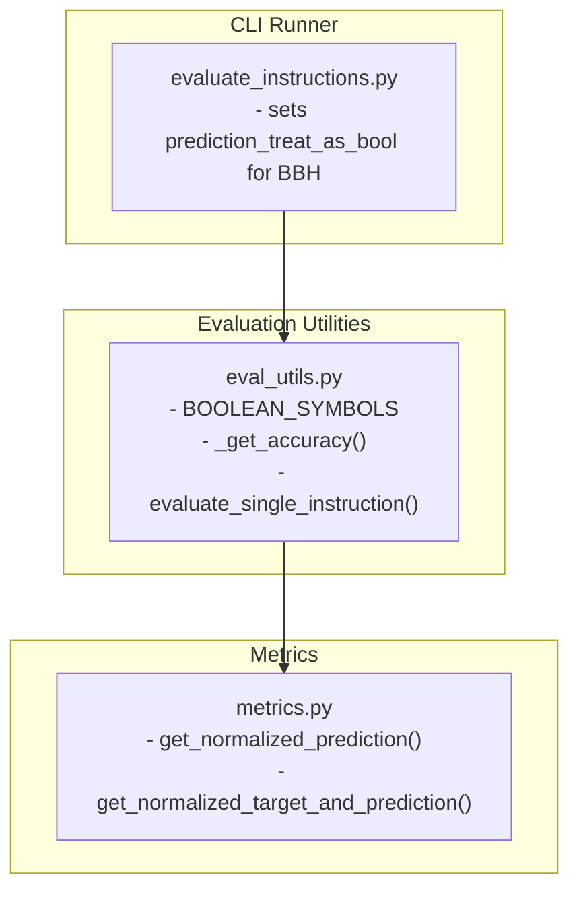
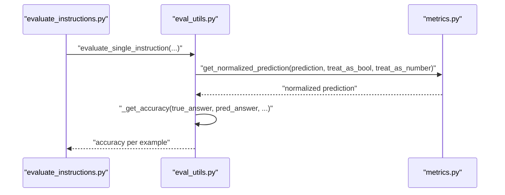
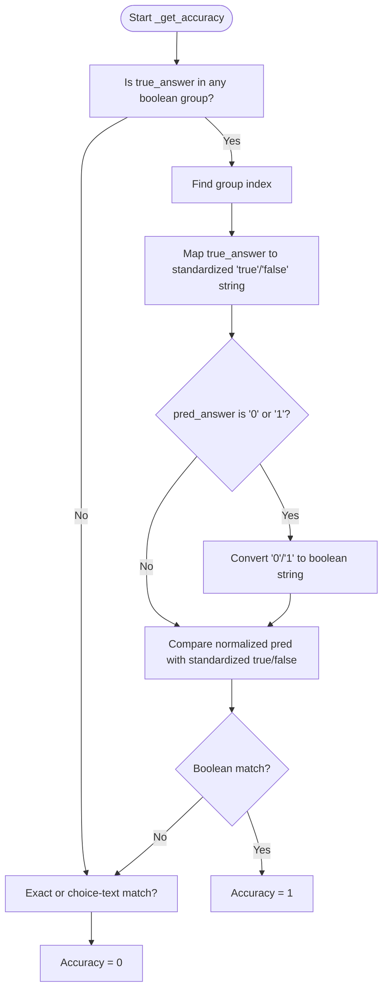
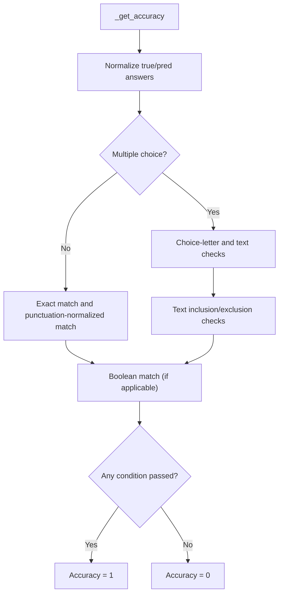
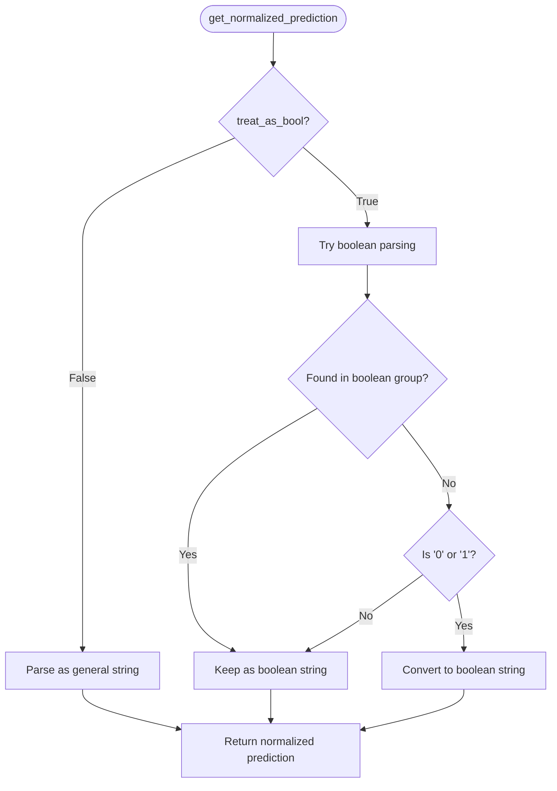
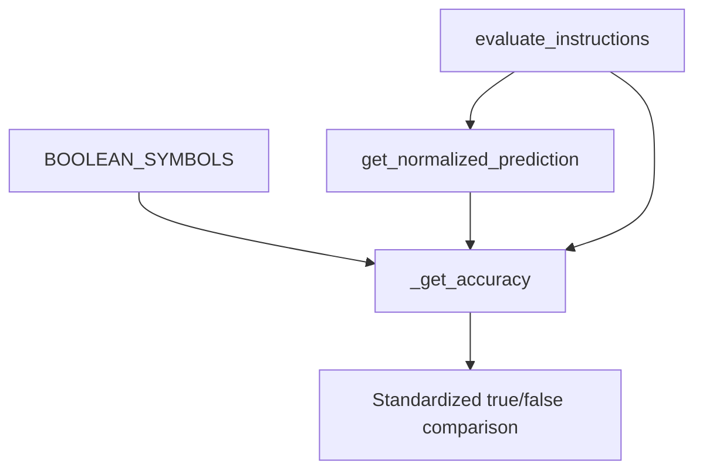

# Boolean Evaluation

<cite>
**Referenced Files in This Document**
- [eval_utils.py](file://opro/evaluation/eval_utils.py)
- [metrics.py](file://opro/evaluation/metrics.py)
- [evaluate_instructions.py](file://opro/evaluation/evaluate_instructions.py)
</cite>

## Table of Contents
1. [Introduction](#introduction)
2. [Project Structure](#project-structure)
3. [Core Components](#core-components)
4. [Architecture Overview](#architecture-overview)
5. [Detailed Component Analysis](#detailed-component-analysis)
6. [Dependency Analysis](#dependency-analysis)
7. [Performance Considerations](#performance-considerations)
8. [Troubleshooting Guide](#troubleshooting-guide)
9. [Conclusion](#conclusion)

## Introduction
This document explains how boolean evaluation is implemented in the scoring mechanism. It focuses on:
- How the system recognizes and processes boolean responses across semantic variants: ["false","true"], ["no","yes"], and ["invalid","valid"].
- The is_boolean_match logic that converts various boolean representations to standardized true/false strings for comparison.
- Handling of numeric boolean representations (0/1) and their conversion to boolean strings.
- Integration of boolean evaluation within the broader accuracy calculation framework.
- The role of the treat_as_bool parameter in get_normalized_prediction and how it influences normalization and scoring.
- Examples of common boolean response patterns in BBH tasks and how the system normalizes them for consistent evaluation.

## Project Structure
The boolean evaluation spans two modules:
- Evaluation utilities: prompt generation, accuracy computation, and BBH data loading.
- Metrics: normalization pipeline for predictions and targets, including boolean-aware parsing.

**Diagram sources**
- [eval_utils.py](file://opro/evaluation/eval_utils.py#L35-L40)
- [eval_utils.py](file://opro/evaluation/eval_utils.py#L462-L490)
- [metrics.py](file://opro/evaluation/metrics.py#L188-L343)
- [evaluate_instructions.py](file://opro/evaluation/evaluate_instructions.py#L439-L504)

**Section sources**
- [eval_utils.py](file://opro/evaluation/eval_utils.py#L35-L40)
- [metrics.py](file://opro/evaluation/metrics.py#L188-L343)
- [evaluate_instructions.py](file://opro/evaluation/evaluate_instructions.py#L439-L504)

## Core Components
- Boolean symbol catalog: The system defines the canonical sets of boolean labels used in BBH tasks.
- Accuracy computation: The scoring logic checks multiple conditions, including a dedicated boolean match branch.
- Prediction normalization: The normalization pipeline converts predictions to a canonical form, including special handling for 0/1 when treating as boolean.

Key responsibilities:
- Detecting boolean targets among the predefined symbol groups.
- Converting candidate predictions to standardized true/false strings.
- Integrating boolean evaluation into the overall accuracy decision.

**Section sources**
- [eval_utils.py](file://opro/evaluation/eval_utils.py#L35-L40)
- [eval_utils.py](file://opro/evaluation/eval_utils.py#L462-L490)
- [metrics.py](file://opro/evaluation/metrics.py#L188-L343)

## Architecture Overview
The boolean evaluation sits at the intersection of:
- Prompting and parsing: The runner prepares prompts and parses raw outputs.
- Normalization: Predictions are normalized according to treat_as_bool and treat_as_number.
- Scoring: The accuracy function applies exact match, inclusion, and boolean match logic.

**Diagram sources**
- [evaluate_instructions.py](file://opro/evaluation/evaluate_instructions.py#L673-L745)
- [eval_utils.py](file://opro/evaluation/eval_utils.py#L788-L800)
- [metrics.py](file://opro/evaluation/metrics.py#L188-L343)

## Detailed Component Analysis

### Boolean Symbol Catalog and Variants
The system maintains a fixed catalog of boolean label groups used in BBH tasks. These define the semantic families that are treated as boolean targets.

- ["false","true"]
- ["no","yes"]
- ["invalid","valid"]

These groups are used to:
- Identify when a true answer is boolean-valued.
- Map the correct label within a group to a standardized true/false string for comparison.

**Section sources**
- [eval_utils.py](file://opro/evaluation/eval_utils.py#L35-L40)
- [metrics.py](file://opro/evaluation/metrics.py#L76-L76)

### is_boolean_match Logic in Accuracy Computation
When the true answer belongs to any of the boolean symbol groups, the system computes a boolean match:
- Determine the group index of the true answer.
- Convert the true answer’s position within the group to a standardized true/false string.
- If the predicted answer is "0" or "1", convert it to boolean strings.
- Compare the normalized predicted answer with the standardized true/false string (including whitespace-insensitive comparison).

This logic ensures that equivalent boolean expressions across variants are treated consistently.

**Diagram sources**
- [eval_utils.py](file://opro/evaluation/eval_utils.py#L462-L490)

**Section sources**
- [eval_utils.py](file://opro/evaluation/eval_utils.py#L462-L490)

### Numeric Boolean Representation Handling (0/1)
Numeric boolean representations ("0" and "1") are handled in two stages:
- During normalization: If treat_as_bool is True and the normalized prediction is "0" or "1", it is converted to a boolean string ("false" or "true").
- During scoring: If the true answer is boolean-valued, "0"/"1" in the raw prediction are also converted to boolean strings before comparison.

This dual handling ensures robustness across different output formats.

**Section sources**
- [metrics.py](file://opro/evaluation/metrics.py#L310-L342)
- [eval_utils.py](file://opro/evaluation/eval_utils.py#L475-L480)

### Integration Within Accuracy Calculation Framework
The accuracy function combines several checks:
- Exact match of symbols or punctuation-normalized symbols.
- Choice-letter exact match for multiple-choice contexts.
- Inclusion of the true answer text among choices.
- Boolean match for boolean targets.

Only one of these conditions needs to pass for correctness.

**Diagram sources**
- [eval_utils.py](file://opro/evaluation/eval_utils.py#L381-L490)

**Section sources**
- [eval_utils.py](file://opro/evaluation/eval_utils.py#L381-L490)

### Role of treat_as_bool in get_normalized_prediction
The treat_as_bool parameter controls how predictions are normalized:
- If treat_as_bool is False: Normalization proceeds as a general string extraction and cleaning routine.
- If treat_as_bool is True:
  - The system attempts to parse the prediction as a boolean string.
  - If the normalized prediction is "0" or "1", it is converted to a boolean string ("false" or "true").
  - Punctuation is removed and the result is stripped.

This ensures that boolean targets are compared against normalized boolean strings rather than raw text.

**Diagram sources**
- [metrics.py](file://opro/evaluation/metrics.py#L188-L343)

**Section sources**
- [metrics.py](file://opro/evaluation/metrics.py#L188-L343)

### Integration of Boolean Evaluation in BBH Tasks
In the evaluation runner, boolean tasks are identified by task name. For BBH boolean tasks, prediction_treat_as_bool is set to True, ensuring normalization treats predictions as boolean and enabling numeric-to-boolean conversion.

- Boolean tasks include: boolean_expressions, causal_judgement, formal_fallacies, navigate, sports_understanding, web_of_lies.
- For these tasks, the runner passes prediction_treat_as_bool=True to the evaluation pipeline.

This guarantees that boolean targets are normalized and scored consistently.

**Section sources**
- [evaluate_instructions.py](file://opro/evaluation/evaluate_instructions.py#L439-L504)

### Common Boolean Response Patterns in BBH Tasks
Examples of expected boolean responses across BBH tasks:
- ["false","true"]: Used in boolean_expressions.
- ["no","yes"]: Used in causal_judgement and navigate.
- ["invalid","valid"]: Used in formal_fallacies.

The system normalizes these to standardized true/false strings and compares against the target. Numeric outputs "0"/"1" are also accepted and converted to boolean strings during normalization and scoring.

**Section sources**
- [evaluate_instructions.py](file://opro/evaluation/evaluate_instructions.py#L496-L503)
- [metrics.py](file://opro/evaluation/metrics.py#L76-L76)
- [eval_utils.py](file://opro/evaluation/eval_utils.py#L35-L40)

## Dependency Analysis
The boolean evaluation depends on:
- Shared boolean symbol catalog in both modules.
- Consistent treatment of boolean targets in accuracy computation.
- Normalization pipeline controlled by treat_as_bool.

**Diagram sources**
- [eval_utils.py](file://opro/evaluation/eval_utils.py#L35-L40)
- [eval_utils.py](file://opro/evaluation/eval_utils.py#L462-L490)
- [metrics.py](file://opro/evaluation/metrics.py#L188-L343)
- [evaluate_instructions.py](file://opro/evaluation/evaluate_instructions.py#L673-L745)

**Section sources**
- [eval_utils.py](file://opro/evaluation/eval_utils.py#L35-L40)
- [metrics.py](file://opro/evaluation/metrics.py#L188-L343)
- [evaluate_instructions.py](file://opro/evaluation/evaluate_instructions.py#L673-L745)

## Performance Considerations
- Boolean detection uses membership checks against predefined groups; complexity is constant with respect to the number of examples.
- Normalization with treat_as_bool adds minimal overhead; the 0/1 conversion is a constant-time operation.
- The overall scoring remains efficient because boolean checks short-circuit with other accuracy conditions.

[No sources needed since this section provides general guidance]

## Troubleshooting Guide
Common issues and resolutions:
- Non-standard boolean outputs: Ensure prediction_treat_as_bool is True for boolean tasks so that "0"/"1" are converted to boolean strings.
- Mixed-case or punctuation variations: The normalization removes punctuation and strips whitespace; ensure outputs are clean.
- Multiple-choice vs. free-form: For multiple-choice contexts, the scoring considers choice-letter and text inclusion; for free-form boolean tasks, rely on boolean match.

**Section sources**
- [metrics.py](file://opro/evaluation/metrics.py#L188-L343)
- [eval_utils.py](file://opro/evaluation/eval_utils.py#L381-L490)

## Conclusion
The boolean evaluation mechanism integrates cleanly with the broader scoring framework:
- It recognizes boolean targets across semantic variants.
- It converts diverse representations (including "0"/"1") to standardized true/false strings.
- It leverages normalization controlled by treat_as_bool to ensure consistent comparison.
- It fits seamlessly into the accuracy computation, alongside exact match, inclusion, and choice-text checks.

Together, these components provide robust and flexible boolean scoring for BBH tasks and similar datasets.