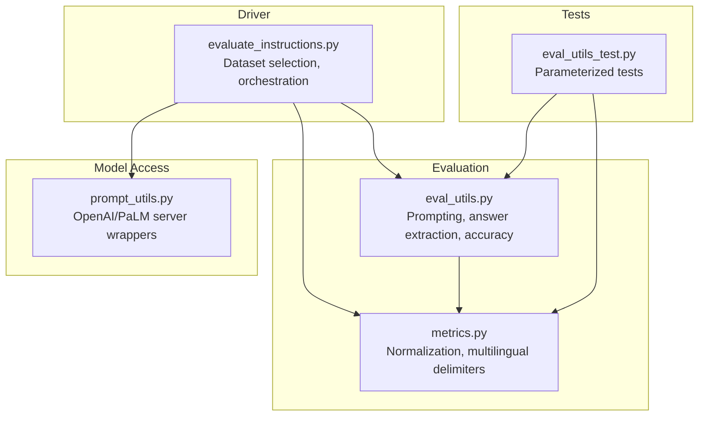
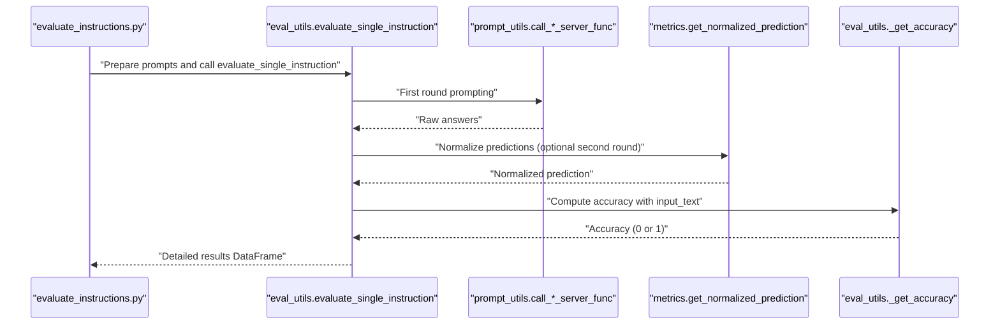
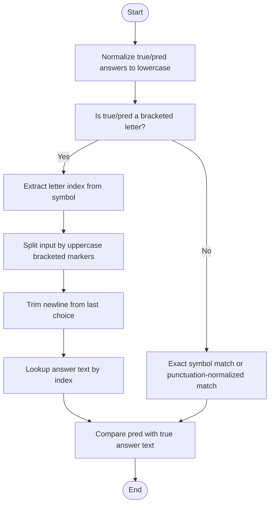
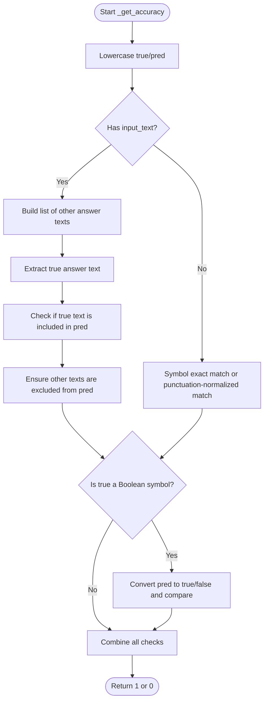
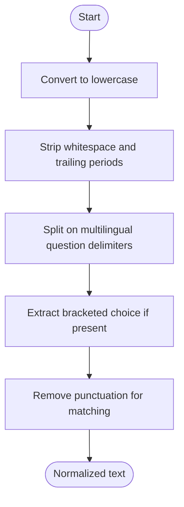
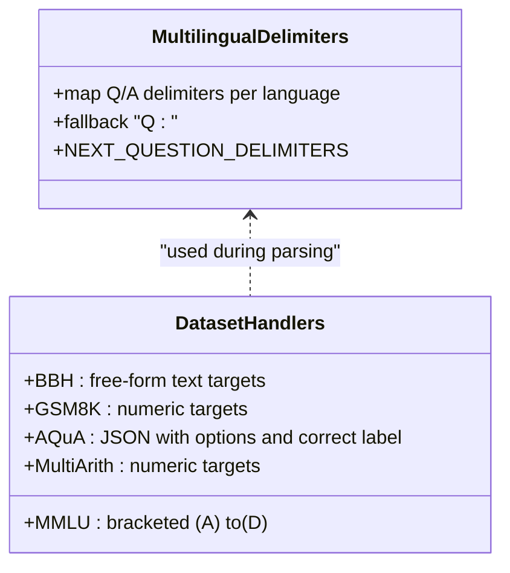
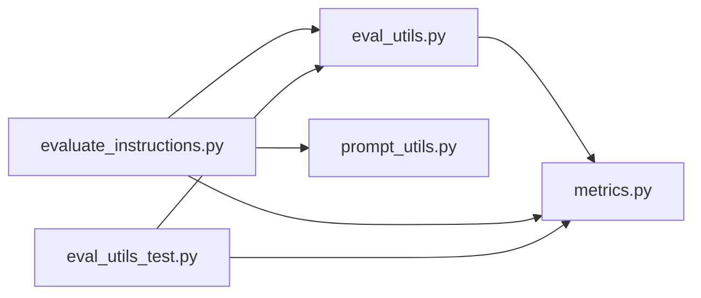

# Categorical Evaluation

<cite>
**Referenced Files in This Document**
- [eval_utils.py](file://opro/evaluation/eval_utils.py)
- [metrics.py](file://opro/evaluation/metrics.py)
- [evaluate_instructions.py](file://opro/evaluation/evaluate_instructions.py)
- [eval_utils_test.py](file://opro/evaluation/eval_utils_test.py)
- [prompt_utils.py](file://opro/prompt_utils.py)
</cite>

## Table of Contents
1. [Introduction](#introduction)
2. [Project Structure](#project-structure)
3. [Core Components](#core-components)
4. [Architecture Overview](#architecture-overview)
5. [Detailed Component Analysis](#detailed-component-analysis)
6. [Dependency Analysis](#dependency-analysis)
7. [Performance Considerations](#performance-considerations)
8. [Troubleshooting Guide](#troubleshooting-guide)
9. [Conclusion](#conclusion)

## Introduction
This document explains the categorical evaluation mechanism used to score multiple-choice answers. It focuses on how the system identifies bracketed choices (A), (B), etc., maps them to their corresponding answer texts, and applies sophisticated matching logic that considers symbol equivalence, exact string matching, and exclusion of conflicting choices. It also documents case normalization, punctuation handling, and the handling of multilingual question delimiters and various answer formatting patterns across benchmark datasets.

## Project Structure
The categorical evaluation pipeline spans several modules:
- Evaluation utilities: prompt construction, answer extraction, and accuracy computation
- Metrics: normalization helpers and multilingual delimiter handling
- Instruction evaluation driver: orchestrates evaluation across datasets and models
- Prompting utilities: model server wrappers for GPT and PaLM
- Tests: parameterized coverage of parsing and scoring logic

**Diagram sources**
- [eval_utils.py](file://opro/evaluation/eval_utils.py#L1-L120)
- [metrics.py](file://opro/evaluation/metrics.py#L1-L120)
- [evaluate_instructions.py](file://opro/evaluation/evaluate_instructions.py#L1-L120)
- [prompt_utils.py](file://opro/prompt_utils.py#L1-L60)
- [eval_utils_test.py](file://opro/evaluation/eval_utils_test.py#L1-L60)

**Section sources**
- [eval_utils.py](file://opro/evaluation/eval_utils.py#L1-L120)
- [metrics.py](file://opro/evaluation/metrics.py#L1-L120)
- [evaluate_instructions.py](file://opro/evaluation/evaluate_instructions.py#L1-L120)
- [prompt_utils.py](file://opro/prompt_utils.py#L1-L60)
- [eval_utils_test.py](file://opro/evaluation/eval_utils_test.py#L1-L60)

## Core Components
- Bracketed choice detection and indexing: Extracts the letter inside parentheses and maps it to an index for answer text lookup.
- Regex-based answer text extraction: Splits the input by uppercase bracketed markers and captures the text segment corresponding to the chosen symbol.
- Case normalization and punctuation handling: Converts to lowercase, strips punctuation for matching, and preserves meaningful punctuation for exact comparisons.
- Sophisticated matching logic: Checks symbol equality, exact text match, inclusion-based match, and Boolean-equivalence.
- Multilingual delimiter support: Recognizes question/answer delimiters across languages to isolate answer segments.

**Section sources**
- [eval_utils.py](file://opro/evaluation/eval_utils.py#L288-L336)
- [eval_utils.py](file://opro/evaluation/eval_utils.py#L381-L497)
- [metrics.py](file://opro/evaluation/metrics.py#L78-L152)
- [metrics.py](file://opro/evaluation/metrics.py#L165-L210)

## Architecture Overview
The evaluation flow integrates prompt construction, model inference, answer normalization, and categorical scoring.

**Diagram sources**
- [evaluate_instructions.py](file://opro/evaluation/evaluate_instructions.py#L673-L745)
- [eval_utils.py](file://opro/evaluation/eval_utils.py#L536-L800)
- [metrics.py](file://opro/evaluation/metrics.py#L188-L343)
- [prompt_utils.py](file://opro/prompt_utils.py#L21-L133)

## Detailed Component Analysis

### Bracketed Choice Indexing and Answer Text Extraction
- Indexing: Converts a symbol like "(B)" or "b" into a zero-based index by extracting the letter inside parentheses and computing its offset from "a".
- Answer text extraction: Builds a regex that splits the input by uppercase bracketed markers (e.g., "(A)", "(B)", ...) and captures the text segment corresponding to the selected symbol. It also trims newlines and ensures the input contains consecutive uppercase brackets.

**Diagram sources**
- [eval_utils.py](file://opro/evaluation/eval_utils.py#L288-L336)
- [eval_utils.py](file://opro/evaluation/eval_utils.py#L381-L441)

**Section sources**
- [eval_utils.py](file://opro/evaluation/eval_utils.py#L288-L336)
- [eval_utils.py](file://opro/evaluation/eval_utils.py#L381-L441)
- [eval_utils_test.py](file://opro/evaluation/eval_utils_test.py#L62-L88)

### Sophisticated Matching Logic
The accuracy function evaluates correctness across multiple modes:
- Symbol equality: Direct equality of bracketed letters or punctuation-normalized equality.
- Text content exact match: Compares the predicted symbol with the true answer text, with punctuation normalization.
- Text inclusion with conflict exclusion: Ensures the true answer text is included in the prediction and excludes other answer texts from the prediction (after removing the true answer text from consideration).
- Boolean equivalence: Treats Boolean-like symbols as equivalent by converting to true/false semantics.

**Diagram sources**
- [eval_utils.py](file://opro/evaluation/eval_utils.py#L381-L497)
- [metrics.py](file://opro/evaluation/metrics.py#L78-L152)

**Section sources**
- [eval_utils.py](file://opro/evaluation/eval_utils.py#L381-L497)
- [eval_utils_test.py](file://opro/evaluation/eval_utils_test.py#L143-L305)

### Case Normalization and Punctuation Handling
- Case normalization: Converts inputs to lowercase for consistent comparison.
- Punctuation normalization: Removes punctuation for matching while preserving meaningful punctuation for exact string comparisons.
- Trimming and splitting: Strips whitespace, removes trailing periods, and splits on multilingual question delimiters to isolate answer segments.

**Diagram sources**
- [metrics.py](file://opro/evaluation/metrics.py#L165-L210)
- [metrics.py](file://opro/evaluation/metrics.py#L211-L343)

**Section sources**
- [metrics.py](file://opro/evaluation/metrics.py#L165-L210)
- [metrics.py](file://opro/evaluation/metrics.py#L211-L343)

### Multilingual Question Delimiters and Dataset Formatting
- Multilingual delimiters: The system recognizes question and answer delimiters across multiple languages to prevent answer leakage from subsequent questions and to correctly parse answers.
- Dataset-specific formatting: Different datasets require distinct prompt formats and answer extraction strategies. The evaluation driver selects appropriate dataset handlers and sets flags accordingly.

**Diagram sources**
- [metrics.py](file://opro/evaluation/metrics.py#L78-L152)
- [evaluate_instructions.py](file://opro/evaluation/evaluate_instructions.py#L387-L526)

**Section sources**
- [metrics.py](file://opro/evaluation/metrics.py#L78-L152)
- [evaluate_instructions.py](file://opro/evaluation/evaluate_instructions.py#L387-L526)

## Dependency Analysis
The categorical evaluation depends on:
- eval_utils for prompt generation, answer extraction, and accuracy computation
- metrics for normalization and multilingual delimiter handling
- evaluate_instructions for dataset orchestration and model selection
- prompt_utils for model server interactions

**Diagram sources**
- [eval_utils.py](file://opro/evaluation/eval_utils.py#L1-L120)
- [metrics.py](file://opro/evaluation/metrics.py#L1-L120)
- [evaluate_instructions.py](file://opro/evaluation/evaluate_instructions.py#L1-L120)
- [prompt_utils.py](file://opro/prompt_utils.py#L1-L60)
- [eval_utils_test.py](file://opro/evaluation/eval_utils_test.py#L1-L60)

**Section sources**
- [eval_utils.py](file://opro/evaluation/eval_utils.py#L1-L120)
- [metrics.py](file://opro/evaluation/metrics.py#L1-L120)
- [evaluate_instructions.py](file://opro/evaluation/evaluate_instructions.py#L1-L120)
- [prompt_utils.py](file://opro/prompt_utils.py#L1-L60)
- [eval_utils_test.py](file://opro/evaluation/eval_utils_test.py#L1-L60)

## Performance Considerations
- Regex splitting: The answer text extraction uses a regex that splits on uppercase bracketed markers. This is efficient for typical multiple-choice formats but may degrade if the input contains irregular spacing or non-standard markers.
- Parallel prompting: The evaluation supports multithreading for model calls, which can reduce total runtime when calling external APIs.
- Normalization overhead: Removing punctuation and trimming whitespace is linear in input length; the impact is generally small compared to model latency.

[No sources needed since this section provides general guidance]

## Troubleshooting Guide
Common issues and resolutions:
- Non-consecutive or missing bracketed markers: Ensure the input contains consecutive uppercase bracketed markers in order (A), (B), (C), (D), etc. Otherwise, the answer text extraction may fail.
- Mixed case and punctuation: Normalize inputs to lowercase and remove punctuation when performing exact matches. For inclusion-based checks, consider punctuation-normalized comparisons.
- Conflicting choices: If the prediction includes the true answer text but also includes other answer texts, the inclusion-with-exclusion rule will mark it incorrect. Verify that only one answer is present.
- Boolean symbols: When the target is a Boolean symbol, ensure the prediction is interpreted consistently (e.g., "true"/"false" vs. "1"/"0").

**Section sources**
- [eval_utils.py](file://opro/evaluation/eval_utils.py#L381-L497)
- [eval_utils_test.py](file://opro/evaluation/eval_utils_test.py#L143-L305)

## Conclusion
The categorical evaluation pipeline robustly handles multiple-choice scoring by combining bracketed choice indexing, regex-based answer text extraction, and sophisticated matching logic that accounts for symbol equivalence, exact text matching, inclusion with conflict exclusion, and Boolean semantics. It also supports multilingual question delimiters and adapts to various dataset formatting patterns, ensuring reliable and fair scoring across benchmarks.