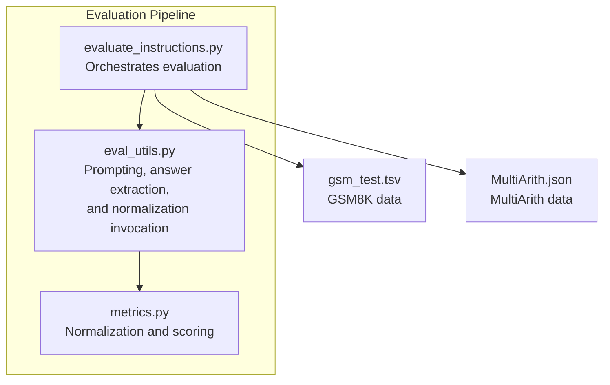
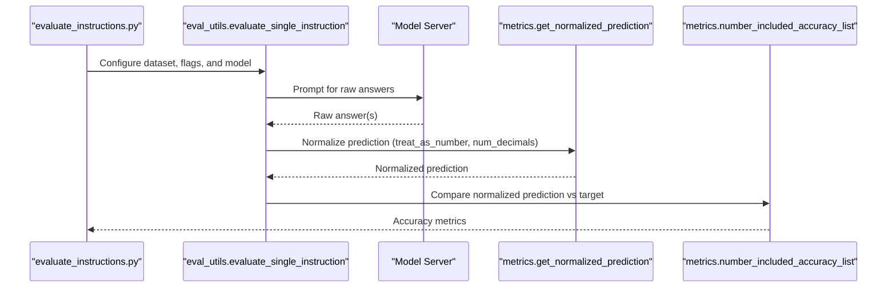
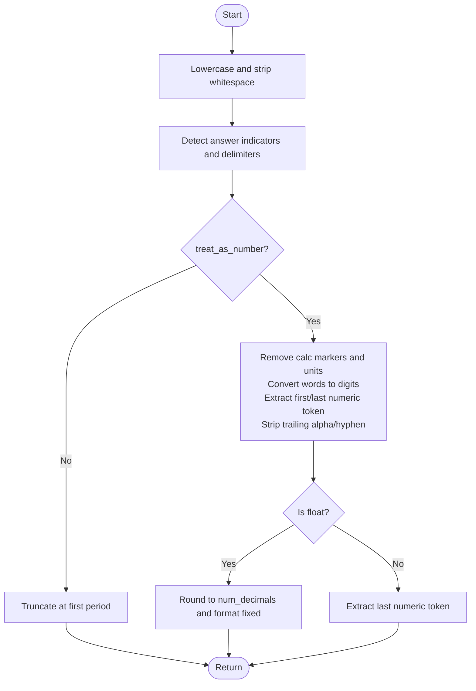
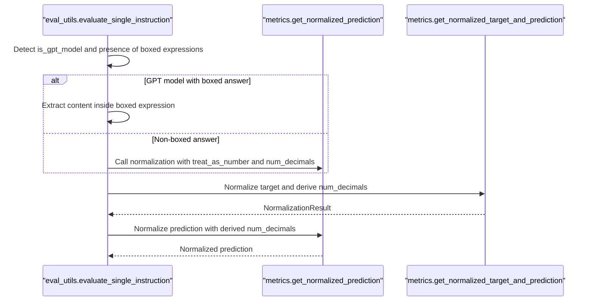
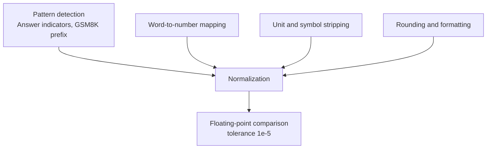

# Numerical Evaluation

<cite>
**Referenced Files in This Document**
- [metrics.py](file://opro/evaluation/metrics.py)
- [eval_utils.py](file://opro/evaluation/eval_utils.py)
- [evaluate_instructions.py](file://opro/evaluation/evaluate_instructions.py)
- [gsm_test.tsv](file://data/gsm_data/gsm_test.tsv)
- [MultiArith.json](file://data/MultiArith-data/MultiArith.json)
</cite>

## Table of Contents
1. [Introduction](#introduction)
2. [Project Structure](#project-structure)
3. [Core Components](#core-components)
4. [Architecture Overview](#architecture-overview)
5. [Detailed Component Analysis](#detailed-component-analysis)
6. [Dependency Analysis](#dependency-analysis)
7. [Performance Considerations](#performance-considerations)
8. [Troubleshooting Guide](#troubleshooting-guide)
9. [Conclusion](#conclusion)

## Introduction
This document explains the numerical evaluation mechanism used to score model outputs that contain numerical answers. It focuses on how predictions are normalized and compared to ground truth values, including:
- The normalization process in get_normalized_prediction with the treat_as_number parameter
- Parsing logic that extracts numbers from model outputs, including word-to-number conversion, unit stripping, and thousand separator removal
- Rounding behavior controlled by num_decimals
- Floating-point comparison using a tolerance threshold of 1e-5
- Extraction of final numerical answers from various formats, including GSM8K’s “#### ” prefix and boxed expressions in GPT models
- Edge cases such as mixed alphanumeric tokens and calculator errors

## Project Structure
The numerical evaluation pipeline spans three main modules:
- metrics.py: Core normalization and scoring logic for numerical answers
- eval_utils.py: End-to-end evaluation orchestration, including prompt construction, answer extraction, and normalization invocation
- evaluate_instructions.py: Orchestration script that wires datasets, model calls, and evaluation flags

**Diagram sources**
- [evaluate_instructions.py](file://opro/evaluation/evaluate_instructions.py#L505-L745)
- [eval_utils.py](file://opro/evaluation/eval_utils.py#L536-L800)
- [metrics.py](file://opro/evaluation/metrics.py#L188-L496)
- [gsm_test.tsv](file://data/gsm_data/gsm_test.tsv#L1-L20)
- [MultiArith.json](file://data/MultiArith-data/MultiArith.json#L1-L40)

**Section sources**
- [evaluate_instructions.py](file://opro/evaluation/evaluate_instructions.py#L505-L745)
- [eval_utils.py](file://opro/evaluation/eval_utils.py#L536-L800)
- [metrics.py](file://opro/evaluation/metrics.py#L188-L496)

## Core Components
- get_normalized_prediction: Extracts and normalizes a numerical answer from raw model output, applying word-to-number conversion, unit stripping, thousand separator normalization, and rounding.
- get_normalized_target_and_prediction: Determines whether the target is numeric, rounds the prediction to match target precision, and returns a NormalizationResult bundle.
- number_included_accuracy_list: Compares normalized predictions to normalized targets using floating-point equality with tolerance.

Key parameters influencing numerical evaluation:
- treat_as_number: Controls whether normalization treats the prediction as a number and applies number-specific parsing and rounding.
- num_decimals: Controls rounding precision for numerical comparisons.
- treat_as_bool: Allows Boolean normalization when the target is Boolean.

**Section sources**
- [metrics.py](file://opro/evaluation/metrics.py#L188-L496)

## Architecture Overview
The evaluation flow integrates dataset-specific logic, prompt construction, answer extraction, and numerical normalization.

**Diagram sources**
- [evaluate_instructions.py](file://opro/evaluation/evaluate_instructions.py#L505-L745)
- [eval_utils.py](file://opro/evaluation/eval_utils.py#L536-L800)
- [metrics.py](file://opro/evaluation/metrics.py#L366-L496)

## Detailed Component Analysis

### Normalization and Scoring Logic
This section documents the core normalization and scoring functions that handle numerical predictions and targets.

- get_normalized_prediction
  - Purpose: Normalize a raw prediction string into a canonical form suitable for comparison.
  - Key steps:
    - Strip answer indicators and delimiters (e.g., “answer is”, “Answer:”, “#### ”)
    - Remove trailing punctuation and byte-string artifacts
    - Extract bracketed choices if present
    - If treat_as_number is False: truncate at first period and return
    - If treat_as_number is True:
      - Remove calculator-style equals sign and colon
      - Strip currency/unit symbols ($, €, £, %, commas)
      - Convert written numbers to digits (e.g., “eight” → “8”)
      - If answer_indicated is true, take the first token containing digits; otherwise take the last token containing digits
      - Strip trailing alphabetic characters and hyphens
      - If the result is a float, round to num_decimals and format with fixed decimals
      - Else, fallback to extracting the last numeric token
    - If treat_as_bool is True:
      - Try Boolean normalization by attempting both number and non-number interpretations
      - Convert “0”/“1” to False/True
      - Remove punctuation and strip
  - Output: Normalized string ready for comparison.

- get_normalized_target_and_prediction
  - Purpose: Determine whether the target is numeric and derive num_decimals from target precision.
  - Key steps:
    - Detect presence of answer indicators or GSM8K prefix in target
    - Strip answer indicators and trailing punctuation
    - Determine treat_as_number based on whether target parses as float
    - If treat_as_number and target contains a decimal point, set num_decimals to the number of digits after the decimal
    - Otherwise, num_decimals = 0
    - Call get_normalized_prediction with treat_as_number and num_decimals
  - Output: NormalizationResult with target, prediction, treat_as_number, and num_decimals.

- number_included_accuracy_list
  - Purpose: Compute per-sample correctness for numerical targets.
  - Key steps:
    - For each (target, prediction) pair:
      - Normalize target and prediction
      - If treat_as_number is False: exact string match
      - If treat_as_number is True: round prediction to target precision and compare with tolerance 1e-5
  - Output: List of booleans indicating correctness.

**Diagram sources**
- [metrics.py](file://opro/evaluation/metrics.py#L188-L343)

**Section sources**
- [metrics.py](file://opro/evaluation/metrics.py#L188-L496)

### Answer Extraction and Final Number Retrieval
- GSM8K “#### ” prefix: The normalization logic explicitly recognizes the GSM8K prefix and strips it to isolate the final number.
- GPT models with boxed expressions: When is_gpt_model is True, the pipeline checks for LaTeX-style boxed expressions and extracts the content inside the box before invoking normalization.

**Diagram sources**
- [eval_utils.py](file://opro/evaluation/eval_utils.py#L788-L800)
- [metrics.py](file://opro/evaluation/metrics.py#L366-L431)

**Section sources**
- [eval_utils.py](file://opro/evaluation/eval_utils.py#L788-L800)
- [metrics.py](file://opro/evaluation/metrics.py#L366-L431)

### Dataset-Specific Flags and Behavior
- GSM8K: prediction_treat_as_number is set to True; prediction_num_decimals defaults to 0 in the script; GSM8K uses “#### ” prefix.
- MultiArith: prediction_treat_as_number is set to True; targets are numeric; normalization derives num_decimals from target precision.
- MMLU/AQuA: prediction_treat_as_number is False; these are primarily multiple-choice or text-based tasks.

**Section sources**
- [evaluate_instructions.py](file://opro/evaluation/evaluate_instructions.py#L583-L629)
- [gsm_test.tsv](file://data/gsm_data/gsm_test.tsv#L1-L20)
- [MultiArith.json](file://data/MultiArith-data/MultiArith.json#L1-L40)

## Dependency Analysis
The numerical evaluation depends on:
- Pattern detection for answer indicators and delimiters
- Word-to-number mapping for textual numbers
- Regex-based token extraction and unit stripping
- Floating-point rounding and tolerance comparison

**Diagram sources**
- [metrics.py](file://opro/evaluation/metrics.py#L188-L496)

**Section sources**
- [metrics.py](file://opro/evaluation/metrics.py#L188-L496)

## Performance Considerations
- Regex operations and repeated string transformations are lightweight for typical model outputs.
- The pipeline avoids expensive operations by focusing on localized extraction and simple numeric checks.
- Parallel prompting is supported in eval_utils for throughput, but numerical normalization is deterministic and single-threaded per sample.

[No sources needed since this section provides general guidance]

## Troubleshooting Guide
Common issues and resolutions:
- Mixed alphanumeric tokens:
  - Symptom: Prediction contains both letters and digits (e.g., “123kg”).
  - Resolution: The normalization logic strips trailing alphabetic characters and hyphens; ensure treat_as_number is True to trigger this behavior.
- Calculator errors:
  - Symptom: Prediction includes “=” or “:” markers.
  - Resolution: The normalization logic removes “=” and “:” markers before extraction; ensure treat_as_number is True.
- Unit and currency symbols:
  - Symptom: Prediction includes “$”, “€”, “£”, “%”, or commas.
  - Resolution: Units and commas are stripped when treat_as_number is True; ensure this flag is enabled.
- Word-to-number conversion:
  - Symptom: Prediction uses words like “eight”.
  - Resolution: The normalization converts words to digits; ensure treat_as_number is True.
- Rounding mismatches:
  - Symptom: Target has decimals but prediction is rounded differently.
  - Resolution: get_normalized_target_and_prediction derives num_decimals from target precision; ensure treat_as_number is True for numeric targets.
- Floating-point tolerance:
  - Symptom: Numerically correct answers fail due to floating-point precision.
  - Resolution: number_included_accuracy_list uses a tolerance of 1e-5; ensure treat_as_number is True and num_decimals aligns with target precision.

**Section sources**
- [metrics.py](file://opro/evaluation/metrics.py#L188-L496)

## Conclusion
The numerical evaluation pipeline provides robust normalization and scoring for numerical predictions:
- treat_as_number enables number-specific parsing and rounding
- num_decimals ensures precision alignment with targets
- tolerance-based floating-point comparison guarantees resilient scoring
- dataset-aware flags (e.g., GSM8K “#### ” prefix, GPT boxed expressions) ensure correct extraction of final answers

[No sources needed since this section summarizes without analyzing specific files]