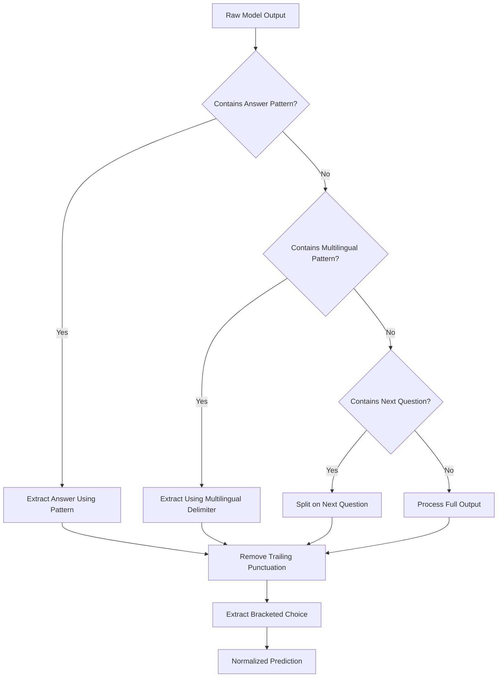
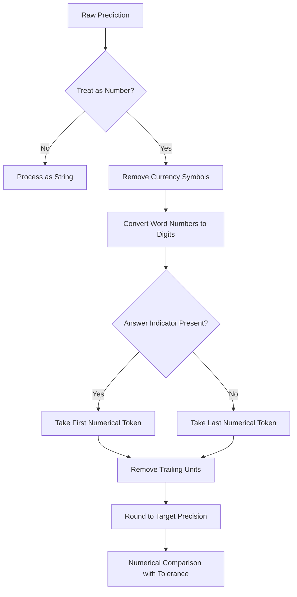
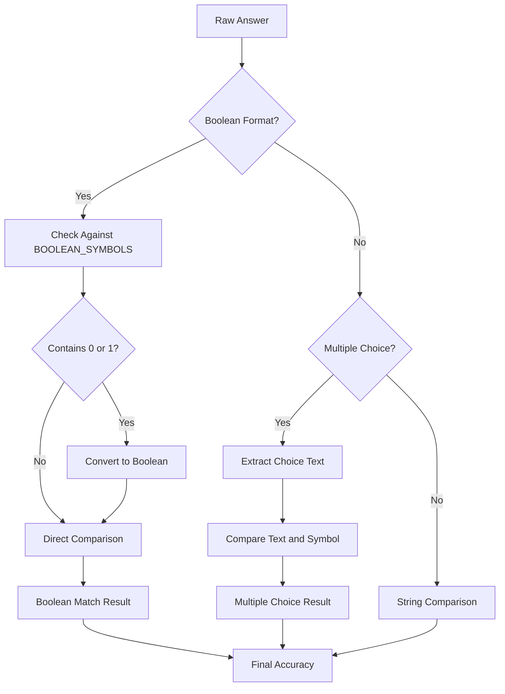
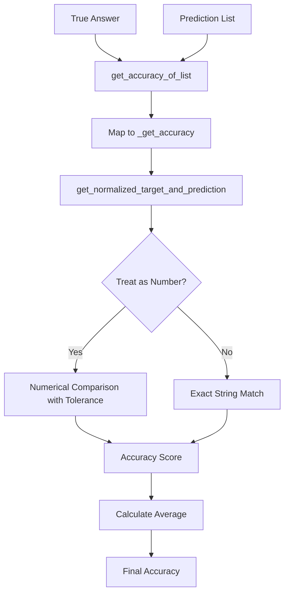

# Scoring Mechanism

<cite>
**Referenced Files in This Document**   
- [metrics.py](file://opro/evaluation/metrics.py)
- [eval_utils.py](file://opro/evaluation/eval_utils.py)
- [evaluate_instructions.py](file://opro/evaluation/evaluate_instructions.py)
</cite>

## Table of Contents
1. [Introduction](#introduction)
2. [Core Components](#core-components)
3. [Answer Parsing Logic](#answer-parsing-logic)
4. [Numerical Answer Processing](#numerical-answer-processing)
5. [Boolean and Multiple Choice Handling](#boolean-and-multiple-choice-handling)
6. [GPT Model Output Extraction](#gpt-model-output-extraction)
7. [Accuracy Computation Workflow](#accuracy-computation-workflow)
8. [Edge Cases and Tolerance Settings](#edge-cases-and-tolerance-settings)

## Introduction
The scoring mechanism in the prompt evaluation system computes accuracy metrics by comparing model outputs against ground truth answers across various dataset types. This system handles diverse answer formats through sophisticated normalization and parsing logic implemented in the `metrics.py` and `eval_utils.py` files. The mechanism supports multiple dataset types including MMLU, BBH, GSM8K, MultiArith, and AQuA, each with distinct answer formats ranging from multiple-choice selections to numerical solutions and boolean responses. The system normalizes predictions by handling numerical values, boolean responses, and multiple-choice answers through comprehensive parsing rules. It accommodates different output formats from LLMs, including extraction of answers from boxed expressions (\boxed{}) in GPT models. The tolerance settings for numerical comparisons and string matching algorithms for categorical answers ensure robust accuracy assessment across diverse problem types.

## Core Components

The scoring mechanism is built around several core components that work together to compute accuracy metrics. The primary functions are `get_accuracy_of_list`, `_get_accuracy`, `get_normalized_prediction`, and `get_normalized_target_and_prediction`, which form the foundation of the accuracy computation system. These functions handle the normalization and comparison of model outputs against ground truth answers across different dataset types. The system processes various answer formats including numerical values, boolean responses, and multiple-choice selections through a series of parsing and normalization steps. The implementation supports multiple dataset types with distinct answer formats, applying appropriate parsing rules based on the dataset characteristics. The accuracy computation workflow involves extracting answers from model outputs, normalizing both predictions and targets, and comparing them according to specific rules for each answer type.

**Section sources**
- [eval_utils.py](file://opro/evaluation/eval_utils.py#L499-L533)
- [metrics.py](file://opro/evaluation/metrics.py#L443-L495)

## Answer Parsing Logic

The answer parsing logic in the system normalizes predictions by handling various answer formats through a comprehensive set of rules. The system identifies answer patterns using primary and secondary patterns defined in `FINAL_ANSWER_BEHIND_PATTERNS_PRIMARY` and `FINAL_ANSWER_BEHIND_PATTERNS_SECONDARY`, which include variations like "answer is ", "answer: ", and "is the correct answer". The parsing process first checks for primary patterns and falls back to secondary ones if not found. For multilingual support, the system uses `MULTILINGUAL_QUESTION_DELIMITER` which contains question and answer delimiters for 13 languages including English, Spanish, French, German, Japanese, Russian, and Chinese. The parsing logic removes trailing punctuation and handles various answer formats by extracting the relevant portion of the model output. The system also handles cases where models generate new questions by splitting on next question delimiters defined in `NEXT_QUESTION_DELIMITERS`. The normalization process includes extracting bracketed choices using `_extract_bracketed_choice_from_string` function, which identifies exactly one bracketed choice in the prediction.



**Diagram sources**
- [metrics.py](file://opro/evaluation/metrics.py#L165-L185)
- [metrics.py](file://opro/evaluation/metrics.py#L213-L224)

**Section sources**
- [metrics.py](file://opro/evaluation/metrics.py#L165-L185)
- [metrics.py](file://opro/evaluation/metrics.py#L213-L224)

## Numerical Answer Processing

The numerical answer processing component handles numerical values through a sophisticated normalization process that accounts for various formats and representations. When `treat_as_number` is True, the system processes the prediction through `_parse_with_treating_as_number` function, which performs several normalization steps. The process begins by extracting the equation result after the equals sign, then removes currency symbols ($, €, £), commas, and percentage signs. The system converts word numbers to digits using `_WORD_TO_NUM` dictionary, which maps words like "zero" through "ninety" to their numerical equivalents. For token extraction, the system takes the first token with numerical values if an answer indicator was present, otherwise it takes the last token. The processing handles units by removing trailing alphabetic characters and hyphens. For decimal precision, the system rounds to the same number of decimal places as the target answer, with a tolerance of 1e-5 for numerical comparisons. The system also handles cases where the answer appears after a colon or in a boxed expression.



**Diagram sources**
- [metrics.py](file://opro/evaluation/metrics.py#L266-L308)
- [metrics.py](file://opro/evaluation/metrics.py#L464-L473)

**Section sources**
- [metrics.py](file://opro/evaluation/metrics.py#L266-L308)
- [metrics.py](file://opro/evaluation/metrics.py#L464-L473)

## Boolean and Multiple Choice Handling

The system handles boolean and multiple-choice answers through specialized parsing and comparison logic. For boolean responses, the system recognizes three pairs of boolean symbols defined in `BOOLEAN_SYMBOLS`: ['false', 'true'], ['no', 'yes'], and ['invalid', 'valid']. The parsing logic converts numeric representations (0/1) to their boolean equivalents (false/true) for comparison. For multiple-choice questions, the system uses bracketed letters from (a) to (z) defined in `bracketed_letters_list` to identify answer choices. The `_get_answer_text` function extracts the text associated with a specific choice symbol by splitting the input text on consecutive uppercase bracketed letters. The accuracy computation considers multiple criteria: exact symbol match, exact text match, inclusion of the correct choice text while excluding other choice texts, and boolean equivalence. The system handles case insensitivity by converting all inputs to lowercase during comparison and removes punctuation when necessary for text matching.



**Diagram sources**
- [eval_utils.py](file://opro/evaluation/eval_utils.py#L463-L480)
- [eval_utils.py](file://opro/evaluation/eval_utils.py#L404-L418)

**Section sources**
- [eval_utils.py](file://opro/evaluation/eval_utils.py#L463-L480)
- [eval_utils.py](file://opro/evaluation/eval_utils.py#L404-L418)

## GPT Model Output Extraction

The system specifically handles GPT model outputs by extracting answers from boxed expressions using LaTeX formatting. When the `is_gpt_model` flag is set to True, the system uses regular expressions to extract content from within `\boxed{}` expressions, which is a common format used by GPT models to present final answers. This extraction occurs in the `_parse_prediction` function within `evaluate_instructions.py`, where it checks for the presence of `\boxed` in the prediction and uses `re.findall(r"\\boxed{(.*?)}", x)` to extract the answer. For non-GPT models, the system falls back to the standard normalization process in `get_normalized_prediction`. The system also supports a two-round prompting approach where a second round of prompting adds "So the final answer is" to better extract the final answer for parsing, particularly useful for models that don't use boxed expressions. This dual approach ensures compatibility with various LLM output formats while maintaining consistent accuracy computation.

```mermaid
flowchart TD
A[Raw Model Output] --> B{Is GPT Model?}
B --> |Yes| C[Search for \\boxed{}]
C --> D{Contains \\boxed{}?}
D --> |Yes| E[Extract Content from \\boxed{}]
D --> |No| F[Fall Back to Standard Parsing]
B --> |No| F
F --> G[Standard Normalization]
E --> H[Normalized Prediction]
G --> H
```

**Diagram sources**
- [evaluate_instructions.py](file://opro/evaluation/evaluate_instructions.py#L791-L793)
- [metrics.py](file://opro/evaluation/metrics.py#L434-L435)

**Section sources**
- [evaluate_instructions.py](file://opro/evaluation/evaluate_instructions.py#L791-L793)
- [metrics.py](file://opro/evaluation/metrics.py#L434-L435)

## Accuracy Computation Workflow

The accuracy computation workflow follows a systematic process to compare model predictions against ground truth answers. The process begins with `get_accuracy_of_list` which takes a true answer and a list of predicted answers, mapping each prediction through `_get_accuracy` to compute individual accuracy scores. The `_get_accuracy` function normalizes both the target and prediction using `get_normalized_target_and_prediction`, which determines whether to treat the answer as a number based on whether the target can be parsed as a float. For numerical answers, the system compares values with a tolerance of 1e-5, while non-numerical answers require exact matches. The workflow handles various edge cases including partial matches, text inclusion, and boolean equivalences. The system also supports treating inclusion of the true answer in the prediction as correct through the `treat_include_as_correct` parameter. The final accuracy is computed as the average of individual accuracy scores across all predictions for a given question.



**Diagram sources**
- [eval_utils.py](file://opro/evaluation/eval_utils.py#L499-L533)
- [metrics.py](file://opro/evaluation/metrics.py#L443-L478)

**Section sources**
- [eval_utils.py](file://opro/evaluation/eval_utils.py#L499-L533)
- [metrics.py](file://opro/evaluation/metrics.py#L443-L478)

## Edge Cases and Tolerance Settings

The system handles various edge cases and employs specific tolerance settings to ensure robust accuracy computation. For numerical comparisons, the system uses a tolerance of 1e-5 to account for floating-point precision differences, allowing answers to be considered correct if their absolute difference is within this threshold. The system handles cases where the answer appears with additional explanatory text by extracting only the relevant portion using pattern matching. It accommodates variations in punctuation and spacing by removing punctuation during comparison when necessary. The system handles multilingual outputs by recognizing answer patterns in 13 different languages, ensuring consistent parsing across language variants. For boolean answers, the system recognizes equivalent meanings across different phrasings (e.g., "yes" equivalent to "true" and "1"). The system also handles cases where models generate additional content after providing the answer by splitting on next question delimiters. The tolerance for numerical precision is determined by the target answer's decimal places, ensuring consistent rounding across comparisons.

**Section sources**
- [metrics.py](file://opro/evaluation/metrics.py#L471-L473)
- [metrics.py](file://opro/evaluation/metrics.py#L251-L253)
- [metrics.py](file://opro/evaluation/metrics.py#L229-L232)