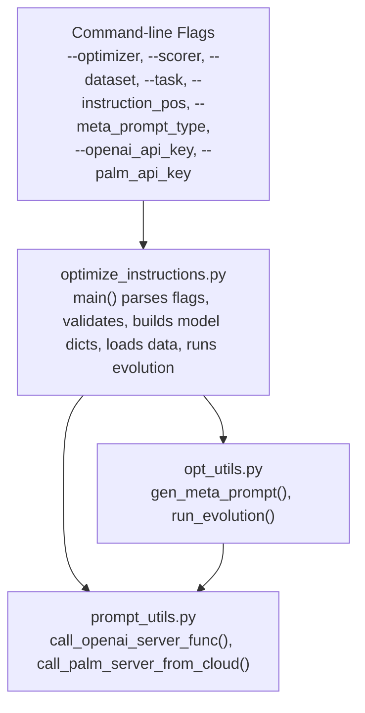
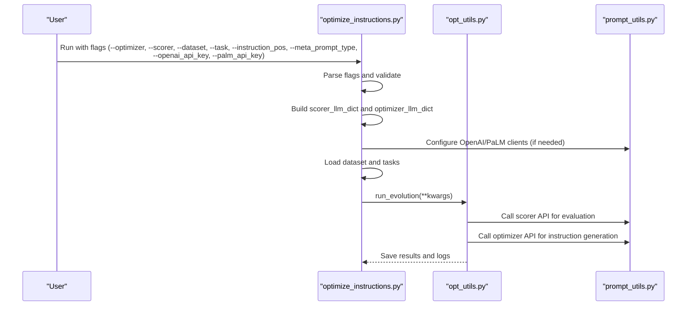
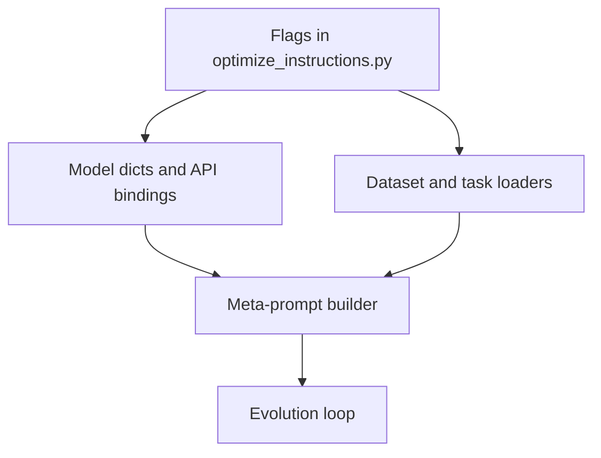

# Configuration Parameters

<cite>
**Referenced Files in This Document**
- [optimize_instructions.py](file://opro/optimization/optimize_instructions.py)
- [opt_utils.py](file://opro/optimization/opt_utils.py)
- [prompt_utils.py](file://opro/prompt_utils.py)
- [README.md](file://README.md)
</cite>

## Table of Contents
1. [Introduction](#introduction)
2. [Project Structure](#project-structure)
3. [Core Components](#core-components)
4. [Architecture Overview](#architecture-overview)
5. [Detailed Component Analysis](#detailed-component-analysis)
6. [Dependency Analysis](#dependency-analysis)
7. [Performance Considerations](#performance-considerations)
8. [Troubleshooting Guide](#troubleshooting-guide)
9. [Conclusion](#conclusion)

## Introduction
This document explains the configuration parameters system for the prompt optimization pipeline. It focuses on the command-line flags and hyperparameters defined in the optimization script and how they influence model selection, dataset/task specification, instruction positioning, and meta-prompt construction. It also documents the model-specific configuration dictionaries and provides practical guidance for tuning optimization hyperparameters based on dataset characteristics.

## Project Structure
The configuration system centers around a single entry-point script that defines command-line flags and orchestrates model calls and dataset loading. Supporting utilities generate meta-prompts and run the evolutionary optimization loop.

**Diagram sources**
- [optimize_instructions.py](file://opro/optimization/optimize_instructions.py#L65-L101)
- [opt_utils.py](file://opro/optimization/opt_utils.py#L90-L110)
- [prompt_utils.py](file://opro/prompt_utils.py#L21-L133)

**Section sources**
- [optimize_instructions.py](file://opro/optimization/optimize_instructions.py#L65-L101)
- [opt_utils.py](file://opro/optimization/opt_utils.py#L90-L110)
- [prompt_utils.py](file://opro/prompt_utils.py#L21-L133)

## Core Components
This section documents each configuration parameter and its role in the optimization process.

- --openai_api_key
  - Purpose: Provides the API key for OpenAI models.
  - Behavior: Required when either the optimizer or scorer is an OpenAI model.
  - Validation: The script asserts the presence of this key before initializing OpenAI clients.
  - Impact: Enables calls to OpenAI Chat Completions API.

- --palm_api_key
  - Purpose: Provides the API key for Google PaLM models.
  - Behavior: Required when either the optimizer or scorer is the PaLM model.
  - Validation: The script asserts the presence of this key before configuring the PaLM client.
  - Impact: Enables calls to the Google Cloud Generative AI Text API.

- --optimizer
  - Purpose: Selects the model used to propose new instructions.
  - Valid values: "gpt-3.5-turbo", "gpt-4", "text-bison".
  - Behavior: Determines which model-specific configuration dictionary is built and which API function is used to generate new instructions.
  - Impact: Controls creativity and decoding behavior via optimizer-specific parameters.

- --scorer
  - Purpose: Selects the model used to evaluate candidate instructions.
  - Valid values: "gpt-3.5-turbo", "gpt-4", "text-bison".
  - Behavior: Determines which model-specific configuration dictionary is built and which API function is used to score instructions.
  - Impact: Controls evaluation stability and decoding behavior via scorer-specific parameters.

- --dataset
  - Purpose: Selects the benchmark dataset to optimize instructions on.
  - Valid values: "mmlu", "bbh", "gsm8k".
  - Behavior: Validates the dataset name and sets the data directory path accordingly.
  - Impact: Affects data loading, task filtering, and evaluation semantics.

- --task
  - Purpose: Specifies the subset or fold within the selected dataset.
  - Valid values:
    - For "mmlu": one of STEM, humanities, social sciences, other (business, health, misc.).
    - For "bbh": one of the BBH task names (single-task mode).
    - For "gsm8k": "train" or "test".
  - Behavior: Validates the task against the dataset and influences data loading and evaluation.
  - Impact: Changes the nature of the task (multiple-choice, boolean, numeric) and evaluation targets.

- --instruction_pos
  - Purpose: Determines where the instruction is placed in the prompt template.
  - Valid values: "before_Q", "Q_begin", "Q_end", "A_begin".
  - Behavior: Validates the position and influences how the meta-prompt is constructed and how exemplars are formatted.
  - Impact: Affects model performance depending on whether the instruction precedes the question, appears at the beginning/end of the question, or at the beginning of the answer.

- --meta_prompt_type
  - Purpose: Controls the composition of the meta-prompt presented to the optimizer.
  - Valid values: "both_instructions_and_exemplars", "instructions_only".
  - Behavior: Validates the type and determines whether the meta-prompt includes prior instruction-score pairs and dataset exemplars, or only instruction-score pairs.
  - Impact: Influences the optimizer’s ability to learn from prior instructions and from dataset examples.

Model-specific configuration dictionaries
- Scorer configuration dictionary (scorer_llm_dict)
  - Keys include model_type, temperature, max_decode_steps, num_decodes, batch_size, num_servers.
  - Behavior: Built based on the selected scorer model; controls evaluation behavior and API call parameters.
  - Impact: Affects scoring stability and throughput.

- Optimizer configuration dictionary (optimizer_llm_dict)
  - Keys include model_type, temperature, num_decodes, batch_size, num_servers, max_decode_steps.
  - Behavior: Built based on the selected optimizer model; controls instruction generation behavior and API call parameters.
  - Impact: Affects diversity and quality of generated instructions.

**Section sources**
- [optimize_instructions.py](file://opro/optimization/optimize_instructions.py#L65-L101)
- [optimize_instructions.py](file://opro/optimization/optimize_instructions.py#L113-L184)
- [optimize_instructions.py](file://opro/optimization/optimize_instructions.py#L190-L209)
- [optimize_instructions.py](file://opro/optimization/optimize_instructions.py#L240-L354)
- [opt_utils.py](file://opro/optimization/opt_utils.py#L90-L110)

## Architecture Overview
The configuration system integrates flag parsing, model configuration, dataset loading, and the optimization loop.

**Diagram sources**
- [optimize_instructions.py](file://opro/optimization/optimize_instructions.py#L104-L189)
- [optimize_instructions.py](file://opro/optimization/optimize_instructions.py#L240-L354)
- [opt_utils.py](file://opro/optimization/opt_utils.py#L338-L426)
- [prompt_utils.py](file://opro/prompt_utils.py#L21-L133)

## Detailed Component Analysis

### Command-line flags and validation
- Flag definitions and defaults:
  - --openai_api_key, --palm_api_key: empty by default; required when using the respective models.
  - --scorer: default "text-bison"; valid values include "text-bison", "gpt-3.5-turbo", "gpt-4".
  - --optimizer: default "gpt-3.5-turbo"; valid values include "text-bison", "gpt-3.5-turbo", "gpt-4".
  - --dataset: default "gsm8k"; valid values include "mmlu", "bbh", "gsm8k".
  - --task: depends on dataset; validated against allowed values.
  - --instruction_pos: default "A_begin"; valid values include "before_Q", "Q_begin", "Q_end", "A_begin".
  - --meta_prompt_type: default "both_instructions_and_exemplars"; valid values include "both_instructions_and_exemplars", "instructions_only".

- Validation logic:
  - Dataset and task combinations are strictly validated.
  - Model names are checked against allowed sets.
  - Instruction position is validated.
  - Meta-prompt type is validated.
  - API keys are asserted when required.

**Section sources**
- [optimize_instructions.py](file://opro/optimization/optimize_instructions.py#L65-L101)
- [optimize_instructions.py](file://opro/optimization/optimize_instructions.py#L113-L184)

### Model-specific configuration dictionaries
- Scorer configuration (scorer_llm_dict):
  - For "text-bison":
    - Uses a fixed model name for Cloud API.
    - Temperature set to a low value for deterministic scoring.
    - Batch size and number of servers configured for serving constraints.
    - Max decode steps set to a moderate value.
  - For "gpt-3.5-turbo"/"gpt-4":
    - Temperature set to a low value for deterministic scoring.
    - Number of decodes and batch size configured for serving constraints.
    - Max decode steps set to a moderate value.
  - Both paths update a unified scorer_llm_dict and bind a scorer API call function.

- Optimizer configuration (optimizer_llm_dict):
  - For "text-bison":
    - Higher temperature to encourage diversity.
    - Configures number of decodes, batch size, number of servers, and max decode steps.
    - Binds a Cloud API call function.
  - For "gpt-3.5-turbo"/"gpt-4":
    - Higher temperature to encourage diversity.
    - Configures batch size and number of decodes.
    - Binds an OpenAI API call function.

- API behavior impact:
  - The chosen model dictates which API client is initialized and how many outputs are produced per call.
  - Serving parameters (batch_size, num_servers) are aligned with model serving constraints.

**Section sources**
- [optimize_instructions.py](file://opro/optimization/optimize_instructions.py#L240-L354)
- [prompt_utils.py](file://opro/prompt_utils.py#L21-L133)

### Dataset and task specification
- Dataset selection:
  - "mmlu": Loads CSV files from a specific folder; task filters by category and subcategories.
  - "bbh": Loads task-specific lists; supports a single task per run.
  - "gsm8k": Loads TSV files; supports "train" and "test" folds.

- Task-specific behavior:
  - Prediction semantics differ by dataset:
    - "mmlu": treated as multiple choice.
    - "bbh": classification tasks vary (boolean/multiple-choice/numerical).
    - "gsm8k": treated as numerical output.
  - Train/validation/test splits are computed based on dataset-specific ratios.

**Section sources**
- [optimize_instructions.py](file://opro/optimization/optimize_instructions.py#L370-L431)
- [optimize_instructions.py](file://opro/optimization/optimize_instructions.py#L578-L606)
- [optimize_instructions.py](file://opro/optimization/optimize_instructions.py#L639-L659)

### Instruction positioning and meta-prompt construction
- Instruction positions:
  - "before_Q": instruction precedes the question.
  - "Q_begin": instruction at the beginning of the question.
  - "Q_end": instruction at the end of the question.
  - "A_begin": instruction at the beginning of the answer.

- Meta-prompt types:
  - "both_instructions_and_exemplars": includes prior instruction-score pairs and dataset exemplars.
  - "instructions_only": includes only prior instruction-score pairs without exemplars.

- Meta-prompt construction:
  - Builds a structured prompt tailored to the optimizer model and instruction position.
  - Optionally includes few-shot QA pairs and controls ordering of instruction-score pairs versus exemplars.

**Section sources**
- [opt_utils.py](file://opro/optimization/opt_utils.py#L90-L110)
- [opt_utils.py](file://opro/optimization/opt_utils.py#L140-L159)
- [opt_utils.py](file://opro/optimization/opt_utils.py#L161-L335)

### Optimization hyperparameters
- num_search_steps
  - Purpose: Total number of optimization iterations.
  - Guidance: Increase for more exploration; decrease for faster runs. Consider dataset size and budget.

- num_generated_instructions_in_each_step
  - Purpose: Number of candidate instructions generated per step.
  - Guidance: Tune based on model serving capacity and desired diversity. The code notes that this value is separate from model-decode limits.

- old_instruction_score_threshold
  - Purpose: Minimum score threshold for retaining old instructions in the meta-prompt.
  - Guidance:
    - For "text-bison" scorer: default 0.0.
    - For "gpt-3.5-turbo"/"gpt-4" scorer: default 0.3.
  - Dataset considerations:
    - For "gsm8k", a comment suggests a higher threshold (e.g., 0.15) as a potential adjustment.

- Additional hyperparameters (selected examples):
  - num_few_shot_questions_for_instruction_refinement: number of exemplars used for refinement prompts.
  - evaluate_generated_ins_on_few_shot, evaluate_old_ins_on_few_shot: toggles for evaluation modes.
  - eval_interval: frequency of validation evaluations.
  - num_score_buckets, max_num_instructions: controls how many past instructions are included and how scores are represented.

**Section sources**
- [optimize_instructions.py](file://opro/optimization/optimize_instructions.py#L682-L709)
- [opt_utils.py](file://opro/optimization/opt_utils.py#L338-L426)
- [opt_utils.py](file://opro/optimization/opt_utils.py#L468-L477)

## Dependency Analysis
The configuration system ties together flag parsing, model configuration, dataset loading, and the optimization loop.

**Diagram sources**
- [optimize_instructions.py](file://opro/optimization/optimize_instructions.py#L104-L189)
- [optimize_instructions.py](file://opro/optimization/optimize_instructions.py#L240-L354)
- [opt_utils.py](file://opro/optimization/opt_utils.py#L90-L110)
- [opt_utils.py](file://opro/optimization/opt_utils.py#L338-L426)

**Section sources**
- [optimize_instructions.py](file://opro/optimization/optimize_instructions.py#L104-L189)
- [opt_utils.py](file://opro/optimization/opt_utils.py#L338-L426)

## Performance Considerations
- API cost control:
  - The project warns about potentially high API costs during optimization and evaluation. Start with smaller datasets or fewer steps to estimate costs.
- Throughput vs. quality:
  - Higher temperatures increase diversity but may reduce consistency; adjust based on dataset difficulty.
  - Serving parameters (batch_size, num_decodes, num_servers) should align with model serving constraints to avoid throttling.
- Evaluation cadence:
  - Adjust eval_interval to balance runtime and feedback frequency.

[No sources needed since this section provides general guidance]

## Troubleshooting Guide
Common configuration errors and resolutions:

- Missing API key
  - Symptom: Assertion failure indicating that an API key must be provided.
  - Resolution: Supply --openai_api_key or --palm_api_key depending on the selected models.

- Unsupported model combination
  - Symptom: Validation fails for --optimizer or --scorer values.
  - Resolution: Use one of the allowed values for each flag.

- Invalid dataset/task combination
  - Symptom: Validation fails for --dataset and --task pairing.
  - Resolution: Choose a valid task for the selected dataset.

- Invalid instruction position
  - Symptom: Assertion failure for --instruction_pos.
  - Resolution: Use one of the allowed positions.

- Invalid meta-prompt type
  - Symptom: Assertion failure for --meta_prompt_type.
  - Resolution: Use one of the allowed types.

- Unexpected evaluation behavior
  - Symptom: Scores appear inconsistent or low.
  - Resolution: Review old_instruction_score_threshold and dataset-specific guidance; consider adjusting thresholds for "gsm8k" as suggested in comments.

**Section sources**
- [optimize_instructions.py](file://opro/optimization/optimize_instructions.py#L113-L184)
- [optimize_instructions.py](file://opro/optimization/optimize_instructions.py#L190-L209)
- [README.md](file://README.md#L59-L62)

## Conclusion
The configuration system provides a robust and flexible way to tailor the optimization pipeline to different models, datasets, and instruction positions. By understanding the roles of each flag and the model-specific configuration dictionaries, users can effectively tune the optimization process for their target tasks while managing API costs and performance trade-offs.