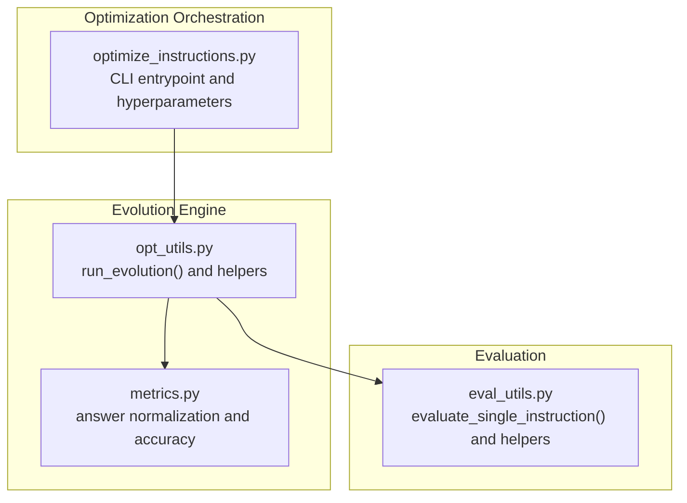
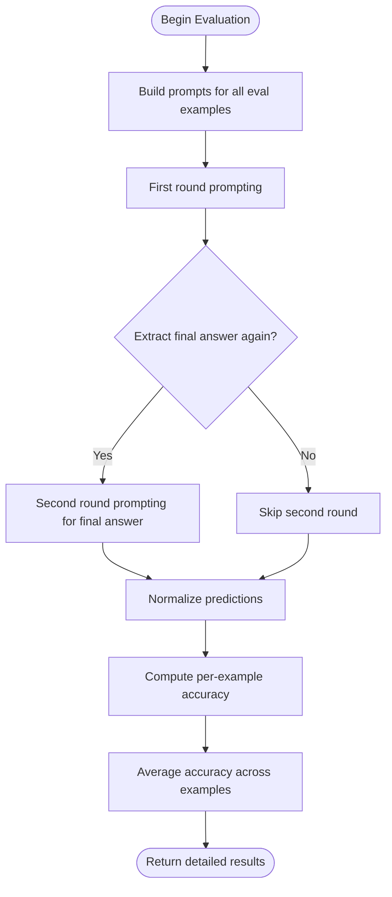
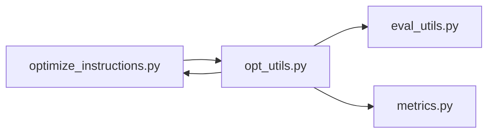

# Instruction Evolution Strategy

<cite>
**Referenced Files in This Document**
- [optimize_instructions.py](file://opro/optimization/optimize_instructions.py)
- [opt_utils.py](file://opro/optimization/opt_utils.py)
- [eval_utils.py](file://opro/evaluation/eval_utils.py)
- [metrics.py](file://opro/evaluation/metrics.py)
</cite>

## Table of Contents
1. [Introduction](#introduction)
2. [Project Structure](#project-structure)
3. [Core Components](#core-components)
4. [Architecture Overview](#architecture-overview)
5. [Detailed Component Analysis](#detailed-component-analysis)
6. [Dependency Analysis](#dependency-analysis)
7. [Performance Considerations](#performance-considerations)
8. [Troubleshooting Guide](#troubleshooting-guide)
9. [Conclusion](#conclusion)

## Introduction
This document explains the instruction evolution strategy implemented around the run_evolution function. The system maintains a population of high-scoring instructions and iteratively improves them by generating new candidate instructions via an optimizer LLM guided by a meta-prompt. Selection filters discard low-performing candidates, while diversity is controlled by limiting the number of stored instructions. Temperature scheduling governs exploration vs. exploitation trade-offs during instruction generation. Few-shot exemplars are selected using four strategies to focus learning on problematic areas. Performance characteristics include the cost of maintaining a counter for wrong questions and strategies to reduce evaluation overhead via eval_interval.

## Project Structure
The instruction evolution pipeline spans two modules:
- Optimization orchestration and configuration
- Evolution loop, meta-prompt construction, and evaluation



**Diagram sources**
- [optimize_instructions.py](file://opro/optimization/optimize_instructions.py#L736-L800)
- [opt_utils.py](file://opro/optimization/opt_utils.py#L338-L1036)
- [eval_utils.py](file://opro/evaluation/eval_utils.py#L536-L917)
- [metrics.py](file://opro/evaluation/metrics.py#L1-L200)

**Section sources**
- [optimize_instructions.py](file://opro/optimization/optimize_instructions.py#L680-L799)
- [opt_utils.py](file://opro/optimization/opt_utils.py#L338-L470)

## Core Components
- run_evolution: The central loop that initializes a population, generates new instructions, evaluates them, prunes low scorers, and periodically evaluates on held-out data.
- Meta-prompt construction: Builds a prompt that includes recent high-scoring instructions and optional few-shot exemplars.
- Few-shot selection strategies: Random, constant, accumulative_most_frequent, and current_most_frequent.
- Temperature scheduling: Constant or linear increase over steps.
- Evaluation: Scores instructions on training data and optionally on held-out eval set via eval_interval.

**Section sources**
- [opt_utils.py](file://opro/optimization/opt_utils.py#L338-L1036)
- [eval_utils.py](file://opro/evaluation/eval_utils.py#L536-L917)

## Architecture Overview
The evolution process is a closed-loop iterative improvement system:
- Initialize population with baseline instructions
- At each step:
  - Select few-shot exemplars based on chosen strategy
  - Build meta-prompt with old instructions and exemplars
  - Generate new instructions using the optimizer LLM with temperature schedule
  - Evaluate new instructions on training data
  - Update population with new high-scoring instructions
  - Periodically evaluate on eval set and persist results

```mermaid
sequenceDiagram
participant CLI as "optimize_instructions.py"
participant EV as "opt_utils.run_evolution()"
participant MP as "Meta-prompt Builder"
participant OPT as "Optimizer LLM"
participant EVAL as "eval_utils.evaluate_single_instruction()"
participant MET as "metrics.py"
CLI->>EV : "Initialize hyperparameters and call run_evolution()"
EV->>EV : "Initialize population and counters"
loop For each step
EV->>MP : "Build meta-prompt with old instructions and few-shot"
MP-->>EV : "Meta-prompt"
EV->>OPT : "Generate N instructions at current temperature"
OPT-->>EV : "Raw outputs"
EV->>EV : "Extract instructions and deduplicate"
EV->>EVAL : "Score new instructions on training"
EVAL->>MET : "Normalize answers and compute accuracy"
MET-->>EVAL : "Per-example accuracy"
EVAL-->>EV : "Average accuracy per instruction"
EV->>EV : "Update population and wrong-question counter"
alt Every eval_interval steps
EV->>EVAL : "Evaluate on eval set"
EVAL-->>EV : "Eval score"
end
end
EV-->>CLI : "Persist results and terminate"
```

**Diagram sources**
- [optimize_instructions.py](file://opro/optimization/optimize_instructions.py#L736-L800)
- [opt_utils.py](file://opro/optimization/opt_utils.py#L568-L1036)
- [eval_utils.py](file://opro/evaluation/eval_utils.py#L536-L917)
- [metrics.py](file://opro/evaluation/metrics.py#L188-L343)

## Detailed Component Analysis

### Evolution Loop and Population Management
- Initialization: Baseline instructions are scored on training data and added to the population with their scores and step indices.
- Population storage: Maintains tuples of (instruction, score, step_index) for both raw and filtered sets. A hash set prevents re-evaluating identical instructions.
- Threshold filtering: New instructions are only kept if they meet the old_instruction_score_threshold; otherwise they are discarded.
- Diversity control: The max_num_instructions cap limits the number of old instructions stored in the meta-prompt, preventing prompt overflow and bias toward very old entries.

Key behaviors:
- Discard low-scoring candidates early to reduce downstream evaluation cost.
- Maintain a rolling window of top-scoring instructions to guide future generations.
- Track wrong-question counts to inform few-shot selection.

**Section sources**
- [opt_utils.py](file://opro/optimization/opt_utils.py#L518-L567)
- [opt_utils.py](file://opro/optimization/opt_utils.py#L803-L823)
- [opt_utils.py](file://opro/optimization/opt_utils.py#L902-L971)

### Temperature Scheduling
- Two modes are supported:
  - constant: Fixed temperature throughout evolution.
  - linear_increase: Temperature increases linearly from a start value to an end value over num_search_steps.
- Impact:
  - Lower temperature encourages exploitation (stable, high-quality outputs).
  - Higher temperature encourages exploration (more diverse, potentially risky outputs).
- The current temperature is computed per step and passed to the optimizer LLM call.

**Section sources**
- [opt_utils.py](file://opro/optimization/opt_utils.py#L409-L412)
- [opt_utils.py](file://opro/optimization/opt_utils.py#L573-L581)

### Few-Shot Selection Strategies
The system selects a small set of exemplars to focus instruction refinement on problematic questions. Four strategies are implemented:

- random
  - Selects a fixed-size random subset of training indices each step.
  - Best when no prior signal about difficulty is available.

- constant
  - Uses a fixed random seed to pick the same subset across steps.
  - Useful for reproducibility and stable feedback loops.

- accumulative_most_frequent
  - Tracks how often each training example has resulted in zero accuracy across all evaluated instructions in the population.
  - Chooses the most frequently wrong examples as exemplars.
  - Effective for focusing on persistent difficulties.

- current_most_frequent
  - Computes wrong-question counts using only the current meta-prompt’s instructions (filtered by threshold).
  - Selects the most frequently wrong examples among those currently considered.
  - Effective for focusing on recent failures introduced by the evolving population.

Selection logic:
- For accumulative_most_frequent and current_most_frequent, a Counter is used to tally wrong occurrences.
- A random subset of the top-k indices is selected to maintain diversity.
- The chosen indices are stored per step for reproducibility and inspection.

**Section sources**
- [opt_utils.py](file://opro/optimization/opt_utils.py#L588-L707)
- [opt_utils.py](file://opro/optimization/opt_utils.py#L615-L669)
- [opt_utils.py](file://opro/optimization/opt_utils.py#L670-L688)

### Meta-Prompt Construction
- The meta-prompt includes:
  - A curated list of high-scoring instructions and their scores (subject to threshold and max_num_instructions).
  - Optional few-shot QA pairs when few_shot_qa_pairs is enabled.
- The prompt format depends on:
  - Optimizer model type (e.g., GPT vs. PaLM).
  - Instruction position (before_Q, Q_begin, Q_end, A_begin).
  - Whether exemplars appear before or after instruction-score pairs.
- The instruction-score list is truncated to max_num_instructions and filtered by old_instruction_score_threshold.

**Section sources**
- [opt_utils.py](file://opro/optimization/opt_utils.py#L90-L191)
- [opt_utils.py](file://opro/optimization/opt_utils.py#L191-L271)
- [opt_utils.py](file://opro/optimization/opt_utils.py#L271-L336)

### Evaluation Pipeline and Accuracy Computation
- Training evaluation:
  - New instructions are scored on training indices using evaluate_single_instruction().
  - The function builds prompts, optionally prompts twice for final answer extraction, normalizes predictions, and computes per-example accuracy.
  - Average accuracy is recorded and used to update the population.
- Eval set evaluation:
  - Every eval_interval steps, instructions that were not skipped are evaluated on the eval set and their scores are recorded.
- Accuracy computation:
  - Exact symbol/text match, inclusion of correct choice text while excluding others, and boolean match heuristics are combined.
  - For multiple-choice, the system identifies the correct choice text and checks that it is included while other choices are excluded.
  - Normalization routines handle punctuation, bracketed choices, and numeric rounding.



**Diagram sources**
- [eval_utils.py](file://opro/evaluation/eval_utils.py#L536-L917)
- [metrics.py](file://opro/evaluation/metrics.py#L188-L343)

**Section sources**
- [opt_utils.py](file://opro/optimization/opt_utils.py#L902-L1010)
- [eval_utils.py](file://opro/evaluation/eval_utils.py#L536-L917)
- [metrics.py](file://opro/evaluation/metrics.py#L188-L343)

## Dependency Analysis
- optimize_instructions.py orchestrates hyperparameters and invokes run_evolution.
- run_evolution depends on:
  - eval_utils.evaluate_single_instruction for scoring
  - metrics for normalization and accuracy
  - Dataset loaders and prompt formatting utilities (via eval_utils)
- Few-shot selection relies on:
  - wrong_questions_from_start_counter for accumulative_most_frequent
  - per-step instruction results for current_most_frequent



**Diagram sources**
- [optimize_instructions.py](file://opro/optimization/optimize_instructions.py#L736-L800)
- [opt_utils.py](file://opro/optimization/opt_utils.py#L338-L1036)
- [eval_utils.py](file://opro/evaluation/eval_utils.py#L536-L917)
- [metrics.py](file://opro/evaluation/metrics.py#L188-L343)

**Section sources**
- [optimize_instructions.py](file://opro/optimization/optimize_instructions.py#L736-L800)
- [opt_utils.py](file://opro/optimization/opt_utils.py#L338-L470)

## Performance Considerations
- Computational cost of wrong_questions_from_start_counter:
  - Maintaining a counter over all training examples adds memory proportional to the dataset size and updates per evaluation.
  - For large datasets, consider:
    - Sampling indices for the counter updates if the dataset is very large.
    - Using a sliding window of recent wrong examples to bound memory.
    - Persisting and loading the counter to resume runs efficiently.
- Reducing evaluation frequency:
  - Use eval_interval to evaluate on the eval set only every K steps, trading off latency for throughput.
  - Keep num_generated_instructions_in_each_step moderate to balance exploration and cost.
- Deduplication and pruning:
  - Early filtering by old_instruction_score_threshold reduces downstream evaluation workload.
  - Deduplicating instructions avoids redundant scoring.
- Parallelization:
  - evaluate_in_parallel enables multi-threaded prompting when appropriate; disable for certain models as configured.

[No sources needed since this section provides general guidance]

## Troubleshooting Guide
- Instructions not appearing in results:
  - Check old_instruction_score_threshold: very low thresholds may discard good instructions unintentionally.
  - Verify max_num_instructions: if too small, recent high-scoring instructions may be trimmed.
- Few-shot selection seems random:
  - Confirm few_shot_selection_criteria is set appropriately.
  - For current_most_frequent, ensure the population contains recent instructions; if population is empty, it falls back to a heuristic.
- Evaluation stalls or timeouts:
  - Increase max_retry and sleep_time in evaluation calls.
  - Reduce batch_size or num_decodes if server-side rate limits are hit.
- Accuracy parsing issues:
  - Review prediction_treat_as_number and prediction_treat_as_bool flags to match dataset semantics.
  - For GPT models, enable extract_final_answer_by_prompting_again to improve final answer extraction.

**Section sources**
- [opt_utils.py](file://opro/optimization/opt_utils.py#L568-L1036)
- [eval_utils.py](file://opro/evaluation/eval_utils.py#L536-L917)

## Conclusion
The instruction evolution strategy centers on a robust loop that balances exploration and exploitation via temperature scheduling, focuses refinement on difficult examples through few-shot selection, and maintains a manageable population of high-scoring instructions. By combining careful selection, efficient evaluation, and periodic held-out validation, the system iteratively improves instruction quality while controlling computational costs.