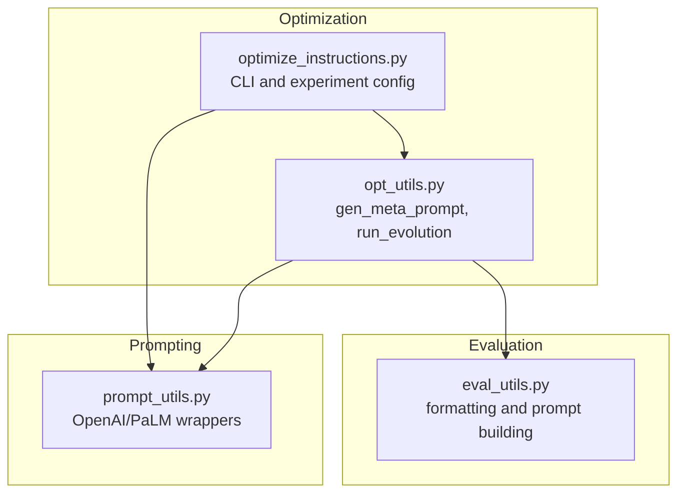
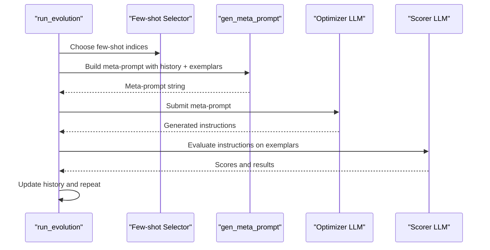
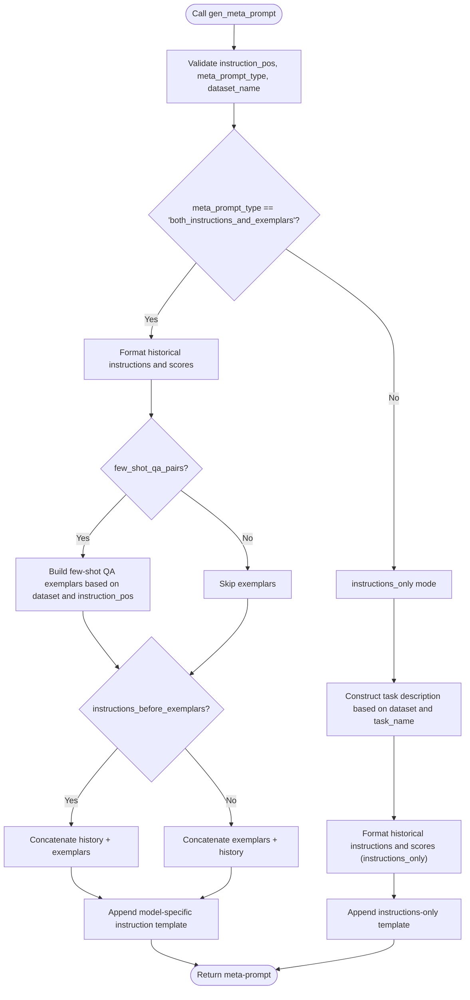
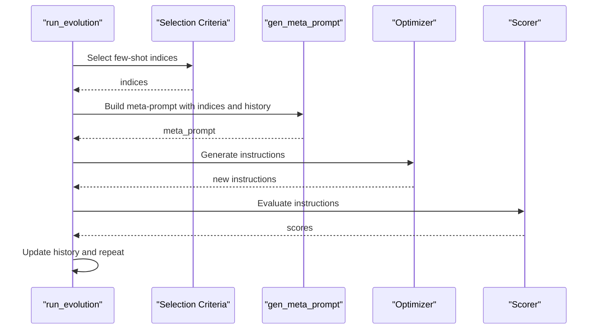
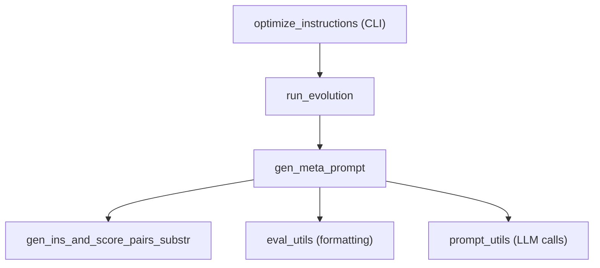

# Meta-Prompt Generation

<cite>
**Referenced Files in This Document**
- [opt_utils.py](file://opro/optimization/opt_utils.py)
- [optimize_instructions.py](file://opro/optimization/optimize_instructions.py)
- [eval_utils.py](file://opro/evaluation/eval_utils.py)
- [prompt_utils.py](file://opro/prompt_utils.py)
- [README.md](file://README.md)
</cite>

## Table of Contents
1. [Introduction](#introduction)
2. [Project Structure](#project-structure)
3. [Core Components](#core-components)
4. [Architecture Overview](#architecture-overview)
5. [Detailed Component Analysis](#detailed-component-analysis)
6. [Dependency Analysis](#dependency-analysis)
7. [Performance Considerations](#performance-considerations)
8. [Troubleshooting Guide](#troubleshooting-guide)
9. [Conclusion](#conclusion)
10. [Appendices](#appendices)

## Introduction
This document explains the meta-prompt generation system centered on the gen_meta_prompt function in opt_utils.py. It describes how historical instruction-score pairs are transformed into effective meta-prompts that guide optimizer LLMs toward better instruction generation. Two meta_prompt_type strategies are covered:
- both_instructions_and_exemplars: designed for fine-tuned optimizers, combining prior instructions with dataset exemplars.
- instructions_only: designed for pre-trained models, focusing on instruction guidance without dataset exemplars.

We also detail the construction of meta-prompt components, including instruction-score formatting, few-shot QA pairs, and positional templates for different instruction_pos values. The impact of parameters such as meta_prompt_instructions_before_exemplars and num_score_buckets is explained, along with practical examples for datasets (MMLU, BBH, GSM8K) and optimizer models (GPT, PaLM). Finally, we address common issues like prompt overflow and solutions such as max_num_instructions capping.

## Project Structure
The meta-prompt generation pipeline spans several modules:
- Optimization utilities: gen_meta_prompt orchestrates meta-prompt assembly.
- Optimization runner: controls the evolutionary loop, including few-shot selection and meta-prompt generation.
- Evaluation utilities: provide helpers for formatting dataset examples and prompts.
- Prompting utilities: wrap external model APIs for GPT and PaLM.

**Diagram sources**
- [opt_utils.py](file://opro/optimization/opt_utils.py#L90-L335)
- [optimize_instructions.py](file://opro/optimization/optimize_instructions.py#L1-L200)
- [eval_utils.py](file://opro/evaluation/eval_utils.py#L160-L260)
- [prompt_utils.py](file://opro/prompt_utils.py#L21-L133)

**Section sources**
- [README.md](file://README.md#L25-L45)
- [opt_utils.py](file://opro/optimization/opt_utils.py#L90-L335)
- [optimize_instructions.py](file://opro/optimization/optimize_instructions.py#L1-L200)
- [eval_utils.py](file://opro/evaluation/eval_utils.py#L160-L260)
- [prompt_utils.py](file://opro/prompt_utils.py#L21-L133)

## Core Components
- gen_meta_prompt: The core function that constructs meta-prompts from historical instruction-score pairs, dataset exemplars, and positional templates. It supports two meta_prompt_type modes and multiple instruction positions.
- gen_ins_and_score_pairs_substr: Formats historical instruction-score pairs into a compact string, with optional bucketization of scores and capping by max_num_instructions.
- run_evolution: The orchestration loop that selects few-shot exemplars, builds meta-prompts, calls the optimizer, evaluates results, and iteratively improves instructions.

Key parameters influencing meta-prompt effectiveness:
- meta_prompt_type: Controls whether to include dataset exemplars alongside historical instructions.
- instruction_pos: Determines where the instruction placeholder appears in the exemplars (before_Q, Q_begin, Q_end, A_begin).
- few_shot_qa_pairs: Whether to include few-shot QA exemplars in the meta-prompt.
- few_shot_index_list: Indices of exemplars selected for inclusion.
- instructions_before_exemplars: Order of components in the meta-prompt.
- num_score_buckets: Bucketization of continuous scores for compactness.
- max_num_instructions: Caps the number of historical instructions included to prevent prompt overflow.

**Section sources**
- [opt_utils.py](file://opro/optimization/opt_utils.py#L52-L88)
- [opt_utils.py](file://opro/optimization/opt_utils.py#L90-L335)
- [opt_utils.py](file://opro/optimization/opt_utils.py#L338-L800)

## Architecture Overview
The meta-prompt generation pipeline integrates with the broader optimization loop. At each step, the runner selects few-shot exemplars, constructs a meta-prompt, and asks the optimizer to propose new instructions. The scoring loop then evaluates these instructions and updates the history.

**Diagram sources**
- [opt_utils.py](file://opro/optimization/opt_utils.py#L680-L740)
- [opt_utils.py](file://opro/optimization/opt_utils.py#L90-L335)
- [prompt_utils.py](file://opro/prompt_utils.py#L21-L133)

## Detailed Component Analysis

### gen_meta_prompt: Meta-Prompt Construction
gen_meta_prompt composes a meta-prompt from:
- Historical instruction-score pairs: formatted via gen_ins_and_score_pairs_substr.
- Few-shot QA exemplars: constructed from dataset-specific loaders and instruction positions.
- Positional templates: tailored to instruction_pos and optimizer model.
- Ordering control: instructions_before_exemplars determines component order.

Behavioral highlights:
- Validation of instruction_pos and meta_prompt_type.
- Dataset-aware formatting for MMLU, BBH, and GSM8K exemplars.
- Model-specific instruction placeholders and templates for GPT vs PaLM.
- Conditional inclusion of “Q:” and “A:” markers based on include_qa and instruction_pos.

**Diagram sources**
- [opt_utils.py](file://opro/optimization/opt_utils.py#L90-L335)

**Section sources**
- [opt_utils.py](file://opro/optimization/opt_utils.py#L90-L335)

### gen_ins_and_score_pairs_substr: Instruction-Score Formatting
This helper formats historical instruction-score pairs into a readable string, with:
- Sorting by score and capping by max_num_instructions.
- Optional filtering by old_instruction_score_threshold.
- Optional bucketization of scores via num_score_buckets.

Impact on meta-prompt effectiveness:
- Bucketization reduces token count and stabilizes perceived differences among scores.
- Capping prevents prompt overflow and keeps the meta-prompt concise.

**Section sources**
- [opt_utils.py](file://opro/optimization/opt_utils.py#L52-L88)

### run_evolution: Evolution Loop and Few-Shot Selection
The runner coordinates:
- Few-shot selection criteria: accumulative_most_frequent, current_most_frequent, constant, random.
- Building meta-prompts with selected exemplars and historical instructions.
- Calling optimizer and scoring servers.
- Updating the instruction history and evaluation intervals.

**Diagram sources**
- [opt_utils.py](file://opro/optimization/opt_utils.py#L680-L740)
- [opt_utils.py](file://opro/optimization/opt_utils.py#L90-L335)

**Section sources**
- [opt_utils.py](file://opro/optimization/opt_utils.py#L338-L800)

### Positional Templates and Instruction Positions
Instruction placement is controlled by instruction_pos:
- before_Q: Place the instruction before the question marker.
- Q_begin: Place the instruction at the beginning of the question.
- Q_end: Place the instruction at the end of the question.
- A_begin: Place the instruction at the beginning of the answer.

The function adapts exemplar formatting and templates accordingly, including dataset-specific question formatting and answer targets.

**Section sources**
- [opt_utils.py](file://opro/optimization/opt_utils.py#L140-L159)
- [opt_utils.py](file://opro/optimization/opt_utils.py#L210-L254)
- [eval_utils.py](file://opro/evaluation/eval_utils.py#L160-L260)

### Meta-Prompt Types: both_instructions_and_exemplars vs instructions_only
- both_instructions_and_exemplars:
  - Includes historical instruction-score pairs and dataset exemplars.
  - Uses model-specific templates and placeholders for GPT and PaLM.
  - Supports ordering via instructions_before_exemplars.
- instructions_only:
  - Designed for pre-trained optimizers.
  - Provides a concise instruction template with dataset/task-aware descriptions.
  - Uses a simpler historical instruction formatting scheme.

**Section sources**
- [opt_utils.py](file://opro/optimization/opt_utils.py#L160-L296)
- [opt_utils.py](file://opro/optimization/opt_utils.py#L296-L335)

### Dataset-Specific Example Construction
- MMLU: Uses eval_utils._format_mmlu_example to build the question text and true answer extraction.
- BBH: Uses data entries’ input/target fields.
- GSM8K: Uses tabular data with question and answer columns.

These are integrated into few-shot QA exemplars when few_shot_qa_pairs is enabled.

**Section sources**
- [opt_utils.py](file://opro/optimization/opt_utils.py#L209-L218)
- [eval_utils.py](file://opro/evaluation/eval_utils.py#L120-L151)
- [eval_utils.py](file://opro/evaluation/eval_utils.py#L262-L286)

### Practical Examples of Meta-Prompts
Below are representative examples of meta-prompts generated for different datasets and optimizer models. These illustrate the structure and content without reproducing exact text.

- GPT-based optimizer with both_instructions_and_exemplars on GSM8K:
  - Includes historical instruction-score pairs.
  - Few-shot QA exemplars with placeholders at Q_begin/Q_end/A_begin depending on instruction_pos.
  - Final instruction template instructing GPT to produce a new instruction or starting sentence.

- PaLM-based optimizer with both_instructions_and_exemplars on MMLU:
  - Similar structure but adapted for PaLM’s text-bison model.
  - Exemplars demonstrate applying the instruction to multiple-choice questions.

- Pre-trained optimizer (instructions_only) on BBH:
  - Instruction-only template describing the task as “logical reasoning.”
  - Historical instructions are presented with precision scores and <TEXT> markers.

Note: The exact wording and formatting depend on instruction_pos, dataset_name, and meta_prompt_type.

**Section sources**
- [opt_utils.py](file://opro/optimization/opt_utils.py#L160-L296)
- [opt_utils.py](file://opro/optimization/opt_utils.py#L296-L335)

## Dependency Analysis
The meta-prompt generation depends on:
- Historical instruction scoring and formatting (gen_ins_and_score_pairs_substr).
- Dataset-specific formatting utilities (eval_utils).
- Optimizer and scorer server wrappers (prompt_utils).
- CLI and experiment configuration (optimize_instructions).

**Diagram sources**
- [opt_utils.py](file://opro/optimization/opt_utils.py#L52-L88)
- [opt_utils.py](file://opro/optimization/opt_utils.py#L90-L335)
- [eval_utils.py](file://opro/evaluation/eval_utils.py#L160-L260)
- [prompt_utils.py](file://opro/prompt_utils.py#L21-L133)
- [optimize_instructions.py](file://opro/optimization/optimize_instructions.py#L1-L200)

**Section sources**
- [opt_utils.py](file://opro/optimization/opt_utils.py#L52-L88)
- [opt_utils.py](file://opro/optimization/opt_utils.py#L90-L335)
- [eval_utils.py](file://opro/evaluation/eval_utils.py#L160-L260)
- [prompt_utils.py](file://opro/prompt_utils.py#L21-L133)
- [optimize_instructions.py](file://opro/optimization/optimize_instructions.py#L1-L200)

## Performance Considerations
- Prompt length control:
  - max_num_instructions caps the number of historical instructions to prevent overflow.
  - num_score_buckets reduces token usage by bucketizing scores.
- Few-shot selection:
  - Current most frequent wrong exemplars can improve focus on problematic areas.
  - Random or constant selection can balance exploration and stability.
- Model-specific decoding:
  - Optimizer and scorer configurations are tuned for throughput and cost.

[No sources needed since this section provides general guidance]

## Troubleshooting Guide
Common issues and solutions:
- Prompt overflow from excessive historical instructions:
  - Increase max_num_instructions to include more history, or reduce it to constrain tokens.
  - Use num_score_buckets to compress score representation.
- Few-shot exemplars not improving instruction quality:
  - Switch few_shot_selection_criteria to current_most_frequent to adapt to recent failures.
  - Adjust num_few_shot_questions_for_instruction_refinement to control exemplar density.
- Inconsistent instruction formatting:
  - Verify instruction_pos and include_qa settings match the dataset and model expectations.
  - Ensure dataset_name and task_name are correctly set for instructions_only mode.

**Section sources**
- [opt_utils.py](file://opro/optimization/opt_utils.py#L52-L88)
- [opt_utils.py](file://opro/optimization/opt_utils.py#L680-L740)
- [optimize_instructions.py](file://opro/optimization/optimize_instructions.py#L700-L740)

## Conclusion
The meta-prompt generation system transforms historical instruction-score pairs into actionable guidance for optimizer LLMs. By supporting two meta_prompt_type modes, flexible instruction positions, and dataset-aware exemplars, it enables robust instruction refinement across MMLU, BBH, and GSM8K. Careful tuning of parameters like max_num_instructions and num_score_buckets helps maintain prompt tractability and effectiveness.

[No sources needed since this section summarizes without analyzing specific files]

## Appendices

### Parameter Reference
- meta_prompt_type: "both_instructions_and_exemplars" or "instructions_only".
- instruction_pos: "before_Q", "Q_begin", "Q_end", "A_begin".
- few_shot_qa_pairs: Enable/disable exemplars.
- few_shot_index_list: Selected exemplar indices.
- instructions_before_exemplars: Order of components in the meta-prompt.
- num_score_buckets: Bucketization of scores.
- max_num_instructions: Cap on historical instructions.
- dataset_name: "mmlu", "bbh", "gsm8k".
- task_name: Task identifier for instructions_only mode.

**Section sources**
- [opt_utils.py](file://opro/optimization/opt_utils.py#L90-L335)
- [optimize_instructions.py](file://opro/optimization/optimize_instructions.py#L700-L740)