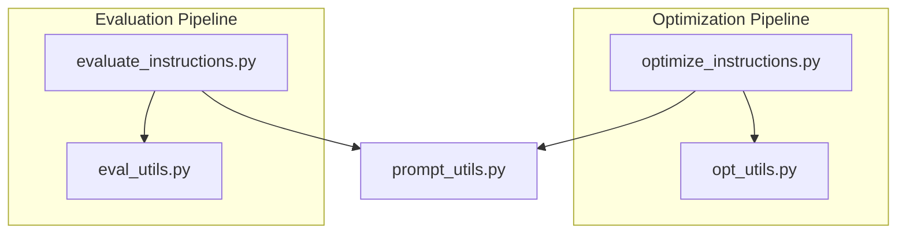
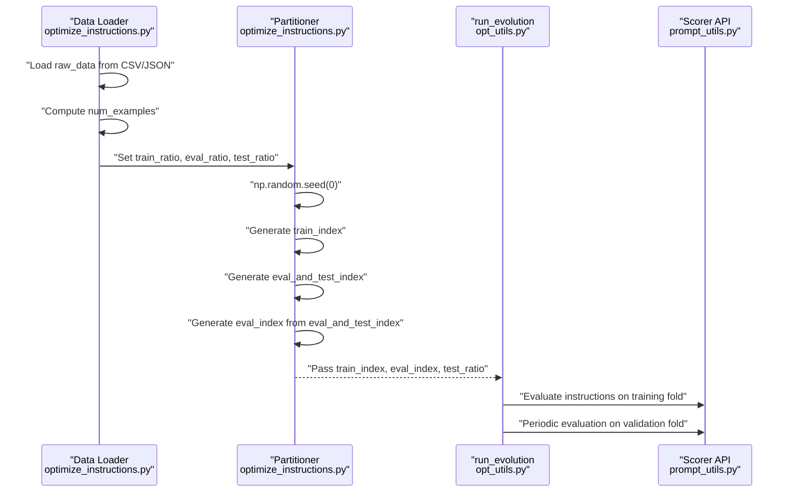
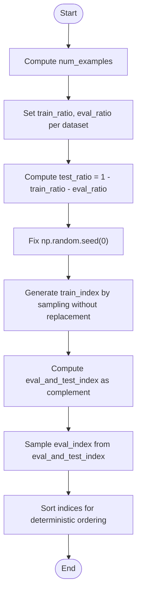
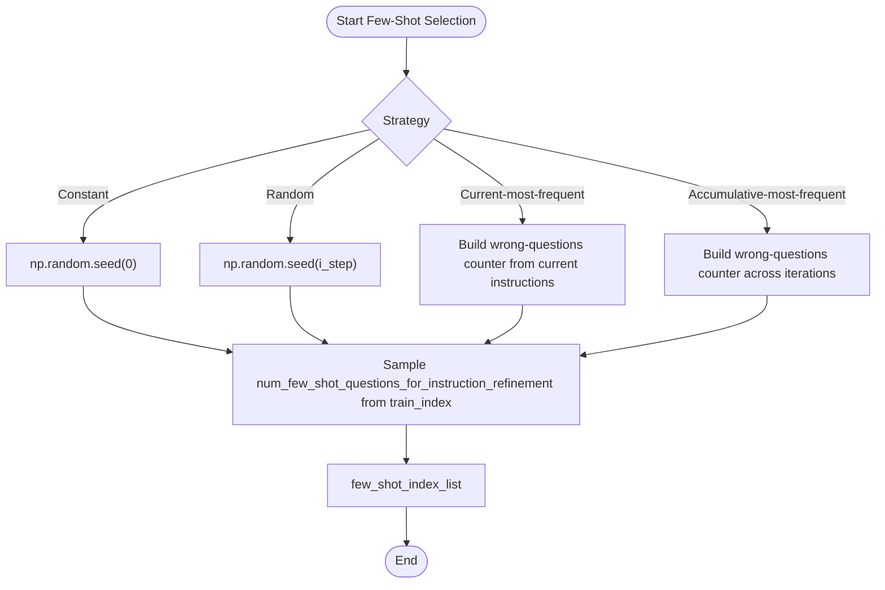
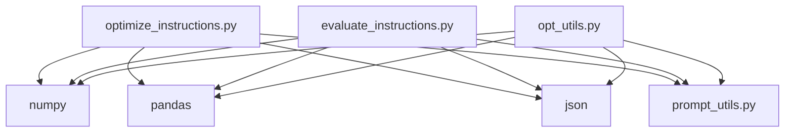

# Dataset Partitioning

<cite>
**Referenced Files in This Document**
- [optimize_instructions.py](file://opro/optimization/optimize_instructions.py)
- [opt_utils.py](file://opro/optimization/opt_utils.py)
- [evaluate_instructions.py](file://opro/evaluation/evaluate_instructions.py)
- [eval_utils.py](file://opro/evaluation/eval_utils.py)
- [prompt_utils.py](file://opro/prompt_utils.py)
</cite>

## Table of Contents
1. [Introduction](#introduction)
2. [Project Structure](#project-structure)
3. [Core Components](#core-components)
4. [Architecture Overview](#architecture-overview)
5. [Detailed Component Analysis](#detailed-component-analysis)
6. [Dependency Analysis](#dependency-analysis)
7. [Performance Considerations](#performance-considerations)
8. [Troubleshooting Guide](#troubleshooting-guide)
9. [Conclusion](#conclusion)
10. [Appendices](#appendices)

## Introduction
This document explains how dataset partitioning is performed during initialization for the prompt optimization workflow. It focuses on the train_ratio, eval_ratio, and test_ratio parameters used in run_evolution, detailing how raw_data is split into training, validation, and test sets using numpy random sampling with a fixed seed for reproducibility. It also documents the data flow from num_examples calculation through train_index generation to the creation of eval_and_test_index subsets, and describes how these partitions are used in the optimization workflow: training data for instruction scoring, validation data for periodic evaluation, and test data for final assessment. Concrete examples of partition sizes for MMLU, BBH, and GSM8K are provided, along with configuration guidance for optimize_instructions.py. Finally, it addresses common issues such as data leakage between partitions, class imbalance in few-shot selection, and strategies for ensuring representative splits across diverse task distributions.

## Project Structure
The dataset partitioning logic is implemented primarily in the optimization pipeline and evaluation utilities. The key files are:
- opro/optimization/optimize_instructions.py: orchestrates dataset loading, partitioning, and passes indices to run_evolution.
- opro/optimization/opt_utils.py: implements run_evolution, including the evolution loop, evaluation intervals, and few-shot selection.
- opro/evaluation/evaluate_instructions.py: provides a separate evaluation script with its own train/test split logic.
- opro/evaluation/eval_utils.py: includes utilities for BBH data loading and evaluation helpers.
- opro/prompt_utils.py: integrates with external LLM APIs used by the optimization and evaluation scripts.

**Diagram sources**
- [optimize_instructions.py](file://opro/optimization/optimize_instructions.py#L370-L800)
- [opt_utils.py](file://opro/optimization/opt_utils.py#L338-L800)
- [evaluate_instructions.py](file://opro/evaluation/evaluate_instructions.py#L540-L770)
- [eval_utils.py](file://opro/evaluation/eval_utils.py#L866-L916)
- [prompt_utils.py](file://opro/prompt_utils.py#L1-L146)

**Section sources**
- [optimize_instructions.py](file://opro/optimization/optimize_instructions.py#L370-L800)
- [opt_utils.py](file://opro/optimization/opt_utils.py#L338-L800)
- [evaluate_instructions.py](file://opro/evaluation/evaluate_instructions.py#L540-L770)
- [eval_utils.py](file://opro/evaluation/eval_utils.py#L866-L916)
- [prompt_utils.py](file://opro/prompt_utils.py#L1-L146)

## Core Components
- Dataset loading and preprocessing: raw_data is assembled from CSV or JSON depending on dataset type.
- Ratio configuration: train_ratio, eval_ratio, and test_ratio are set per dataset.
- Random split with fixed seed: numpy random sampling generates train_index and eval_index deterministically.
- Partition usage: train_index for instruction scoring, eval_index for periodic evaluation, and test_index for final assessment in evaluation scripts.

Key implementation references:
- Ratio configuration and split logic in optimize_instructions.py.
- Evolution loop and evaluation intervals in opt_utils.py.
- Evaluation split logic in evaluate_instructions.py.

**Section sources**
- [optimize_instructions.py](file://opro/optimization/optimize_instructions.py#L630-L700)
- [opt_utils.py](file://opro/optimization/opt_utils.py#L478-L520)
- [evaluate_instructions.py](file://opro/evaluation/evaluate_instructions.py#L646-L710)

## Architecture Overview
The dataset partitioning is part of the broader optimization workflow. The high-level flow is:
- Load raw_data from dataset-specific sources.
- Compute num_examples and derive train_ratio, eval_ratio, test_ratio.
- Generate deterministic train_index and eval_index using numpy random sampling with a fixed seed.
- Pass indices to run_evolution for instruction scoring and periodic evaluation.
- Use test_index for final assessment in evaluation scripts.

**Diagram sources**
- [optimize_instructions.py](file://opro/optimization/optimize_instructions.py#L630-L700)
- [opt_utils.py](file://opro/optimization/opt_utils.py#L518-L567)
- [prompt_utils.py](file://opro/prompt_utils.py#L1-L146)

## Detailed Component Analysis

### Partitioning Logic in run_evolution
The partitioning logic is centralized in optimize_instructions.py around the train/eval/test split and passed into run_evolution. The process:
- Calculate num_examples from raw_data shape or length.
- Set dataset-specific train_ratio and eval_ratio.
- Derive test_ratio = 1 - train_ratio - eval_ratio.
- Fix numpy random seed to 0 for reproducibility.
- Generate train_index by sampling without replacement from [0, ..., num_examples-1].
- Build eval_and_test_index as the complement of train_index.
- Sample eval_index from eval_and_test_index using eval_ratio.
- Sort indices to ensure deterministic ordering.

**Diagram sources**
- [optimize_instructions.py](file://opro/optimization/optimize_instructions.py#L630-L700)

**Section sources**
- [optimize_instructions.py](file://opro/optimization/optimize_instructions.py#L630-L700)

### Role of Partitions in the Optimization Workflow
- Training data (train_index): Used to compute instruction scores during initial evaluation and instruction refinement.
- Validation data (eval_index): Periodically evaluated to monitor progress and guide instruction selection criteria.
- Test data: Not used during optimization; reserved for final assessment in evaluation scripts.

Evidence:
- Initial evaluation uses train_index for scoring.
- Few-shot selection strategies sample from train_index.
- Evaluation interval controls periodic validation.

**Section sources**
- [opt_utils.py](file://opro/optimization/opt_utils.py#L518-L567)
- [opt_utils.py](file://opro/optimization/opt_utils.py#L586-L700)

### Data Flow Through Few-Shot Selection
Few-shot selection uses train_index to construct exemplars for instruction refinement. Strategies include:
- Constant: fixed random selection from train_index.
- Random: per-step seeded selection from train_index.
- Current-most-frequent: selects wrong examples from current instructions’ history.
- Accumulative-most-frequent: selects wrong examples across all iterations.

**Diagram sources**
- [opt_utils.py](file://opro/optimization/opt_utils.py#L586-L700)

**Section sources**
- [opt_utils.py](file://opro/optimization/opt_utils.py#L586-L700)

### Final Assessment with Test Data
While the optimization pipeline constructs eval_index for periodic evaluation, the evaluation script provides a dedicated test split for final assessment. It:
- Fixes train_ratio and test_ratio according to flags.
- Generates train_index and test_index deterministically with a fixed seed.
- Evaluates instructions on training and/or test folds and saves detailed results.

**Section sources**
- [evaluate_instructions.py](file://opro/evaluation/evaluate_instructions.py#L110-L117)
- [evaluate_instructions.py](file://opro/evaluation/evaluate_instructions.py#L646-L710)

## Dependency Analysis
The partitioning logic depends on:
- numpy for random sampling and index manipulation.
- pandas for reading CSV data (MMLU/GSM8K).
- JSON parsing for BBH data.
- External LLM APIs for scoring and optimization.

**Diagram sources**
- [optimize_instructions.py](file://opro/optimization/optimize_instructions.py#L370-L800)
- [opt_utils.py](file://opro/optimization/opt_utils.py#L338-L800)
- [evaluate_instructions.py](file://opro/evaluation/evaluate_instructions.py#L540-L770)
- [prompt_utils.py](file://opro/prompt_utils.py#L1-L146)

**Section sources**
- [optimize_instructions.py](file://opro/optimization/optimize_instructions.py#L370-L800)
- [opt_utils.py](file://opro/optimization/opt_utils.py#L338-L800)
- [evaluate_instructions.py](file://opro/evaluation/evaluate_instructions.py#L540-L770)
- [prompt_utils.py](file://opro/prompt_utils.py#L1-L146)

## Performance Considerations
- Deterministic seeding: Using a fixed seed ensures reproducible splits across runs, which is essential for fair comparisons.
- Sorting indices: Ensures consistent ordering and alignment with data structures (e.g., is_multiple_choice arrays).
- Few-shot selection: Random seeds per step enable variability in exemplars while maintaining reproducibility when needed.

[No sources needed since this section provides general guidance]

## Troubleshooting Guide
Common issues and mitigations:
- Data leakage between partitions:
  - Ensure train_index and eval_index are disjoint and derived from the same raw_data.
  - Verify that eval_and_test_index is computed as the complement of train_index.
  - Confirm that eval_index is sampled only from eval_and_test_index.
- Class imbalance in few-shot selection:
  - Use “current_most_frequent” or “accumulative_most_frequent” strategies to bias selection toward problematic examples.
  - Adjust num_few_shot_questions_for_instruction_refinement to balance coverage and diversity.
- Representative splits across diverse tasks:
  - For MMLU, ensure category filtering yields sufficient examples per subject.
  - For BBH, confirm that tasks_all is correctly constrained and indices are mapped per-task when needed.
  - For GSM8K, validate that the dataset split aligns with the intended train/test usage.

**Section sources**
- [optimize_instructions.py](file://opro/optimization/optimize_instructions.py#L630-L700)
- [opt_utils.py](file://opro/optimization/opt_utils.py#L488-L515)
- [opt_utils.py](file://opro/optimization/opt_utils.py#L586-L700)

## Conclusion
Dataset partitioning in this codebase is designed to be deterministic and robust. The train_ratio, eval_ratio, and test_ratio parameters are configured per dataset, and numpy random sampling with a fixed seed guarantees reproducibility. The resulting train_index and eval_index are used throughout the optimization workflow for instruction scoring and periodic evaluation, while a separate evaluation script provides a dedicated test split for final assessment. By following the strategies outlined here—particularly around avoiding data leakage, addressing class imbalance, and ensuring representative splits—the optimization pipeline can yield reliable and comparable results across datasets.

## Appendices

### Concrete Examples of Partition Sizes
The following examples illustrate typical partition configurations and resulting sizes for different datasets. These values depend on the actual dataset sizes and the configured ratios.

- MMLU:
  - train_ratio = 0.8
  - eval_ratio = 0.2
  - test_ratio = 0.0
  - Example: With num_examples ≈ 10000, train_index ≈ 8000, eval_index ≈ 2000, test_index = ∅.

- BBH:
  - train_ratio = 0.2
  - eval_ratio = 0.0
  - test_ratio = 0.8
  - Example: With num_examples ≈ 1000, train_index ≈ 200, eval_index = ∅, test_index ≈ 800.

- GSM8K:
  - train_ratio = 0.035
  - eval_ratio = 0.0
  - test_ratio = 0.965
  - Example: With num_examples ≈ 13000, train_index ≈ 455, eval_index = ∅, test_index ≈ 12545.

These examples reflect the dataset-specific ratio assignments in the optimization pipeline.

**Section sources**
- [optimize_instructions.py](file://opro/optimization/optimize_instructions.py#L639-L650)

### Configuration in optimize_instructions.py
To configure dataset partitioning:
- Modify train_ratio and eval_ratio in the dataset-specific branches before the split logic.
- Ensure train_ratio + eval_ratio ≤ 1 so that test_ratio remains non-negative.
- Keep np.random.seed(0) fixed for reproducibility.

**Section sources**
- [optimize_instructions.py](file://opro/optimization/optimize_instructions.py#L639-L650)
- [optimize_instructions.py](file://opro/optimization/optimize_instructions.py#L660-L680)