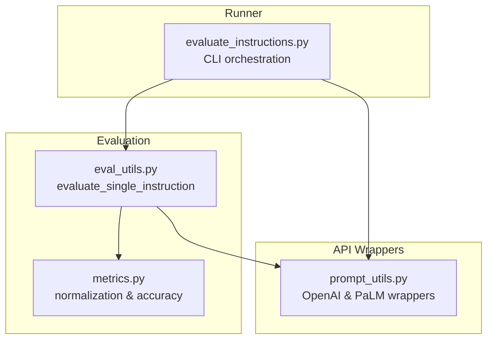
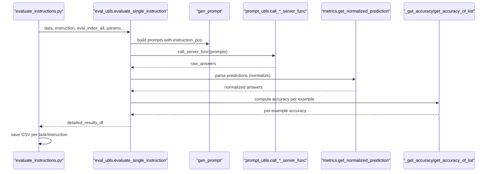
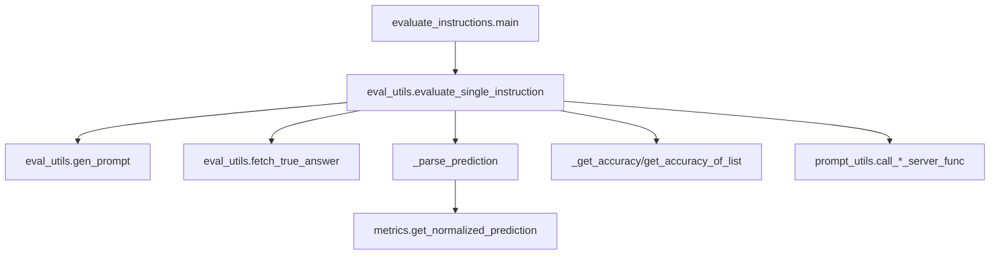

# Evaluation Mechanism

<cite>
**Referenced Files in This Document**
- [eval_utils.py](file://opro/evaluation/eval_utils.py)
- [evaluate_instructions.py](file://opro/evaluation/evaluate_instructions.py)
- [metrics.py](file://opro/evaluation/metrics.py)
- [prompt_utils.py](file://opro/prompt_utils.py)
- [eval_utils_test.py](file://opro/evaluation/eval_utils_test.py)
</cite>

## Table of Contents
1. [Introduction](#introduction)
2. [Project Structure](#project-structure)
3. [Core Components](#core-components)
4. [Architecture Overview](#architecture-overview)
5. [Detailed Component Analysis](#detailed-component-analysis)
6. [Dependency Analysis](#dependency-analysis)
7. [Performance Considerations](#performance-considerations)
8. [Troubleshooting Guide](#troubleshooting-guide)
9. [Conclusion](#conclusion)
10. [Appendices](#appendices)

## Introduction
This document explains the evaluation mechanism during initialization, focusing on the evaluate_single_instruction function in eval_utils.py. It details how the scorer LLM evaluates initial instructions against a training dataset, including prompt construction with instruction_pos placement, model output processing, and accuracy computation. It also documents how raw_data is filtered by train_index to produce detailed_results_df, and how key parameters control evaluation behavior and handle API failures. Finally, it covers performance considerations, error handling for malformed LLM responses, and strategies for ensuring result consistency across runs.

## Project Structure
The evaluation pipeline spans several modules:
- Evaluation utilities: prompt construction, scoring, and result assembly
- Instruction evaluation runner: orchestrates dataset loading, train/test split, and CSV serialization
- Metrics: normalization and accuracy computation
- Prompt utilities: API wrappers for OpenAI and Google Cloud models

**Diagram sources**
- [eval_utils.py](file://opro/evaluation/eval_utils.py#L536-L917)
- [metrics.py](file://opro/evaluation/metrics.py#L1-L496)
- [evaluate_instructions.py](file://opro/evaluation/evaluate_instructions.py#L1-L770)
- [prompt_utils.py](file://opro/prompt_utils.py#L1-L146)

**Section sources**
- [eval_utils.py](file://opro/evaluation/eval_utils.py#L1-L120)
- [evaluate_instructions.py](file://opro/evaluation/evaluate_instructions.py#L1-L120)

## Core Components
- evaluate_single_instruction: central function that builds prompts, calls the scorer, parses outputs, computes accuracy, and returns a detailed DataFrame
- gen_prompt: constructs dataset-specific prompts with configurable instruction placement
- fetch_true_answer: retrieves ground truth labels for each example
- metrics.get_normalized_prediction: normalizes predictions for comparison
- _get_accuracy and get_accuracy_of_list: compute correctness across single and multiple decodes
- _prompting_to_get_raw_answers: robustly calls the inference server with retries and sleep
- prompt_utils: wraps OpenAI and PaLM APIs with retry and rate-limit handling

**Section sources**
- [eval_utils.py](file://opro/evaluation/eval_utils.py#L164-L259)
- [eval_utils.py](file://opro/evaluation/eval_utils.py#L262-L286)
- [eval_utils.py](file://opro/evaluation/eval_utils.py#L338-L379)
- [eval_utils.py](file://opro/evaluation/eval_utils.py#L381-L497)
- [eval_utils.py](file://opro/evaluation/eval_utils.py#L499-L534)
- [metrics.py](file://opro/evaluation/metrics.py#L188-L343)
- [prompt_utils.py](file://opro/prompt_utils.py#L29-L146)

## Architecture Overview
The evaluation flow:
1. The runner loads raw_data and splits into train/test indices
2. For each instruction, evaluate_single_instruction generates prompts, calls the scorer, normalizes predictions, and computes accuracy
3. Results are stored as CSV files per task and instruction

**Diagram sources**
- [evaluate_instructions.py](file://opro/evaluation/evaluate_instructions.py#L673-L766)
- [eval_utils.py](file://opro/evaluation/eval_utils.py#L536-L917)
- [metrics.py](file://opro/evaluation/metrics.py#L188-L343)

## Detailed Component Analysis

### evaluate_single_instruction: End-to-end evaluation flow
Key responsibilities:
- Build prompts for each example using gen_prompt with instruction_pos
- Call the scorer via call_server_func with batching and parallelism
- Optionally prompt again to extract final answers
- Normalize predictions and compute accuracy
- Assemble detailed_results_df with raw_prompt, raw_answer, parsed_answer, true_answer, accuracy

Data flow:
- Inputs: raw_data, instruction, eval_index_all, dataset_name, instruction_pos, is_multiple_choice, num_decodes, prediction_treat_as_number/bool/decimals, is_gpt_model, include_qa, extract_final_answer_by_prompting_again, evaluate_in_parallel, batch_size, num_servers, max_retry, sleep_time
- Outputs: detailed_results_df with columns index_in_raw_dataset, raw_prompt, raw_answer, parsed_answer, true_answer, accuracy; plus optional second-round fields when extract_final_answer_by_prompting_again is enabled

Parallelism and batching:
- When evaluate_in_parallel is True, prompts are grouped into batches sized by batch_size and distributed across num_servers using a thread pool
- Each batch is sent to a different server_index modulo num_servers
- Second-round prompts reuse the same batching and server assignment scheme

Accuracy computation:
- For each example, group num_decodes predictions and compute accuracy using get_accuracy_of_list
- For multiple-choice, input_text is passed to enable text-based checks

CSV serialization:
- After evaluation, detailed_results_df is saved to CSV files under a task-specific folder named by the instruction’s filename

**Section sources**
- [eval_utils.py](file://opro/evaluation/eval_utils.py#L536-L917)
- [evaluate_instructions.py](file://opro/evaluation/evaluate_instructions.py#L673-L766)

### Prompt construction with instruction_pos
The gen_prompt function builds dataset-specific prompts:
- Supports datasets: mmlu, bbh, gsm8k, multiarith, aqua
- Supports instruction placement modes: before_Q, Q_begin, Q_end, A_begin
- Uses dataset-specific formatting helpers (_format_mmlu_example, _format_aqua_example) and fetch_true_answer to assemble question and answer fields

Examples of placement effects:
- before_Q: instruction precedes the Q: block
- Q_begin: instruction inserted at the beginning of the question
- Q_end: instruction appended at the end of the question
- A_begin: instruction placed at the beginning of the answer segment

**Section sources**
- [eval_utils.py](file://opro/evaluation/eval_utils.py#L164-L259)
- [eval_utils.py](file://opro/evaluation/eval_utils.py#L262-L286)
- [eval_utils.py](file://opro/evaluation/eval_utils.py#L126-L161)

### Model output processing and normalization
Two extraction strategies:
- Direct extraction: raw_answers are normalized via metrics.get_normalized_prediction
- Final-answer prompting: a second round prompts “So the final answer is” to improve extraction, then applies normalization

Normalization logic:
- Removes answer indicators and trailing punctuation
- Handles number normalization, rounding, and unit stripping
- Converts 0/1 to boolean when treat_as_bool is True
- Extracts bracketed choices like (A) when present

Parsing and accuracy:
- _parse_prediction handles GPT-style boxed answers and delegates to metrics.get_normalized_prediction
- _get_accuracy and get_accuracy_of_list implement multiple correctness criteria:
  - Exact symbol match (with or without brackets)
  - Text match of the answer choice
  - Inclusion of the true answer text while excluding others
  - Boolean symbol equivalence

**Section sources**
- [eval_utils.py](file://opro/evaluation/eval_utils.py#L788-L863)
- [metrics.py](file://opro/evaluation/metrics.py#L188-L343)
- [eval_utils.py](file://opro/evaluation/eval_utils.py#L381-L497)

### Data flow from raw_data to detailed_results_df
- raw_data is loaded by the runner (evaluate_instructions.py) depending on dataset and task
- train_index or test_index filters exemplars for evaluation
- evaluate_single_instruction:
  - Generates prompts for eval_index_all
  - Calls the scorer (optionally in parallel and batched)
  - Parses and normalizes predictions
  - Computes accuracy per example
  - Constructs detailed_results_df with index_in_raw_dataset, raw_prompt, raw_answer, parsed_answer, true_answer, accuracy

CSV storage:
- Per-task folders are created under outputs/scorer-outputs/
- CSV filenames encode dataset/task, fold ratio, and instruction hash/filename

**Section sources**
- [evaluate_instructions.py](file://opro/evaluation/evaluate_instructions.py#L554-L766)
- [eval_utils.py](file://opro/evaluation/eval_utils.py#L536-L917)

### Parameter roles and behavior controls
- batch_size: controls batching for model serving; affects throughput and resource utilization
- num_servers: distributes batches across multiple servers for parallelism
- max_retry and sleep_time: control retry attempts and backoff for API failures
- evaluate_in_parallel: toggles multithreading batching vs. sequential calls
- num_decodes: enables multiple decoding per prompt; accuracy aggregates across decodes
- prediction_treat_as_number/bool/decimals: tuning for numeric and boolean tasks
- is_gpt_model: adjusts parsing for GPT-style boxed answers
- include_qa and instruction_pos: control prompt structure and instruction placement
- extract_final_answer_by_prompting_again: adds a second round to improve extraction quality

**Section sources**
- [eval_utils.py](file://opro/evaluation/eval_utils.py#L536-L917)
- [evaluate_instructions.py](file://opro/evaluation/evaluate_instructions.py#L527-L766)

### API failure handling and robustness
- _prompting_to_get_raw_answers retries on exceptions up to max_retry with sleep_time intervals
- prompt_utils wraps OpenAI and PaLM APIs with explicit error handling for timeouts, rate limits, API errors, connection issues, and service unavailability, including exponential or fixed backoff
- For GPT models, evaluate_in_parallel is disabled to avoid concurrency issues with streaming or rate-limited endpoints

**Section sources**
- [eval_utils.py](file://opro/evaluation/eval_utils.py#L338-L379)
- [prompt_utils.py](file://opro/prompt_utils.py#L29-L146)
- [evaluate_instructions.py](file://opro/evaluation/evaluate_instructions.py#L527-L547)

### Accuracy computation and consistency
- get_accuracy_of_list averages correctness across multiple decodes per example
- For multiple-choice, input_text enables text-based checks to reduce false negatives
- Consistency across runs:
  - Fixed random seed for train/test split
  - Deterministic instruction filename hashing
  - CSV serialization preserves row ordering by index_in_raw_dataset

**Section sources**
- [eval_utils.py](file://opro/evaluation/eval_utils.py#L499-L534)
- [evaluate_instructions.py](file://opro/evaluation/evaluate_instructions.py#L646-L671)

## Dependency Analysis

**Diagram sources**
- [eval_utils.py](file://opro/evaluation/eval_utils.py#L536-L917)
- [metrics.py](file://opro/evaluation/metrics.py#L188-L343)
- [evaluate_instructions.py](file://opro/evaluation/evaluate_instructions.py#L673-L766)
- [prompt_utils.py](file://opro/prompt_utils.py#L29-L146)

**Section sources**
- [eval_utils.py](file://opro/evaluation/eval_utils.py#L536-L917)
- [metrics.py](file://opro/evaluation/metrics.py#L188-L343)
- [evaluate_instructions.py](file://opro/evaluation/evaluate_instructions.py#L673-L766)
- [prompt_utils.py](file://opro/prompt_utils.py#L29-L146)

## Performance Considerations
- Throughput and latency:
  - Parallelism: evaluate_in_parallel=True with num_servers and batch_size increases throughput but may increase API costs and contention
  - Batching: larger batch_size reduces overhead but can increase latency and memory usage
  - Decoding: num_decodes > 1 improves robustness but increases cost and time linearly
- API rate limiting:
  - prompt_utils handles rate limits with retry-after delays; tune max_retry and sleep_time accordingly
  - For GPT models, disabling parallelism avoids concurrency-related issues
- Cost implications:
  - Larger batch_size, num_decodes, and num_servers increase token usage and cost
  - Consider adaptive prediction_treat_as_number to avoid unnecessary normalization overhead
- Extraction quality:
  - extract_final_answer_by_prompting_again improves parsing reliability at extra cost and latency
- Stability:
  - Fixed seeds and deterministic filenames ensure reproducibility across runs

[No sources needed since this section provides general guidance]

## Troubleshooting Guide
Common issues and remedies:
- Malformed LLM responses:
  - Use extract_final_answer_by_prompting_again to improve structured extraction
  - Tune prediction_treat_as_number/bool/decimals for numeric/boolean tasks
  - Validate instruction_pos placement to minimize ambiguity
- API failures:
  - Increase max_retry and adjust sleep_time
  - Monitor rate-limit errors and reduce batch_size or num_servers
  - For GPT models, disable parallelism to avoid endpoint issues
- Inconsistent results:
  - Ensure fixed random seed and deterministic instruction filename
  - Verify dataset/task selection and train/test split logic
- Accuracy anomalies:
  - For multiple-choice, confirm input_text is provided to enable text-based checks
  - Review is_multiple_choice flags and dataset-specific task categories

**Section sources**
- [eval_utils.py](file://opro/evaluation/eval_utils.py#L338-L379)
- [eval_utils.py](file://opro/evaluation/eval_utils.py#L788-L863)
- [metrics.py](file://opro/evaluation/metrics.py#L188-L343)
- [evaluate_instructions.py](file://opro/evaluation/evaluate_instructions.py#L646-L766)

## Conclusion
The evaluation mechanism centers on evaluate_single_instruction, which constructs dataset-aware prompts with flexible instruction placement, robustly calls the scorer with retries, normalizes and validates model outputs, and computes accurate per-example scores. The runner coordinates data loading, train/test splits, and CSV serialization. Proper tuning of batch_size, num_servers, max_retry, and extraction strategies balances throughput, cost, and accuracy. Robust error handling and deterministic workflows ensure reliable and repeatable evaluations.

[No sources needed since this section summarizes without analyzing specific files]

## Appendices

### Example evaluation outputs and storage
- Output files:
  - Training fold: {ratio}-TRAIN-{instruction_filename}.csv
  - Test fold: {ratio}-TEST-{instruction_filename}.csv
  - Combined: {instruction_filename}.csv (concatenated and sorted by index_in_raw_dataset)
- Columns include index_in_raw_dataset, raw_prompt, raw_answer, parsed_answer, true_answer, accuracy; optional second-round fields when extract_final_answer_by_prompting_again is enabled

**Section sources**
- [evaluate_instructions.py](file://opro/evaluation/evaluate_instructions.py#L701-L760)

### Accuracy computation details
- Multiple-choice tasks rely on symbol/text inclusion/exclusion checks
- Numeric tasks use normalized number comparison with tolerance
- Boolean tasks convert 0/1 and textual equivalents to boolean for comparison

**Section sources**
- [eval_utils.py](file://opro/evaluation/eval_utils.py#L381-L497)
- [metrics.py](file://opro/evaluation/metrics.py#L443-L496)