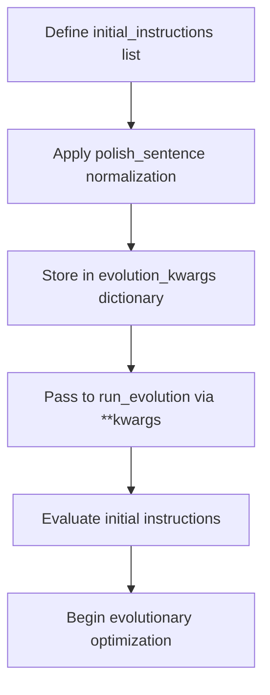
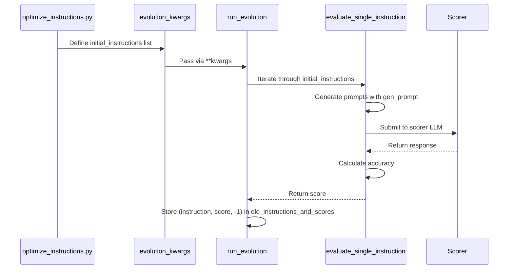
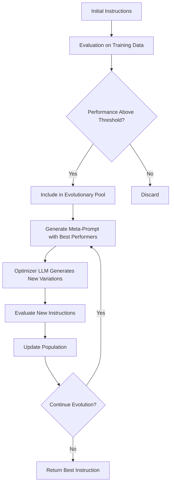
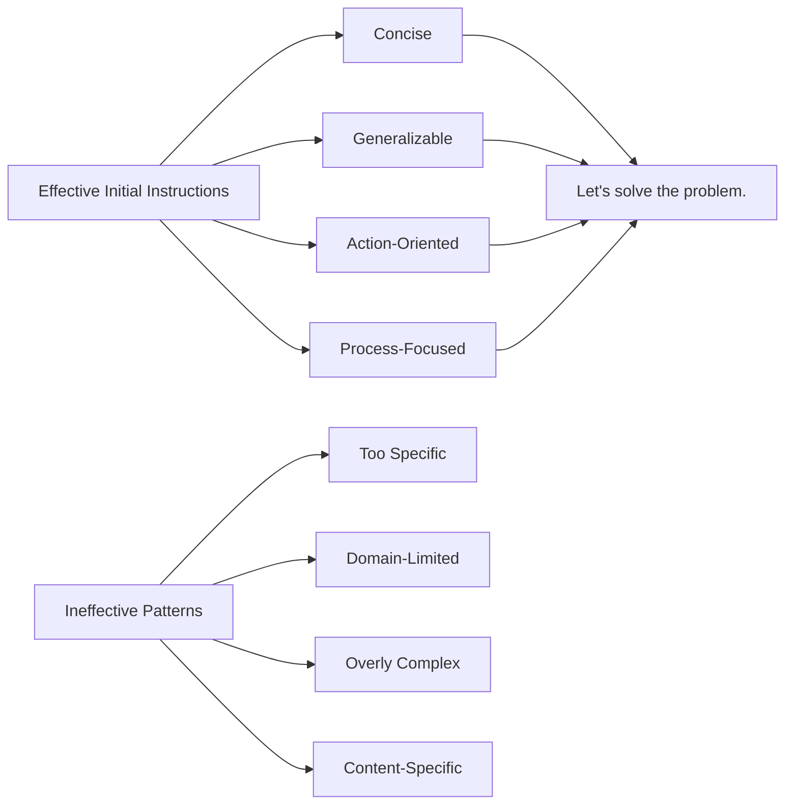
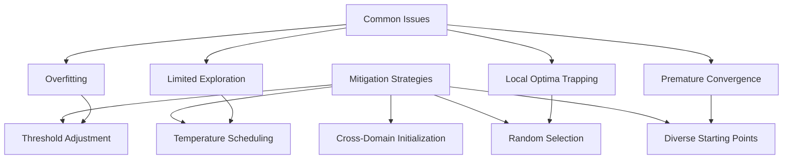

# Initialization Process

<cite>
**Referenced Files in This Document**   
- [optimize_instructions.py](file://opro/optimization/optimize_instructions.py)
- [opt_utils.py](file://opro/optimization/opt_utils.py)
- [eval_utils.py](file://opro/evaluation/eval_utils.py)
</cite>

## Table of Contents
1. [Introduction](#introduction)
2. [Initial Instructions Configuration](#initial-instructions-configuration)
3. [Data Flow from Script to Execution](#data-flow-from-script-to-execution)
4. [Role of Initial Instructions in Evolutionary Process](#role-of-initial-instructions-in-evolutionary-process)
5. [Effective Initial Instruction Patterns](#effective-initial-instruction-patterns)
6. [Common Issues and Mitigation Strategies](#common-issues-and-mitigation-strategies)
7. [Conclusion](#conclusion)

## Introduction
The initialization phase of the prompt optimization workflow establishes the foundation for the evolutionary search process. This document details how initial instructions are defined in the main script, processed through the configuration pipeline, and utilized by the optimization engine. The focus is on the `initial_instructions` variable in `optimize_instructions.py` and its interaction with the `run_evolution` function's kwargs parameter, which governs the entire optimization process.

**Section sources**
- [optimize_instructions.py](file://opro/optimization/optimize_instructions.py#L709-L714)

## Initial Instructions Configuration
The `initial_instructions` variable is defined in the `optimize_instructions.py` script as a list of strings that serve as the starting point for the evolutionary optimization process. This list is configured at the script level and contains one or more initial prompt templates that will be evaluated and evolved.

The default configuration includes the instruction "Let's solve the problem." as the primary starting point, with other potential instructions commented out. These initial instructions are designed to be simple, general-purpose prompts that can be applied across various problem domains. The configuration allows for multiple starting points to increase diversity in the search space from the beginning of the optimization process.

The initial instructions undergo preprocessing through the `polish_sentence` function from `eval_utils.py`, which standardizes the text by capitalizing the first letter, removing extra whitespace, and ensuring proper punctuation. This normalization ensures consistency in how instructions are represented and compared throughout the optimization process.

**Diagram sources**
- [optimize_instructions.py](file://opro/optimization/optimize_instructions.py#L709-L714)
- [opt_utils.py](file://opro/optimization/opt_utils.py#L519-L555)

**Section sources**
- [optimize_instructions.py](file://opro/optimization/optimize_instructions.py#L709-L714)
- [opt_utils.py](file://opro/optimization/opt_utils.py#L519-L555)
- [eval_utils.py](file://opro/evaluation/eval_utils.py#L90-L117)

## Data Flow from Script to Execution
The data flow from script-level configuration to execution context follows a well-defined pipeline. The `initial_instructions` list is first defined in the main script and then incorporated into the `evolution_kwargs` dictionary, which serves as the central configuration container for the optimization process.

This dictionary is passed to the `run_evolution` function using the `**kwargs` parameter unpacking mechanism, allowing for flexible and extensible configuration. Within `run_evolution`, the `initial_instructions` are extracted from the kwargs and used to initialize the optimization process by evaluating each instruction's performance on the training dataset.

The evaluation process involves generating prompts using the `gen_prompt` function, which combines the instruction with specific problem instances according to the specified `instruction_pos` (where the instruction should be placed in relation to the question and answer). The resulting prompts are then scored by the designated scorer LLM, and the performance metrics are recorded for each initial instruction.

**Diagram sources**
- [optimize_instructions.py](file://opro/optimization/optimize_instructions.py#L769-L799)
- [opt_utils.py](file://opro/optimization/opt_utils.py#L371-L555)

**Section sources**
- [optimize_instructions.py](file://opro/optimization/optimize_instructions.py#L769-L799)
- [opt_utils.py](file://opro/optimization/opt_utils.py#L371-L555)

## Role of Initial Instructions in Evolutionary Process
The `initial_instructions` list plays a critical role in bootstrapping the evolutionary optimization process. These starting points directly influence the search trajectory by establishing the initial population of prompts that will be iteratively refined through the evolutionary algorithm.

Each initial instruction is evaluated on the training dataset to establish a baseline performance metric. These evaluations create the first generation of the instruction population, which is then used to generate subsequent generations through mutation and crossover operations performed by the optimizer LLM. The performance scores of the initial instructions help determine which prompts are retained and which are discarded based on the `old_instruction_score_threshold` parameter.

The diversity of the initial instructions is crucial for effective exploration of the search space. A diverse starting population increases the likelihood of discovering high-performing prompt templates that might not be reachable from a single starting point. The evolutionary process uses the initial instructions as reference points for generating new variations, with the meta-prompt construction in `gen_meta_prompt` explicitly including the highest-performing initial instructions to guide the optimizer LLM.

The initial instructions also serve as anchors for the optimization process, providing stability and preventing the search from diverging too far from effective prompting patterns. By maintaining a record of the initial instructions and their performance, the system can track progress and ensure that improvements are being made relative to the baseline.

**Diagram sources**
- [opt_utils.py](file://opro/optimization/opt_utils.py#L519-L555)
- [opt_utils.py](file://opro/optimization/opt_utils.py#L692-L708)

**Section sources**
- [opt_utils.py](file://opro/optimization/opt_utils.py#L519-L555)
- [opt_utils.py](file://opro/optimization/opt_utils.py#L692-L708)

## Effective Initial Instruction Patterns
Effective initial instruction patterns share several key characteristics that contribute to successful optimization convergence. The most effective patterns are concise, generalizable, and focused on the problem-solving process rather than specific content.

The default instruction "Let's solve the problem." exemplifies an effective pattern because it is:
- **Action-oriented**: It prompts the model to engage in problem-solving
- **Domain-agnostic**: It can be applied across various subject areas
- **Concise**: It avoids unnecessary words that might distract the model
- **Positive framing**: It assumes success is possible

Other effective patterns include:
- "Think step by step to solve this problem"
- "Analyze the question carefully before responding"
- "Provide a clear and logical solution"

These patterns work well because they encourage systematic reasoning without constraining the model to a specific approach. The effectiveness of an initial instruction can be measured by its ability to generate high-scoring offspring during the evolutionary process. Instructions that are too specific or contain domain-specific terminology tend to produce less diverse and lower-performing variations.

The choice of initial instructions should consider the target dataset and problem type. For mathematical reasoning tasks like GSM8K, instructions that emphasize step-by-step thinking tend to perform better. For multiple-choice questions like MMLU, instructions that focus on careful analysis of options are more effective.

**Section sources**
- [optimize_instructions.py](file://opro/optimization/optimize_instructions.py#L709-L714)

## Common Issues and Mitigation Strategies
Several common issues can arise from poorly formulated initial instructions, leading to suboptimal search paths and reduced optimization effectiveness. The most frequent issues include:

**Premature Convergence**: When initial instructions are too similar or limited in diversity, the evolutionary process may converge prematurely on a suboptimal solution. This occurs because the search space is not adequately explored from the beginning.

**Local Optima Trapping**: Initial instructions that are moderately effective but not optimal can create a "fitness plateau" that prevents the discovery of better solutions. The evolutionary process may become trapped in this local optimum.

**Overfitting to Training Data**: Initial instructions that perform well on the training set but generalize poorly can lead to overfitting, where the optimization process reinforces patterns that don't transfer to unseen problems.

**Limited Exploration**: When initial instructions are too restrictive in their approach, they constrain the types of variations that can be generated, limiting the exploration of alternative problem-solving strategies.

To mitigate these issues, several strategies can be employed:

1. **Diverse Starting Points**: Include multiple initial instructions with different approaches to increase diversity from the beginning of the optimization process.

2. **Random Selection**: Use the "random" few-shot selection criteria to ensure that the evolutionary process is exposed to a wide variety of problem types during optimization.

3. **Temperature Scheduling**: Implement a temperature schedule that starts with higher randomness and gradually decreases, allowing for broader exploration initially and more focused refinement later.

4. **Threshold Adjustment**: Carefully tune the `old_instruction_score_threshold` to balance between maintaining high-performing instructions and allowing for exploration of new variations.

5. **Cross-Domain Initialization**: When possible, use initial instructions that have proven effective on similar but different problem domains to introduce beneficial transfer learning effects.

**Section sources**
- [optimize_instructions.py](file://opro/optimization/optimize_instructions.py#L718-L725)
- [opt_utils.py](file://opro/optimization/opt_utils.py#L573-L581)

## Conclusion
The initialization phase of the prompt optimization workflow is critical for establishing an effective evolutionary search process. The `initial_instructions` list in `optimize_instructions.py` serves as the foundation for this process, directly influencing the search trajectory and ultimate optimization outcomes.

By carefully selecting diverse and effective initial instruction patterns, practitioners can improve the likelihood of discovering high-performing prompt templates. The data flow from script-level configuration to execution context through the kwargs parameter ensures flexibility and maintainability in the optimization pipeline.

Understanding the role of initial instructions in bootstrapping the evolutionary process and recognizing common issues with appropriate mitigation strategies enables more effective prompt optimization. The success of the entire optimization workflow depends significantly on the quality and diversity of the initial instructions, making this initialization phase a crucial component of the overall system.