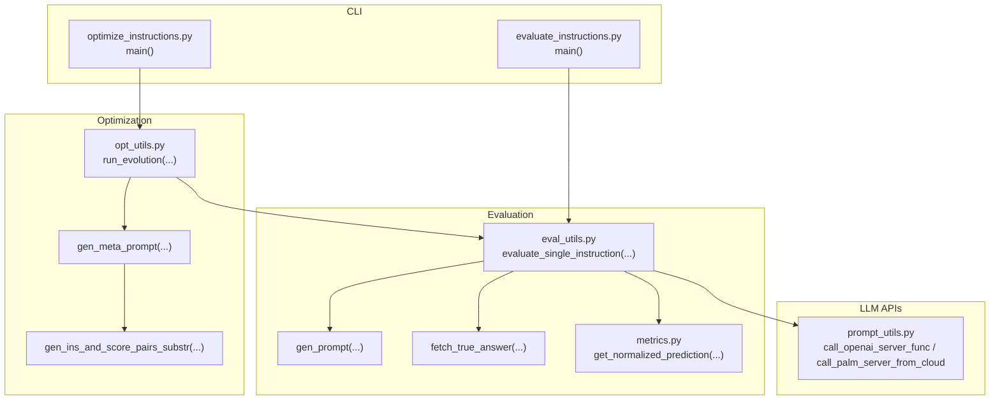
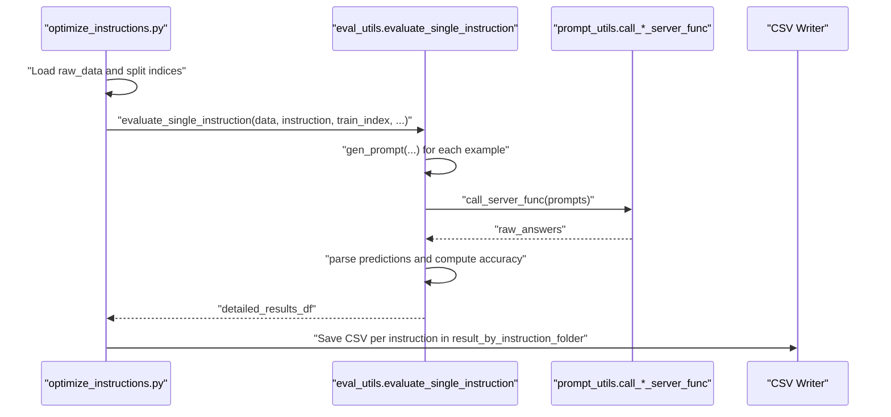
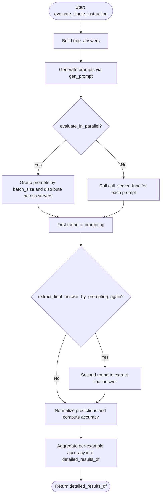
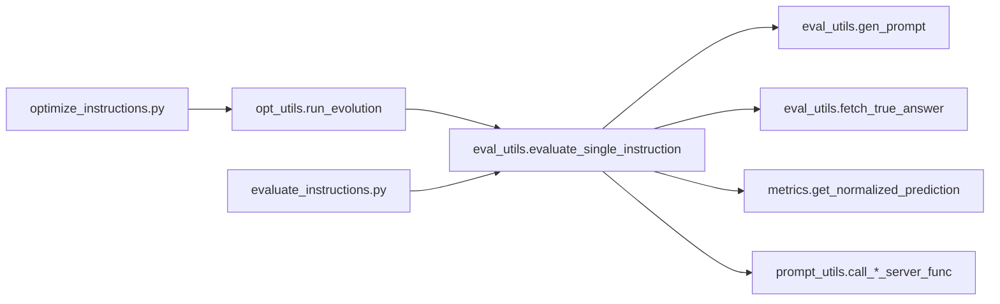

# Initialization and Evaluation

<cite>
**Referenced Files in This Document**
- [opt_utils.py](file://opro/optimization/opt_utils.py)
- [eval_utils.py](file://opro/evaluation/eval_utils.py)
- [optimize_instructions.py](file://opro/optimization/optimize_instructions.py)
- [evaluate_instructions.py](file://opro/evaluation/evaluate_instructions.py)
- [prompt_utils.py](file://opro/prompt_utils.py)
- [metrics.py](file://opro/evaluation/metrics.py)
- [README.md](file://README.md)
</cite>

## Table of Contents
1. [Introduction](#introduction)
2. [Project Structure](#project-structure)
3. [Core Components](#core-components)
4. [Architecture Overview](#architecture-overview)
5. [Detailed Component Analysis](#detailed-component-analysis)
6. [Dependency Analysis](#dependency-analysis)
7. [Performance Considerations](#performance-considerations)
8. [Troubleshooting Guide](#troubleshooting-guide)
9. [Conclusion](#conclusion)

## Introduction
This document explains the initialization and evaluation phase of the prompt optimization workflow, focusing on the run_evolution function in opt_utils.py. It describes how the optimization process starts with initial_instructions, evaluates them using the scorer LLM on the training dataset, and documents the data flow from loading raw_data through train/validation/test splits to computing initial scores via evaluate_single_instruction in eval_utils.py. It also covers the role of train_ratio, eval_ratio, and test_ratio in controlling dataset partitioning, provides examples of initial instruction evaluation outputs and their storage in result_by_instruction_folder, and addresses performance considerations and error handling.

## Project Structure
The prompt optimization pipeline is organized into two major modules:
- Optimization: orchestrates the evolutionary search and evaluation loop, including initial instruction evaluation.
- Evaluation: provides utilities for generating prompts, calling LLM servers, parsing predictions, and computing accuracy.

Key entry points:
- opt_utils.py: defines run_evolution and related helpers for orchestration.
- eval_utils.py: defines evaluate_single_instruction and related helpers for scoring.
- optimize_instructions.py: CLI entry point that constructs datasets, splits, and invokes run_evolution.
- evaluate_instructions.py: CLI entry point for standalone instruction evaluation.
- prompt_utils.py: thin wrappers around OpenAI and Google Cloud model APIs.
- metrics.py: normalization and accuracy computation for predictions.

**Diagram sources**
- [opt_utils.py](file://opro/optimization/opt_utils.py#L338-L800)
- [eval_utils.py](file://opro/evaluation/eval_utils.py#L536-L917)
- [optimize_instructions.py](file://opro/optimization/optimize_instructions.py#L639-L800)
- [evaluate_instructions.py](file://opro/evaluation/evaluate_instructions.py#L548-L766)
- [prompt_utils.py](file://opro/prompt_utils.py#L21-L133)
- [metrics.py](file://opro/evaluation/metrics.py#L188-L343)

**Section sources**
- [opt_utils.py](file://opro/optimization/opt_utils.py#L338-L800)
- [eval_utils.py](file://opro/evaluation/eval_utils.py#L536-L917)
- [optimize_instructions.py](file://opro/optimization/optimize_instructions.py#L639-L800)
- [evaluate_instructions.py](file://opro/evaluation/evaluate_instructions.py#L548-L766)
- [prompt_utils.py](file://opro/prompt_utils.py#L21-L133)
- [metrics.py](file://opro/evaluation/metrics.py#L188-L343)

## Core Components
- run_evolution: The central orchestration function that initializes the optimization loop, evaluates initial instructions, and manages meta-prompts and instruction generations.
- evaluate_single_instruction: The scoring routine that generates prompts, calls the LLM, parses outputs, and computes accuracy per example.
- gen_meta_prompt and gen_ins_and_score_pairs_substr: Helpers that construct the meta-prompt containing prior instructions and exemplars.
- prompt_utils: Thin wrappers for OpenAI and Google Cloud model APIs used by the scorer and optimizer.
- metrics: Prediction normalization and accuracy computation used by evaluation.

**Section sources**
- [opt_utils.py](file://opro/optimization/opt_utils.py#L338-L800)
- [eval_utils.py](file://opro/evaluation/eval_utils.py#L536-L917)
- [prompt_utils.py](file://opro/prompt_utils.py#L21-L133)
- [metrics.py](file://opro/evaluation/metrics.py#L188-L343)

## Architecture Overview
The initialization and evaluation phase follows this high-level flow:
- CLI loads dataset and splits into train/eval/test based on train_ratio, eval_ratio, and test_ratio.
- Initial instructions are evaluated on the training split using evaluate_single_instruction.
- Results are stored per instruction in result_by_instruction_folder.
- The optimization loop continues, generating new instructions via meta-prompts and evaluating them.

**Diagram sources**
- [optimize_instructions.py](file://opro/optimization/optimize_instructions.py#L639-L800)
- [eval_utils.py](file://opro/evaluation/eval_utils.py#L536-L917)
- [prompt_utils.py](file://opro/prompt_utils.py#L21-L133)

## Detailed Component Analysis

### Initialization and Dataset Partitioning
- Dataset loading and splitting:
  - The CLI reads raw_data and computes train_index and eval_index based on train_ratio, eval_ratio, and test_ratio.
  - For MMLU, GSM8K, and BBH, the CLI sets dataset-specific defaults and asserts valid splits.
- Train/eval/test ratios:
  - train_ratio + eval_ratio + test_ratio must equal 1.0 for deterministic behavior.
  - Indices are sorted to ensure alignment of is_multiple_choice lists with data points.

Key behaviors:
- Deterministic randomization via fixed seed for reproducibility.
- Assertions enforce valid dataset names and splits.

**Section sources**
- [optimize_instructions.py](file://opro/optimization/optimize_instructions.py#L639-L709)
- [optimize_instructions.py](file://opro/optimization/optimize_instructions.py#L640-L680)

### Initial Instruction Evaluation
- The run_evolution function iterates over initial_instructions and evaluates each using evaluate_single_instruction with the training split.
- For each instruction:
  - evaluate_single_instruction generates prompts for each training example, calls the scorer LLM, parses outputs, and computes per-example accuracy.
  - The resulting detailed_results_df is saved to result_by_instruction_folder with a filename derived from the instruction.
  - The average accuracy across examples is recorded and tracked in old_instructions_and_scores.

Important parameters influencing evaluation:
- batch_size and num_servers control batching and server distribution.
- extract_final_answer_by_prompting_again toggles a second round of prompting to improve extraction.
- evaluate_in_parallel controls multithreading for parallel inference.
- prediction_treat_as_number, prediction_treat_as_bool, and prediction_num_decimals influence normalization and accuracy computation.

Storage:
- CSV files are saved per instruction in result_by_instruction_folder.
- A dictionary mapping instruction to its detailed_results_df is maintained for downstream use.

**Section sources**
- [opt_utils.py](file://opro/optimization/opt_utils.py#L518-L567)
- [eval_utils.py](file://opro/evaluation/eval_utils.py#L536-L917)
- [metrics.py](file://opro/evaluation/metrics.py#L188-L343)

### Data Flow Through evaluate_single_instruction
The evaluation pipeline inside evaluate_single_instruction:
- Build true_answers from raw_data using fetch_true_answer.
- Generate prompts via gen_prompt for each example.
- Optionally parallelize inference across batches and servers.
- Optionally prompt again to extract final answers.
- Normalize predictions using get_normalized_prediction and compute accuracy per example.
- Aggregate per-example accuracy into a detailed_results_df.

**Diagram sources**
- [eval_utils.py](file://opro/evaluation/eval_utils.py#L536-L917)
- [metrics.py](file://opro/evaluation/metrics.py#L188-L343)
- [prompt_utils.py](file://opro/prompt_utils.py#L21-L133)

### Meta-Prompt Construction for Instruction Generation
- gen_ins_and_score_pairs_substr formats prior instructions and scores into a string for inclusion in the meta-prompt.
- gen_meta_prompt composes:
  - Old instruction-score pairs (filtered by threshold and bucketization).
  - Few-shot QA exemplars selected according to criteria (accumulative_most_frequent, current_most_frequent, constant, random).
  - A task description and instruction placement hints depending on dataset and model.

These meta-prompts guide the optimizer LLM to generate improved instructions.

**Section sources**
- [opt_utils.py](file://opro/optimization/opt_utils.py#L52-L88)
- [opt_utils.py](file://opro/optimization/opt_utils.py#L90-L335)

### Example Outputs and Storage
- Per-instruction CSV files:
  - Each initial instruction evaluation produces a CSV in result_by_instruction_folder with columns including raw_prompt, raw_answer, parsed_answer, true_answer, and accuracy.
  - The filename is derived from the instruction via instruction_to_filename.
- Aggregated metrics:
  - Average accuracy across examples is computed and stored alongside the per-instruction DataFrame.
  - The instruction-to-score mapping is maintained in instruction_score_dict and old_instructions_and_scores.

Practical example (descriptive):
- An instruction “Let’s solve the problem.” is evaluated on the training split.
- The detailed_results_df contains rows for each training example with accuracy 1.0 for correct predictions and 0.0 for incorrect ones.
- The CSV file is saved as <md5_hash>.csv in result_by_instruction_folder.
- The average score is recorded and appended to the list of old instructions.

**Section sources**
- [opt_utils.py](file://opro/optimization/opt_utils.py#L518-L567)
- [eval_utils.py](file://opro/evaluation/eval_utils.py#L76-L88)

### Role of train_ratio, eval_ratio, and test_ratio
- train_ratio: Proportion of data used for initial instruction evaluation and later for few-shot exemplars selection.
- eval_ratio: Optional proportion reserved for validation; in many runs it is zero.
- test_ratio: Remaining proportion reserved for final testing.
- Defaults:
  - MMLU: train_ratio = 0.8, eval_ratio = 0.2.
  - GSM8K: train_ratio = 0.035, eval_ratio = 0.
  - BBH: train_ratio = 0.2, eval_ratio = 0.

These ratios determine the sizes of train_index and eval_index, which are used to construct the training set for initial evaluation and the few-shot exemplars for instruction refinement.

**Section sources**
- [optimize_instructions.py](file://opro/optimization/optimize_instructions.py#L639-L680)

## Dependency Analysis
- Orchestration depends on:
  - opt_utils.run_evolution for the main loop and meta-prompt construction.
  - eval_utils.evaluate_single_instruction for scoring.
- Scoring depends on:
  - gen_prompt and fetch_true_answer for prompt assembly and ground-truth retrieval.
  - metrics.get_normalized_prediction for robust parsing.
  - prompt_utils.call_*_server_func for LLM inference.
- CLI depends on:
  - optimize_instructions.py to load data, split indices, and invoke run_evolution.
  - evaluate_instructions.py for standalone evaluation scenarios.

**Diagram sources**
- [opt_utils.py](file://opro/optimization/opt_utils.py#L338-L800)
- [eval_utils.py](file://opro/evaluation/eval_utils.py#L536-L917)
- [metrics.py](file://opro/evaluation/metrics.py#L188-L343)
- [prompt_utils.py](file://opro/prompt_utils.py#L21-L133)
- [optimize_instructions.py](file://opro/optimization/optimize_instructions.py#L639-L800)
- [evaluate_instructions.py](file://opro/evaluation/evaluate_instructions.py#L548-L766)

**Section sources**
- [opt_utils.py](file://opro/optimization/opt_utils.py#L338-L800)
- [eval_utils.py](file://opro/evaluation/eval_utils.py#L536-L917)
- [metrics.py](file://opro/evaluation/metrics.py#L188-L343)
- [prompt_utils.py](file://opro/prompt_utils.py#L21-L133)
- [optimize_instructions.py](file://opro/optimization/optimize_instructions.py#L639-L800)
- [evaluate_instructions.py](file://opro/evaluation/evaluate_instructions.py#L548-L766)

## Performance Considerations
- API call costs:
  - The README warns that calling PaLM or GPT APIs may incur significant costs. Cost estimation should be performed before running full evaluations.
- Parallelization:
  - evaluate_in_parallel enables multithreading to reduce wall-clock time when calling the scorer LLM.
- Batching and server distribution:
  - batch_size and num_servers control throughput and resource utilization during inference.
- Computational overhead:
  - Maintaining detailed_results_df_by_instruction_dict and per-instruction CSVs increases disk I/O and memory usage. Consider reducing verbosity and limiting the number of initial instructions to minimize overhead.
- Few-shot exemplars:
  - Selecting frequent wrong questions for few-shot exemplars can improve instruction quality but adds extra prompt construction and evaluation overhead.

[No sources needed since this section provides general guidance]

## Troubleshooting Guide
- LLM call failures:
  - prompt_utils wraps OpenAI and Google Cloud calls with retry logic for timeouts, rate limits, API errors, and service unavailability. These are logged and retried with exponential backoff.
- Malformed instruction outputs:
  - run_evolution extracts generated instructions from optimizer outputs using delimiters (<INS>, </INS>, <Start>, </Start>) or bracketed content for text-bison. If outputs lack expected markers, extraction may fail. Consider adjusting meta_prompt_type or instruction_pos to improve formatting.
- No output after retries:
  - _prompting_to_get_raw_answers asserts that outputs are produced after all retries. If not, it indicates a persistent server outage or misconfiguration.
- Accuracy computation anomalies:
  - Metrics normalization handles various answer formats and special cases. If accuracy seems inconsistent, review prediction_treat_as_number, prediction_treat_as_bool, and prediction_num_decimals.

**Section sources**
- [prompt_utils.py](file://opro/prompt_utils.py#L21-L133)
- [eval_utils.py](file://opro/evaluation/eval_utils.py#L338-L379)
- [opt_utils.py](file://opro/optimization/opt_utils.py#L733-L784)

## Conclusion
The initialization and evaluation phase establishes the baseline performance of initial instructions by scoring them on the training split. It leverages a robust evaluation pipeline with prompt construction, LLM inference, prediction normalization, and accuracy computation. The orchestration in run_evolution coordinates this process, stores detailed results per instruction, and prepares the stage for iterative instruction improvement guided by meta-prompts. Proper configuration of dataset splits, parallelization, and cost-aware usage is essential for efficient and reliable experimentation.