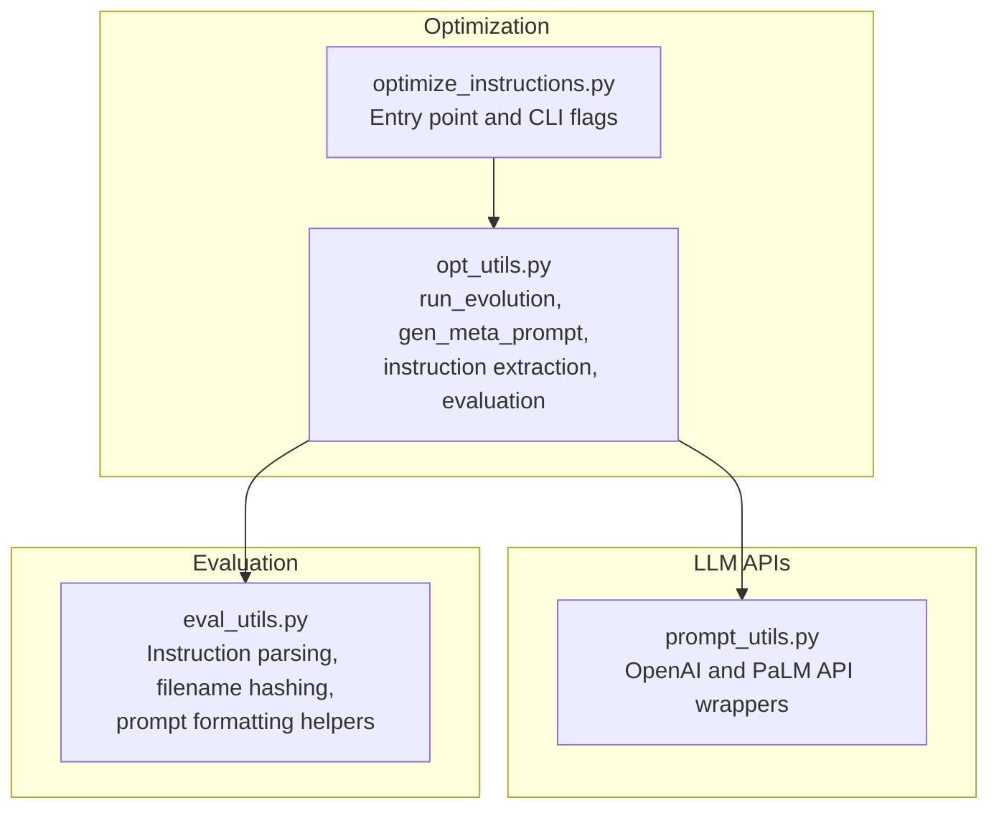
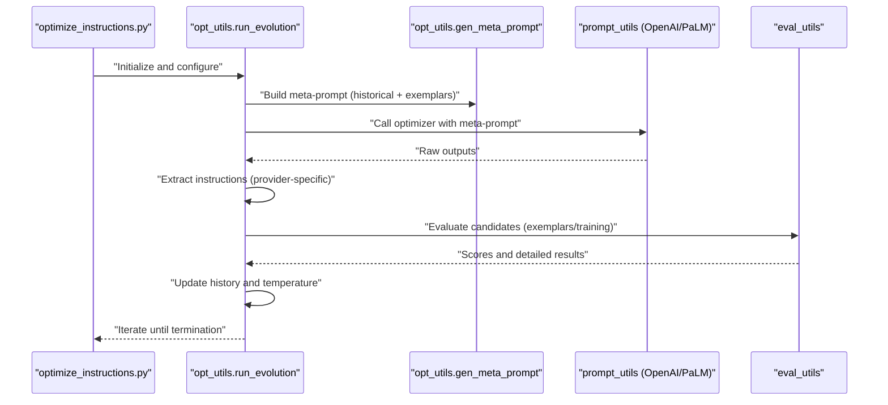
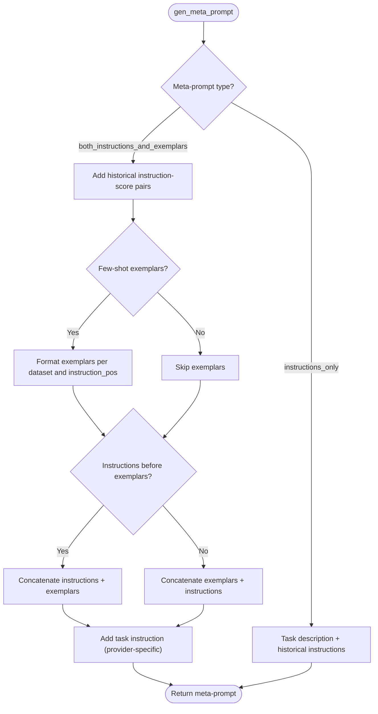
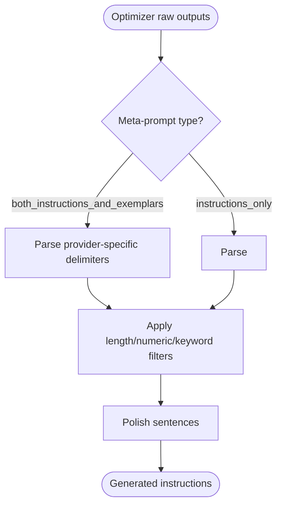
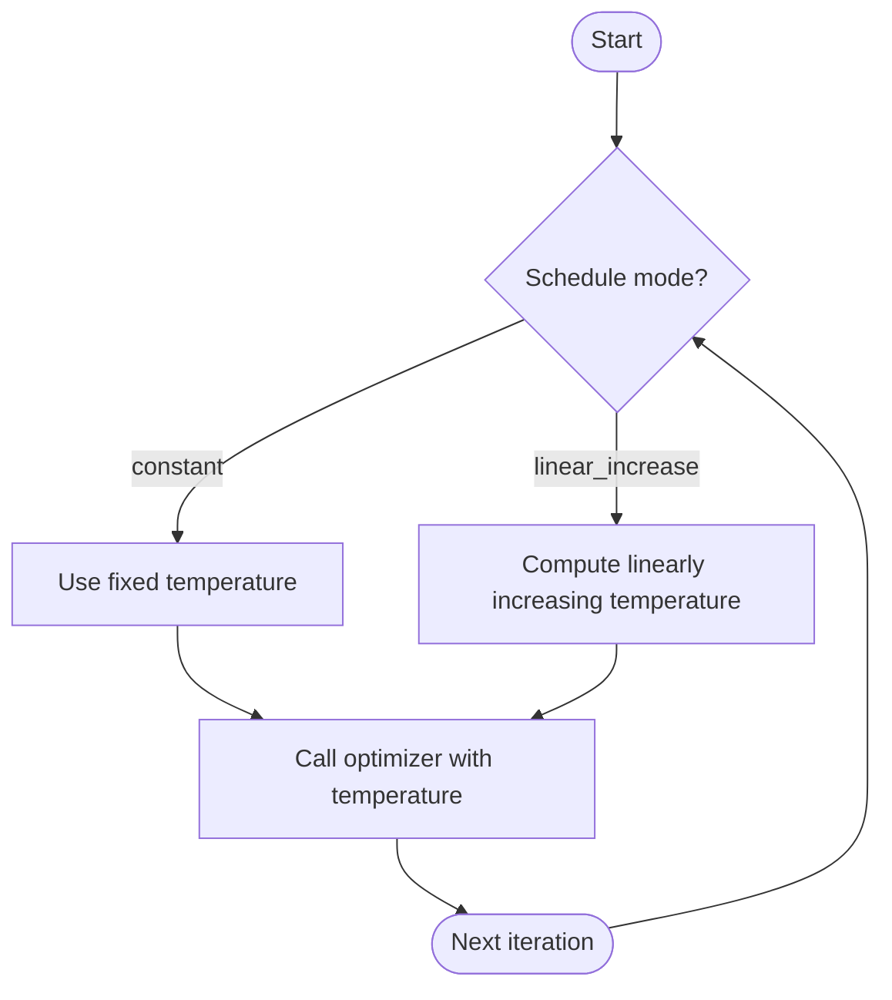
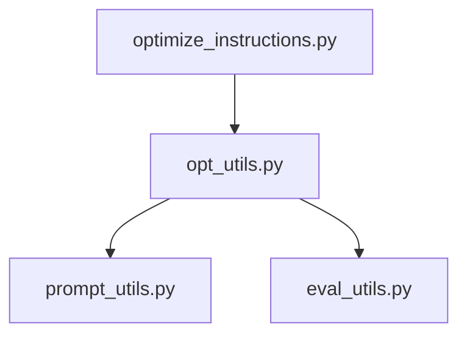

# Instruction Generation Mechanism

<cite>
**Referenced Files in This Document**
- [optimize_instructions.py](file://opro/optimization/optimize_instructions.py)
- [opt_utils.py](file://opro/optimization/opt_utils.py)
- [prompt_utils.py](file://opro/prompt_utils.py)
- [eval_utils.py](file://opro/evaluation/eval_utils.py)
</cite>

## Table of Contents
1. [Introduction](#introduction)
2. [Project Structure](#project-structure)
3. [Core Components](#core-components)
4. [Architecture Overview](#architecture-overview)
5. [Detailed Component Analysis](#detailed-component-analysis)
6. [Dependency Analysis](#dependency-analysis)
7. [Performance Considerations](#performance-considerations)
8. [Troubleshooting Guide](#troubleshooting-guide)
9. [Conclusion](#conclusion)

## Introduction
This document explains the instruction generation mechanism used in run_evolution. It focuses on how gen_meta_prompt constructs context-rich prompts that combine historical instruction-score pairs and dataset exemplars to guide the optimizer LLM. It documents the two meta-prompt types (“both_instructions_and_exemplars” and “instructions_only”), their intended use cases with fine-tuned versus pre-trained optimizers, and how instruction_pos controls insertion locations (before_Q, Q_begin, Q_end, A_begin). It also covers provider-specific template differences (GPT vs. text-bison), temperature scheduling via optimizer_llm_temperature, and robustness strategies for malformed outputs and API failures.

## Project Structure
The instruction generation pipeline spans three modules:
- Optimization entrypoint and orchestration
- Meta-prompt construction and instruction synthesis loop
- LLM API wrappers and evaluation utilities

**Diagram sources**
- [optimize_instructions.py](file://opro/optimization/optimize_instructions.py#L1-L200)
- [opt_utils.py](file://opro/optimization/opt_utils.py#L1-L120)
- [prompt_utils.py](file://opro/prompt_utils.py#L1-L146)
- [eval_utils.py](file://opro/evaluation/eval_utils.py#L1-L120)

**Section sources**
- [optimize_instructions.py](file://opro/optimization/optimize_instructions.py#L1-L200)
- [opt_utils.py](file://opro/optimization/opt_utils.py#L1-L120)

## Core Components
- gen_meta_prompt: Builds a context-rich meta-prompt from historical instruction-score pairs and dataset exemplars, with provider-specific and insertion-position-aware formatting.
- run_evolution: Controls the evolutionary loop, temperature scheduling, few-shot selection, and instruction extraction/evaluation.
- prompt_utils: Provides provider-agnostic API wrappers for OpenAI and Google PaLM models.
- eval_utils: Supplies helpers for instruction normalization, filename hashing, and prompt formatting.

Key responsibilities:
- Constructing meta-prompts tailored to optimizer capabilities and dataset/task characteristics.
- Managing temperature schedules to balance exploration and exploitation.
- Extracting structured instructions from optimizer outputs and filtering malformed candidates.
- Evaluating candidate instructions on exemplars and training sets.

**Section sources**
- [opt_utils.py](file://opro/optimization/opt_utils.py#L90-L336)
- [opt_utils.py](file://opro/optimization/opt_utils.py#L338-L470)
- [prompt_utils.py](file://opro/prompt_utils.py#L29-L146)
- [eval_utils.py](file://opro/evaluation/eval_utils.py#L76-L118)

## Architecture Overview
The instruction generation process follows a closed-loop evolution:
1. Initialize configuration and models.
2. Build a meta-prompt with historical instructions and exemplars.
3. Call the optimizer LLM with the meta-prompt to generate candidate instructions.
4. Extract and post-process instructions.
5. Evaluate candidates on exemplars and/or training set.
6. Update history and repeat until convergence.

**Diagram sources**
- [optimize_instructions.py](file://opro/optimization/optimize_instructions.py#L680-L800)
- [opt_utils.py](file://opro/optimization/opt_utils.py#L338-L470)
- [opt_utils.py](file://opro/optimization/opt_utils.py#L690-L744)
- [prompt_utils.py](file://opro/prompt_utils.py#L29-L146)
- [eval_utils.py](file://opro/evaluation/eval_utils.py#L76-L118)

## Detailed Component Analysis

### Meta-Prompt Construction: gen_meta_prompt
gen_meta_prompt composes a context-rich prompt that includes:
- Historical instruction-score pairs (filtered by threshold and capped by count).
- Few-shot QA exemplars (optional), formatted according to dataset and instruction position.
- A clear instruction to generate a novel instruction or starting sentence, depending on provider and insertion position.

Behavioral highlights:
- Two meta-prompt types:
  - both_instructions_and_exemplars: For fine-tuned optimizers; includes historical instructions and exemplars.
  - instructions_only: For pre-trained optimizers; includes only historical instructions and a concise task description.
- Instruction position determines where the instruction placeholder appears:
  - before_Q: Insert before the question segment.
  - Q_begin: Insert at the beginning of the question.
  - Q_end: Insert at the end of the question.
  - A_begin: Insert at the beginning of the answer.
- Provider-specific formatting:
  - GPT models receive explicit tags (<INS> or <Start>) and structured QA segments.
  - text-bison receives bracketed text and a concise instruction to write bracketed text differing from prior entries.

**Diagram sources**
- [opt_utils.py](file://opro/optimization/opt_utils.py#L90-L336)

**Section sources**
- [opt_utils.py](file://opro/optimization/opt_utils.py#L90-L336)

### Instruction Position Semantics
The instruction_pos flag controls where the instruction placeholder is placed:
- before_Q: Place the instruction before the question segment.
- Q_begin: Place the instruction at the beginning of the question.
- Q_end: Place the instruction at the end of the question.
- A_begin: Place the instruction at the beginning of the answer.

These positions influence how exemplars are formatted and how the optimizer interprets the instruction’s role in the prompt.

**Section sources**
- [opt_utils.py](file://opro/optimization/opt_utils.py#L140-L160)
- [opt_utils.py](file://opro/optimization/opt_utils.py#L221-L246)

### Meta-Prompt Types and Use Cases
- both_instructions_and_exemplars:
  - Intended for fine-tuned optimizers that benefit from seeing prior successful instructions and concrete exemplars.
  - Encourages the optimizer to propose instructions that differ from existing ones and generalize across problems.
- instructions_only:
  - Intended for pre-trained optimizers that are guided primarily by historical instruction quality and a concise task description.
  - Emphasizes generating high-quality instructions without relying on dataset exemplars.

**Section sources**
- [opt_utils.py](file://opro/optimization/opt_utils.py#L161-L210)
- [opt_utils.py](file://opro/optimization/opt_utils.py#L296-L336)

### Provider-Specific Templates and Formatting
- GPT models:
  - Use explicit tags (<INS> or <Start>) to delimit instructions.
  - Include structured QA segments with “Q:” and “A:” or “Ground truth answer”.
  - Provide a clear instruction to generate a novel instruction or starting sentence.
- text-bison:
  - Uses bracketed text [ ... ] to represent instructions.
  - Provides a concise instruction to produce a new text differing from old ones and achieving high scores.
  - Exemplars are presented with “input:”, “Q:”, and “A:” formats, and “output:” ground truths.

These differences shape how the optimizer interprets the prompt and how instructions are extracted.

**Section sources**
- [opt_utils.py](file://opro/optimization/opt_utils.py#L163-L207)
- [opt_utils.py](file://opro/optimization/opt_utils.py#L221-L254)
- [opt_utils.py](file://opro/optimization/opt_utils.py#L296-L336)

### Instruction Extraction from Optimizer Outputs
After receiving raw outputs from the optimizer:
- For both_instructions_and_exemplars:
  - GPT outputs are parsed by locating <INS> or <Start> delimiters and extracting the content between them.
  - text-bison outputs are parsed by extracting bracketed text [ ... ].
- For instructions_only:
  - GPT outputs are parsed by extracting <TEXT> ... </TEXT> blocks.
  - text-bison outputs are parsed similarly to bracketed text.

The system also applies basic filters to discard overly long instructions, numeric-only instructions (for GSM8K), and instructions containing specific markers.

**Diagram sources**
- [opt_utils.py](file://opro/optimization/opt_utils.py#L730-L807)
- [eval_utils.py](file://opro/evaluation/eval_utils.py#L90-L118)

**Section sources**
- [opt_utils.py](file://opro/optimization/opt_utils.py#L730-L807)
- [eval_utils.py](file://opro/evaluation/eval_utils.py#L90-L118)

### Temperature Scheduling and Exploration vs. Exploitation
- The optimizer’s temperature is configurable and can be scheduled:
  - constant: Fixed temperature across iterations.
  - linear_increase: Linearly increase temperature from a starting value to an end value over the course of optimization.
- Higher temperature increases diversity and exploration; lower temperature improves consistency and exploitation of known good patterns.
- The scheduler computes the current temperature per iteration and passes it to the optimizer API call.

**Diagram sources**
- [opt_utils.py](file://opro/optimization/opt_utils.py#L360-L413)
- [opt_utils.py](file://opro/optimization/opt_utils.py#L573-L584)

**Section sources**
- [opt_utils.py](file://opro/optimization/opt_utils.py#L360-L413)
- [opt_utils.py](file://opro/optimization/opt_utils.py#L573-L584)

### API Wrappers and Robustness
- OpenAI wrapper:
  - Handles timeouts, rate limits, API errors, connection errors, and service unavailability with retries and backoff.
  - Supports single prompt and batched calls.
- PaLM wrapper:
  - Handles availability checks and retries with backoff.
  - Raises an ImportError if the environment lacks compatibility for the library.

These wrappers ensure resilience during instruction generation.

**Section sources**
- [prompt_utils.py](file://opro/prompt_utils.py#L29-L146)

### Evaluation and Post-Processing
- Generated instructions are evaluated on exemplars and/or training sets using evaluation utilities.
- Results include per-question accuracy and aggregated scores.
- Instructions are saved with filenames derived from hashing to avoid duplicates.

**Section sources**
- [opt_utils.py](file://opro/optimization/opt_utils.py#L825-L961)
- [eval_utils.py](file://opro/evaluation/eval_utils.py#L76-L118)

## Dependency Analysis
The instruction generation mechanism exhibits clear separation of concerns:
- optimize_instructions.py orchestrates configuration and invokes opt_utils.run_evolution.
- opt_utils.py encapsulates prompt construction, instruction extraction, and evaluation loops.
- prompt_utils.py abstracts provider-specific API calls.
- eval_utils.py provides shared utilities for instruction normalization and prompt formatting.

**Diagram sources**
- [optimize_instructions.py](file://opro/optimization/optimize_instructions.py#L680-L800)
- [opt_utils.py](file://opro/optimization/opt_utils.py#L338-L470)
- [prompt_utils.py](file://opro/prompt_utils.py#L29-L146)
- [eval_utils.py](file://opro/evaluation/eval_utils.py#L1-L120)

**Section sources**
- [optimize_instructions.py](file://opro/optimization/optimize_instructions.py#L680-L800)
- [opt_utils.py](file://opro/optimization/opt_utils.py#L338-L470)

## Performance Considerations
- Few-shot exemplars reduce the need for long context while guiding instruction synthesis.
- Temperature scheduling balances exploration and exploitation; linear increase can help escape local optima early.
- Batch sizes and decoding parameters are configured per provider to align with serving constraints.
- Filtering out malformed instructions reduces downstream evaluation overhead.

[No sources needed since this section provides general guidance]

## Troubleshooting Guide
Common issues and mitigations:
- Malformed optimizer outputs:
  - For both_instructions_and_exemplars, ensure delimiters are present; otherwise, fallback indices are used to extract content.
  - For instructions_only, ensure <TEXT> blocks or bracketed text are present.
  - Apply length and content filters to skip instructions that are too long, numeric-only (GSM8K), or contain prohibited markers.
- API failures:
  - OpenAI wrapper retries on timeouts, rate limits, API errors, connection errors, and service unavailability.
  - PaLM wrapper retries with backoff and raises ImportError if the library is unavailable.
- Provider mismatches:
  - Ensure the optimizer model name matches supported providers and that API keys are configured accordingly.

**Section sources**
- [opt_utils.py](file://opro/optimization/opt_utils.py#L730-L807)
- [opt_utils.py](file://opro/optimization/opt_utils.py#L803-L823)
- [prompt_utils.py](file://opro/prompt_utils.py#L29-L146)

## Conclusion
The instruction generation mechanism combines historical instruction-score pairs with dataset exemplars to guide an optimizer LLM in evolving high-quality instructions. The gen_meta_prompt function tailors prompts to provider capabilities and insertion positions, while run_evolution coordinates temperature scheduling, instruction extraction, and evaluation. Robust API wrappers and post-processing filters ensure reliable operation across providers and datasets.