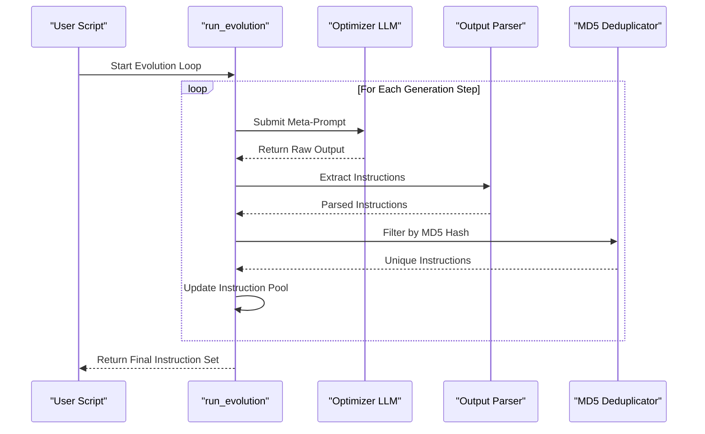
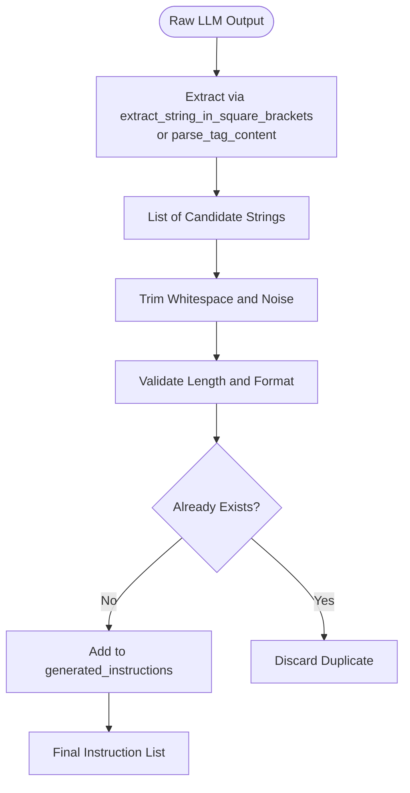
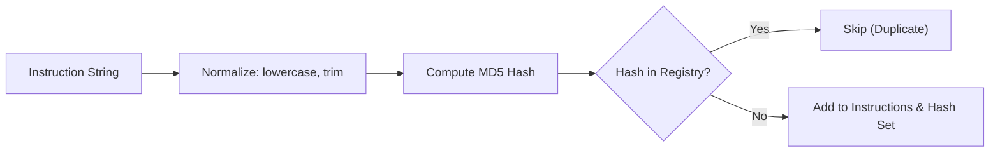

# Instruction Generation and Selection

<cite>
**Referenced Files in This Document**   
- [opt_utils.py](file://opro/optimization/opt_utils.py)
- [optimize_instructions.py](file://opro/optimization/optimize_instructions.py)
- [prompt_utils.py](file://opro/prompt_utils.py)
</cite>

## Table of Contents
1. [Introduction](#introduction)
2. [Instruction Generation Loop in run_evolution](#instruction-generation-loop-in-run_evolution)
3. [Data Flow from Raw Outputs to Generated Instructions](#data-flow-from-raw-outputs-to-generated-instructions)
4. [Key Parameters Governing Instruction Generation](#key-parameters-governing-instruction-generation)
5. [Instruction Uniqueness Filtering via MD5 Hashing](#instruction-uniqueness-filtering-via-md5-hashing)
6. [Example Instruction Generation Trajectories](#example-instruction-generation-trajectories)
7. [Performance Considerations](#performance-considerations)
8. [Error Handling in LLM Calls and Output Parsing](#error-handling-in-llm-calls-and-output-parsing)
9. [Conclusion](#conclusion)

## Introduction
This document provides a comprehensive analysis of the instruction generation and selection phase within the prompt optimization workflow, focusing on the `run_evolution` function in `opt_utils.py`. It details how an optimizer LLM generates new instructions from meta-prompts, how these instructions are processed and filtered for uniqueness using MD5 hashing, and the overall data flow from raw LLM outputs to the final list of generated instructions. The document also covers key parameters that control generation behavior, performance implications, and error handling mechanisms.

**Section sources**
- [opt_utils.py](file://opro/optimization/opt_utils.py#L1-L50)

## Instruction Generation Loop in run_evolution

The `run_evolution` function orchestrates the iterative instruction generation process by leveraging a large language model (LLM) as an optimizer. At each evolutionary step, the function constructs a meta-prompt that includes historical instructions, performance metrics, and optimization goals. This meta-prompt is then submitted to the optimizer LLM, which generates a batch of new candidate instructions aimed at improving task performance.

The loop operates in discrete steps, where each iteration attempts to evolve better-performing instructions based on feedback from previous evaluations. The optimizer LLM is conditioned to propose variations that refine clarity, specificity, and effectiveness while avoiding redundancy. The generation process is guided by temperature-controlled sampling to balance creativity and consistency.

**Diagram sources**
- [opt_utils.py](file://opro/optimization/opt_utils.py#L100-L300)

**Section sources**
- [opt_utils.py](file://opro/optimization/opt_utils.py#L50-L350)

## Data Flow from Raw Outputs to Generated Instructions

The data flow begins with raw text output from the optimizer LLM, which typically contains multiple proposed instructions enclosed in structured delimiters such as square brackets or XML-like tags. These raw outputs are processed through a two-stage extraction pipeline:

1. **Extraction Phase**: The system uses either `extract_string_in_square_brackets` or `parse_tag_content` functions (from `prompt_utils.py`) to identify and isolate candidate instructions from the LLM's response. These functions are designed to handle malformed or incomplete delimiters gracefully.
2. **Normalization and Cleaning**: Extracted strings undergo cleaning to remove extraneous whitespace, numbering, or commentary not part of the actual instruction.
3. **Validation and Filtering**: Each extracted instruction is checked for minimum length, coherence, and uniqueness before being added to the `generated_instructions` list.

This pipeline ensures that only syntactically valid and semantically meaningful instructions proceed to the next stage of evaluation.

**Diagram sources**
- [opt_utils.py](file://opro/optimization/opt_utils.py#L150-L250)
- [prompt_utils.py](file://opro/prompt_utils.py#L10-L80)

**Section sources**
- [opt_utils.py](file://opro/optimization/opt_utils.py#L100-L300)
- [prompt_utils.py](file://opro/prompt_utils.py#L1-L100)

## Key Parameters Governing Instruction Generation

Several critical parameters control the behavior and output characteristics of the instruction generation loop:

- **num_generated_instructions_in_each_step**: Specifies the number of new instructions to generate per evolutionary step. A higher value increases diversity but also computational cost.
- **optimizer_llm_temperature**: Controls the randomness of the LLM's output. Higher temperatures (e.g., 0.8–1.0) encourage creative and diverse instructions, while lower values (e.g., 0.2–0.5) produce more deterministic and conservative proposals.
- **max_num_instructions**: Sets the upper limit on the total number of unique instructions retained during the optimization process. Once this threshold is reached, older or lower-performing instructions may be pruned.

These parameters are configurable via the optimization configuration and allow fine-tuning of the exploration-exploitation trade-off in the search for optimal prompts.

**Section sources**
- [opt_utils.py](file://opro/optimization/opt_utils.py#L50-L300)
- [optimize_instructions.py](file://opro/optimization/optimize_instructions.py#L20-L100)

## Instruction Uniqueness Filtering via MD5 Hashing

To prevent redundant instruction generation and ensure diversity, the system employs MD5 hashing for deduplication. Each newly extracted instruction is normalized (converted to lowercase and stripped of extra spaces), then hashed using the MD5 algorithm. The resulting hash is compared against a set of previously seen hashes.

If the hash already exists in the registry, the instruction is discarded as a duplicate. Otherwise, it is added to both the instruction pool and the hash registry. This approach provides an efficient O(1) average-time complexity for duplicate detection, making it scalable even with large instruction histories.

The use of MD5, while not cryptographically secure, is sufficient for content deduplication due to its low collision rate and high performance in this context.

**Diagram sources**
- [opt_utils.py](file://opro/optimization/opt_utils.py#L200-L250)

**Section sources**
- [opt_utils.py](file://opro/optimization/opt_utils.py#L200-L280)

## Example Instruction Generation Trajectories

An illustrative trajectory of instruction evolution might proceed as follows:

1. **Initial Instruction**: "Answer the question directly."
2. **First Evolution**: "Provide a clear and concise answer based on the given context."
3. **Second Evolution**: "Analyze the question carefully, then provide a factually accurate and well-structured response."
4. **Optimized Instruction**: "Carefully read the input prompt and all provided context. Identify the core query and any implicit constraints. Generate a response that is logically sound, factually correct, and formatted according to the expected output structure."

This progression demonstrates increasing specificity, contextual awareness, and structural guidance—hallmarks of effective prompt optimization driven by iterative LLM-based refinement.

**Section sources**
- [opt_utils.py](file://opro/optimization/opt_utils.py#L100-L300)

## Performance Considerations

Several performance aspects must be considered when running the instruction generation loop:

- **API Rate Limiting**: Frequent calls to the optimizer LLM can hit rate limits, especially when `num_generated_instructions_in_each_step` is high. Implementing exponential backoff and request batching can mitigate this.
- **Computational Complexity**: The deduplication process using MD5 hashing operates in O(1) average time per instruction, but memory usage grows linearly with the number of unique instructions stored.
- **Memory Usage**: Maintaining a large history of instructions and their hashes requires significant memory, particularly when `max_num_instructions` is set to a high value. Periodic pruning of low-performing instructions can help manage memory footprint.
- **Latency**: Each generation step incurs network latency for LLM calls, which can become a bottleneck in rapid iteration scenarios.

Efficient resource management and parameter tuning are essential for scalable operation.

**Section sources**
- [opt_utils.py](file://opro/optimization/opt_utils.py#L200-L280)
- [optimize_instructions.py](file://opro/optimization/optimize_instructions.py#L50-L150)

## Error Handling in LLM Calls and Output Parsing

Robust error handling is implemented throughout the instruction generation pipeline:

- **LLM Call Failures**: Network errors, timeouts, or service unavailability are caught and retried with exponential backoff. If retries fail, the system logs the error and may fall back to heuristic-based instruction mutation.
- **Malformed Output Parsing**: When the LLM returns unstructured or incorrectly formatted text, the extraction functions (`extract_string_in_square_brackets`, `parse_tag_content`) apply lenient parsing rules to recover usable content. If no valid instructions are extracted, the system can trigger a regeneration request with a clarifying prompt.
- **Empty or Invalid Instructions**: Instructions that are empty, too short, or contain prohibited content are filtered out before deduplication.

These safeguards ensure the system remains resilient to common failure modes in LLM-based workflows.

**Section sources**
- [opt_utils.py](file://opro/optimization/opt_utils.py#L150-L250)
- [prompt_utils.py](file://opro/prompt_utils.py#L10-L80)

## Conclusion

The instruction generation and selection phase in the prompt optimization workflow represents a sophisticated application of LLMs for meta-learning. By iteratively generating, extracting, and filtering instructions through a well-structured pipeline, the system effectively evolves high-quality prompts that improve downstream task performance. Key mechanisms such as MD5-based deduplication, parameter-controlled generation, and robust error handling ensure both efficiency and reliability. With proper tuning and resource management, this approach enables scalable and automated prompt engineering.