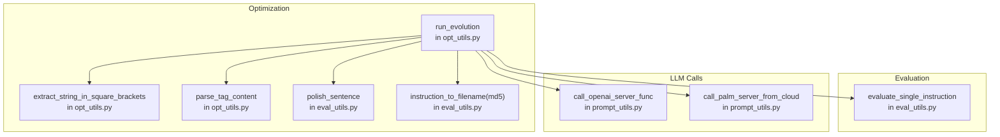
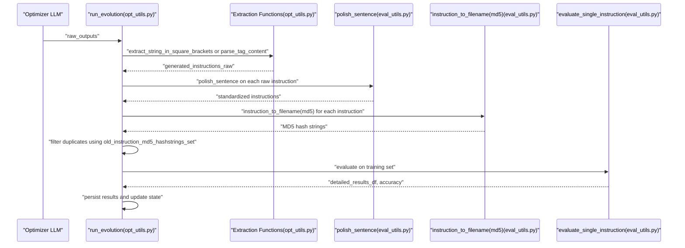
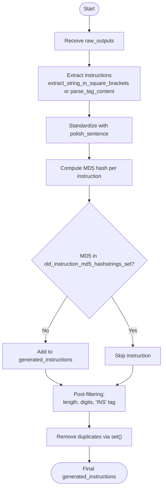
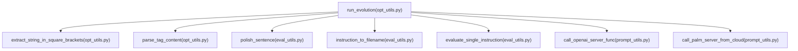

# Instruction Selection and Deduplication

<cite>
**Referenced Files in This Document**
- [opt_utils.py](file://opro/optimization/opt_utils.py)
- [eval_utils.py](file://opro/evaluation/eval_utils.py)
- [optimize_instructions.py](file://opro/optimization/optimize_instructions.py)
- [evaluate_instructions.py](file://opro/evaluation/evaluate_instructions.py)
- [prompt_utils.py](file://opro/prompt_utils.py)
</cite>

## Table of Contents
1. [Introduction](#introduction)
2. [Project Structure](#project-structure)
3. [Core Components](#core-components)
4. [Architecture Overview](#architecture-overview)
5. [Detailed Component Analysis](#detailed-component-analysis)
6. [Dependency Analysis](#dependency-analysis)
7. [Performance Considerations](#performance-considerations)
8. [Troubleshooting Guide](#troubleshooting-guide)
9. [Conclusion](#conclusion)

## Introduction
This document explains the instruction selection and deduplication pipeline used in run_evolution. It focuses on how generated instructions are extracted from optimizer outputs, standardized via polish_sentence, and filtered using instruction_to_filename with MD5 hashing to avoid re-evaluating duplicates. It also documents the role of old_instruction_md5_hashstrings_set in maintaining state across optimization steps, the data flow from raw_outputs to final generated_instructions, and strategies for handling near-duplicates and edge cases.

## Project Structure
The instruction selection and deduplication logic is implemented in the optimization module and evaluation utilities:
- Optimization orchestrator: run_evolution coordinates instruction generation, extraction, deduplication, and scoring.
- Extraction utilities: extract_string_in_square_brackets and parse_tag_content extract candidate instructions from optimizer outputs.
- Standardization: polish_sentence normalizes instruction text for consistency.
- Uniqueness filtering: instruction_to_filename(md5_hashing=True) computes MD5 digests to detect duplicates.
- Evaluation: evaluate_single_instruction computes accuracy and persists results.

**Diagram sources**
- [opt_utils.py](file://opro/optimization/opt_utils.py#L33-L45)
- [opt_utils.py](file://opro/optimization/opt_utils.py#L785-L801)
- [eval_utils.py](file://opro/evaluation/eval_utils.py#L76-L118)
- [prompt_utils.py](file://opro/prompt_utils.py#L95-L146)

**Section sources**
- [opt_utils.py](file://opro/optimization/opt_utils.py#L33-L45)
- [opt_utils.py](file://opro/optimization/opt_utils.py#L785-L801)
- [eval_utils.py](file://opro/evaluation/eval_utils.py#L76-L118)
- [prompt_utils.py](file://opro/prompt_utils.py#L95-L146)

## Core Components
- run_evolution: Orchestrates instruction generation, extraction, deduplication, and evaluation.
- extract_string_in_square_brackets: Extracts bracketed content from PaLM outputs.
- parse_tag_content: Extracts tagged content from GPT outputs.
- polish_sentence: Normalizes instruction text for consistency.
- instruction_to_filename(md5_hashing=True): Computes MD5 digest for uniqueness.
- evaluate_single_instruction: Scores instructions on training data and persists results.

**Section sources**
- [opt_utils.py](file://opro/optimization/opt_utils.py#L785-L801)
- [opt_utils.py](file://opro/optimization/opt_utils.py#L33-L45)
- [eval_utils.py](file://opro/evaluation/eval_utils.py#L76-L118)
- [eval_utils.py](file://opro/evaluation/eval_utils.py#L536-L800)

## Architecture Overview
The end-to-end flow from raw_outputs to deduplicated instructions and evaluation:

**Diagram sources**
- [opt_utils.py](file://opro/optimization/opt_utils.py#L785-L801)
- [opt_utils.py](file://opro/optimization/opt_utils.py#L33-L45)
- [eval_utils.py](file://opro/evaluation/eval_utils.py#L76-L118)
- [eval_utils.py](file://opro/evaluation/eval_utils.py#L536-L800)

## Detailed Component Analysis

### Instruction Extraction and Standardization
- Extraction:
  - For GPT-family optimizers, parse_tag_content extracts content between tags.
  - For PaLM optimizers, extract_string_in_square_brackets extracts bracketed content.
- Standardization:
  - polish_sentence capitalizes the first letter, removes extra formatting, and optionally adds an ending punctuation.

These steps ensure that raw model outputs are converted into clean instruction candidates suitable for evaluation.

**Section sources**
- [opt_utils.py](file://opro/optimization/opt_utils.py#L740-L784)
- [opt_utils.py](file://opro/optimization/opt_utils.py#L33-L45)
- [eval_utils.py](file://opro/evaluation/eval_utils.py#L90-L118)

### MD5-Based Uniqueness Filtering
- After extraction and standardization, each instruction is hashed using instruction_to_filename(instruction, md5_hashing=True).
- A global set old_instruction_md5_hashstrings_set tracks previously seen MD5 hashes.
- If a hash is already present, the instruction is skipped to avoid redundant evaluations.
- After deduplication, a secondary deduplication step removes duplicates from the list.

This mechanism prevents repeated scoring of identical instructions across steps and reduces API costs.

**Section sources**
- [opt_utils.py](file://opro/optimization/opt_utils.py#L790-L802)
- [eval_utils.py](file://opro/evaluation/eval_utils.py#L76-L88)

### Data Flow from raw_outputs to Final Generated Instructions
- raw_outputs: List of model outputs from optimizer.
- generated_instructions_raw: Extracted instruction candidates.
- generated_instructions: Deduplicated list after MD5 filtering and set removal.
- to_evaluate_instructions: Additional filtering for length, content constraints, and tag presence.

**Diagram sources**
- [opt_utils.py](file://opro/optimization/opt_utils.py#L785-L802)
- [opt_utils.py](file://opro/optimization/opt_utils.py#L33-L45)
- [eval_utils.py](file://opro/evaluation/eval_utils.py#L76-L118)

**Section sources**
- [opt_utils.py](file://opro/optimization/opt_utils.py#L785-L802)

### Role of old_instruction_md5_hashstrings_set
- Maintains a set of MD5 hash strings for all previously generated instructions across optimization steps.
- Prevents re-evaluation of duplicates, reducing redundant API calls and saving compute time.
- Persists across iterations to ensure global deduplication.

**Section sources**
- [opt_utils.py](file://opro/optimization/opt_utils.py#L449-L450)
- [opt_utils.py](file://opro/optimization/opt_utils.py#L790-L802)

### Handling Near-Duplicates and Edge Cases
- Minor wording differences (e.g., punctuation, casing) produce different MD5 hashes and are treated as distinct candidates.
- Strategies to mitigate near-duplicates:
  - Pre-normalize text (already done via polish_sentence).
  - Apply additional normalization (e.g., lowercasing, removing extra whitespace) before hashing if needed.
  - Use approximate string matching (e.g., cosine similarity) post-hashing to group near-duplicates, then pick the highest-scoring representative.
- Constraints during deduplication:
  - Instructions exceeding a length threshold are skipped.
  - Instructions containing numeric characters (GSM8K context) are skipped.
  - Instructions containing a specific tag are skipped.

**Section sources**
- [opt_utils.py](file://opro/optimization/opt_utils.py#L803-L823)
- [eval_utils.py](file://opro/evaluation/eval_utils.py#L90-L118)

### Example Scenarios
- Different instruction formulations differing only by punctuation or casing are treated as unique due to MD5 hashing.
- An instruction containing digits is skipped in GSM8K context.
- An instruction containing a reserved tag is skipped.

**Section sources**
- [opt_utils.py](file://opro/optimization/opt_utils.py#L803-L823)

## Dependency Analysis
- run_evolution depends on:
  - Extraction utilities for parsing optimizer outputs.
  - polish_sentence for normalization.
  - instruction_to_filename for uniqueness.
  - evaluate_single_instruction for scoring.
  - LLM call wrappers for API interactions.

**Diagram sources**
- [opt_utils.py](file://opro/optimization/opt_utils.py#L33-L45)
- [opt_utils.py](file://opro/optimization/opt_utils.py#L785-L801)
- [eval_utils.py](file://opro/evaluation/eval_utils.py#L76-L118)
- [eval_utils.py](file://opro/evaluation/eval_utils.py#L536-L800)
- [prompt_utils.py](file://opro/prompt_utils.py#L95-L146)

**Section sources**
- [opt_utils.py](file://opro/optimization/opt_utils.py#L33-L45)
- [opt_utils.py](file://opro/optimization/opt_utils.py#L785-L801)
- [eval_utils.py](file://opro/evaluation/eval_utils.py#L76-L118)
- [eval_utils.py](file://opro/evaluation/eval_utils.py#L536-L800)
- [prompt_utils.py](file://opro/prompt_utils.py#L95-L146)

## Performance Considerations
- Memory usage:
  - old_instruction_md5_hashstrings_set grows with the number of unique instructions encountered. For large-scale runs, consider periodic pruning or using a bounded-size structure to cap memory.
- Computational overhead:
  - MD5 hashing is fast but still adds per-instruction cost. Batch processing and avoiding repeated hashing (e.g., caching) can help.
- API cost reduction:
  - Deduplication avoids redundant evaluations, significantly lowering API call volume.
- Parallelization:
  - Evaluation uses multithreading when supported. Ensure appropriate batch sizes and server distribution to maximize throughput.

[No sources needed since this section provides general guidance]

## Troubleshooting Guide
- Symptom: Duplicate instructions reappear frequently.
  - Cause: MD5 hashing is sensitive to minor differences; near-duplicates are not collapsed.
  - Resolution: Apply additional normalization or approximate matching before hashing.
- Symptom: Instructions are skipped unexpectedly.
  - Cause: Length limits, numeric content (GSM8K), or reserved tags.
  - Resolution: Review constraints and adjust preprocessing if necessary.
- Symptom: No instructions extracted.
  - Cause: Output format mismatch with expected tags or brackets.
  - Resolution: Verify meta-prompt formatting and extraction logic.

**Section sources**
- [opt_utils.py](file://opro/optimization/opt_utils.py#L803-L823)
- [opt_utils.py](file://opro/optimization/opt_utils.py#L785-L801)
- [opt_utils.py](file://opro/optimization/opt_utils.py#L33-L45)

## Conclusion
The instruction selection and deduplication pipeline in run_evolution ensures efficient exploration of instruction space by extracting, standardizing, and deduplicating candidates using MD5 hashing. While this guarantees minimal redundant evaluations, it treats minor wording differences as distinct. For robustness in large-scale runs, consider complementary strategies such as pre-normalization and approximate matching to handle near-duplicates effectively.