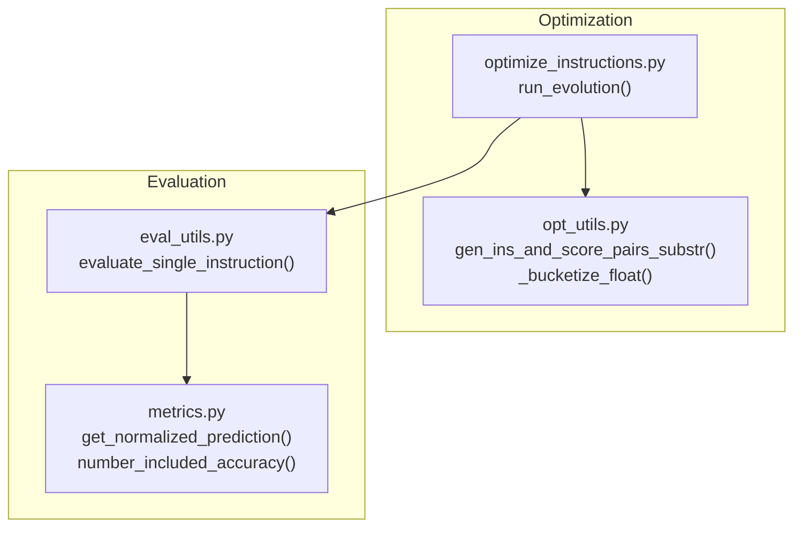
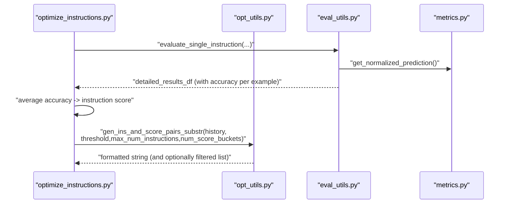
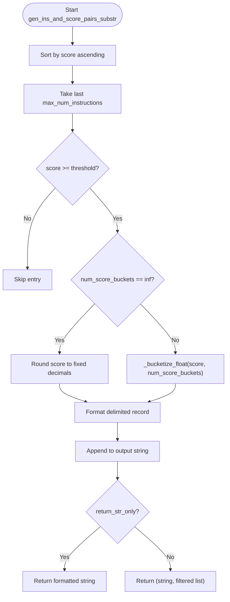
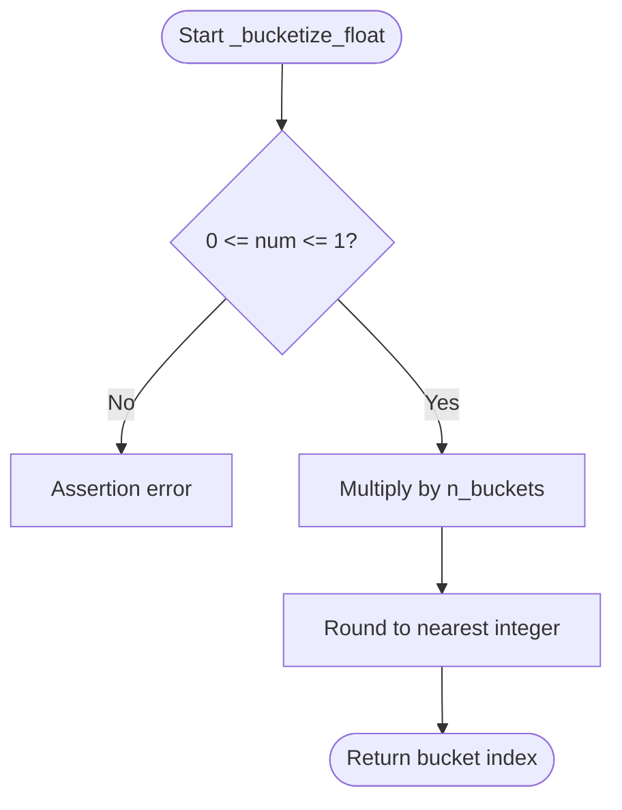
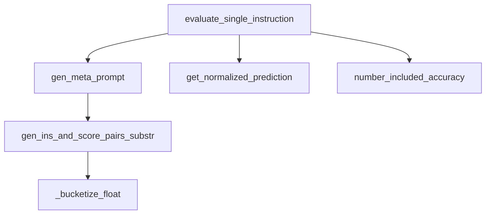

# Instruction-Score Pair Processing

<cite>
**Referenced Files in This Document**
- [opt_utils.py](file://opro/optimization/opt_utils.py)
- [optimize_instructions.py](file://opro/optimization/optimize_instructions.py)
- [eval_utils.py](file://opro/evaluation/eval_utils.py)
- [metrics.py](file://opro/evaluation/metrics.py)
</cite>

## Table of Contents
1. [Introduction](#introduction)
2. [Project Structure](#project-structure)
3. [Core Components](#core-components)
4. [Architecture Overview](#architecture-overview)
5. [Detailed Component Analysis](#detailed-component-analysis)
6. [Dependency Analysis](#dependency-analysis)
7. [Performance Considerations](#performance-considerations)
8. [Troubleshooting Guide](#troubleshooting-guide)
9. [Conclusion](#conclusion)

## Introduction
This document explains the instruction-score pair processing pipeline focused on the gen_ins_and_score_pairs_substr function in opt_utils.py. It covers how historical instruction optimization results are filtered by a configurable threshold and limited by a maximum count to control meta-prompt size, how raw (instruction, score, i_step) tuples are transformed into formatted string representations, and how continuous accuracy scores are discretized into categorical buckets via _bucketize_float to improve LLM comprehension. It also documents error handling for edge cases and discusses performance considerations for processing large instruction histories.

## Project Structure
The instruction-score pair processing is part of the optimization workflow:
- opt_utils.py defines the core functions for building meta-prompts and transforming historical instruction-score pairs.
- optimize_instructions.py orchestrates the end-to-end evolution process and passes parameters to opt_utils.
- eval_utils.py evaluates instructions and computes per-example accuracy, which is averaged to produce instruction scores used in the pipeline.
- metrics.py provides normalization and accuracy computation utilities used during evaluation.

**Diagram sources**
- [opt_utils.py](file://opro/optimization/opt_utils.py#L47-L88)
- [opt_utils.py](file://opro/optimization/opt_utils.py#L90-L335)
- [optimize_instructions.py](file://opro/optimization/optimize_instructions.py#L736-L800)
- [eval_utils.py](file://opro/evaluation/eval_utils.py#L535-L862)
- [metrics.py](file://opro/evaluation/metrics.py#L188-L496)

**Section sources**
- [opt_utils.py](file://opro/optimization/opt_utils.py#L47-L88)
- [opt_utils.py](file://opro/optimization/opt_utils.py#L90-L335)
- [optimize_instructions.py](file://opro/optimization/optimize_instructions.py#L736-L800)
- [eval_utils.py](file://opro/evaluation/eval_utils.py#L535-L862)
- [metrics.py](file://opro/evaluation/metrics.py#L188-L496)

## Core Components
- gen_ins_and_score_pairs_substr: Filters historical instruction-score pairs by a threshold, limits by a maximum count, and formats them into a string with delimited fields. Supports raw or bucketized score display.
- _bucketize_float: Discretizes continuous scores in [0, 1] into integer buckets for improved categorical comprehension by LLMs.
- gen_meta_prompt: Builds the full meta-prompt by combining instruction-score history with optional few-shot exemplars and optimizer-specific instructions.

Key parameters:
- old_instruction_score_threshold: Minimum score threshold for inclusion.
- max_num_instructions: Maximum number of historical entries to include.
- num_score_buckets: Controls bucketization; np.inf for raw scores.
- return_str_only: Controls whether to return only the formatted string or also the filtered list.

**Section sources**
- [opt_utils.py](file://opro/optimization/opt_utils.py#L47-L88)
- [opt_utils.py](file://opro/optimization/opt_utils.py#L90-L335)

## Architecture Overview
The instruction-score pair processing integrates with the broader optimization loop:
- Historical instruction-score pairs are maintained as lists of (instruction, score, i_step).
- At each step, gen_ins_and_score_pairs_substr filters and formats the history for inclusion in the meta-prompt.
- The evaluation pipeline computes per-example accuracy and averages to produce instruction scores used to populate the history.

**Diagram sources**
- [optimize_instructions.py](file://opro/optimization/optimize_instructions.py#L528-L555)
- [eval_utils.py](file://opro/evaluation/eval_utils.py#L535-L862)
- [metrics.py](file://opro/evaluation/metrics.py#L188-L496)
- [opt_utils.py](file://opro/optimization/opt_utils.py#L52-L88)

## Detailed Component Analysis

### gen_ins_and_score_pairs_substr
Purpose:
- Transform historical (instruction, score, i_step) tuples into a formatted string for the meta-prompt.
- Apply filtering by score threshold and cap by maximum number of instructions.
- Optionally bucketize scores for improved LLM comprehension.

Processing logic:
- Sort by score ascending, then take the last max_num_instructions to keep the highest-scoring entries.
- Filter by old_instruction_score_threshold.
- For each retained entry:
  - If num_score_buckets == np.inf, round score to a fixed decimal.
  - Else, map score s in [0, 1] to bucket index using _bucketize_float(s, num_score_buckets).
  - Append a delimited record with fields: instruction, score, and step index.
- Return either the formatted string or a tuple of (formatted string, filtered list).

Edge cases handled:
- Empty history: Returns empty string and empty filtered list.
- Threshold equals zero: Includes all entries within the max count.
- num_score_buckets not an integer or np.inf: Assertion prevents invalid values.

**Diagram sources**
- [opt_utils.py](file://opro/optimization/opt_utils.py#L52-L88)

**Section sources**
- [opt_utils.py](file://opro/optimization/opt_utils.py#L52-L88)

### _bucketize_float
Purpose:
- Discretize continuous accuracy scores in [0, 1] into integer buckets for categorical representation.

Behavior:
- Asserts input is within [0, 1].
- Multiplies by n_buckets and rounds to nearest integer.

Usage:
- Called when num_score_buckets is an integer; otherwise raw scores are used.

**Diagram sources**
- [opt_utils.py](file://opro/optimization/opt_utils.py#L47-L50)

**Section sources**
- [opt_utils.py](file://opro/optimization/opt_utils.py#L47-L50)

### Data Transformation Pipeline
Raw input: List of (instruction, score, i_step).
Transformation steps:
- Sort by score ascending, slice to top N by max_num_instructions.
- Filter by threshold.
- For each retained tuple:
  - Compute score_to_show:
    - If bucketization enabled: _bucketize_float(score, num_score_buckets)
    - Else: round(score, fixed decimals)
  - Format delimited record with fields: instruction, score_to_show, i_step.
- Concatenate records into a single string with consistent delimiters.

Delimiters and structure:
- Delimited fields: "text:" for instruction, "score:" for score.
- Records separated by newline boundaries.

Escaping and safety:
- The function does not escape special characters in instruction text; downstream consumers should ensure safe formatting or sanitize inputs if needed.

**Section sources**
- [opt_utils.py](file://opro/optimization/opt_utils.py#L52-L88)

### Score Bucketization Mechanism
- Continuous accuracy scores are mapped to discrete buckets using _bucketize_float.
- This improves LLM comprehension by presenting categorical labels instead of precise decimals.
- Bucket count controlled by num_score_buckets; default behavior uses raw scores.

Examples:
- Bucketized representation:
  - Input: score = 0.87, num_score_buckets = 100
  - Output: bucket index computed by rounding(0.87 * 100) = 87
- Raw representation:
  - Input: score = 0.8734
  - Output: rounded to fixed decimals (e.g., 0.873) depending on context

**Section sources**
- [opt_utils.py](file://opro/optimization/opt_utils.py#L47-L50)
- [opt_utils.py](file://opro/optimization/opt_utils.py#L52-L88)

### Meta-Prompt Integration
- gen_meta_prompt composes the full meta-prompt by:
  - Building instruction-score history via gen_ins_and_score_pairs_substr.
  - Optionally appending few-shot exemplars based on dataset and selection criteria.
  - Adding optimizer-specific instructions and formatting.

Parameters affecting meta-prompt size:
- old_instruction_score_threshold: Filters low-performing instructions.
- max_num_instructions: Caps the number of historical entries.
- num_score_buckets: Switches between raw and bucketized scores.

**Section sources**
- [opt_utils.py](file://opro/optimization/opt_utils.py#L90-L335)

## Dependency Analysis
- gen_ins_and_score_pairs_substr depends on:
  - _bucketize_float for score discretization.
  - Sorting and slicing to enforce max_num_instructions and threshold filtering.
- gen_meta_prompt depends on:
  - gen_ins_and_score_pairs_substr for instruction-score history.
  - Dataset-specific formatting helpers and exemplar selection logic.
- Evaluation pipeline (evaluate_single_instruction) produces instruction scores used to populate the history:
  - Uses metrics.get_normalized_prediction and number_included_accuracy to compute per-example accuracy and aggregate scores.

**Diagram sources**
- [opt_utils.py](file://opro/optimization/opt_utils.py#L47-L88)
- [opt_utils.py](file://opro/optimization/opt_utils.py#L90-L335)
- [eval_utils.py](file://opro/evaluation/eval_utils.py#L535-L862)
- [metrics.py](file://opro/evaluation/metrics.py#L188-L496)

**Section sources**
- [opt_utils.py](file://opro/optimization/opt_utils.py#L47-L88)
- [opt_utils.py](file://opro/optimization/opt_utils.py#L90-L335)
- [eval_utils.py](file://opro/evaluation/eval_utils.py#L535-L862)
- [metrics.py](file://opro/evaluation/metrics.py#L188-L496)

## Performance Considerations
- String concatenation efficiency:
  - The function builds a long string by repeated concatenation. For very large histories, consider using a list and joining once to reduce intermediate allocations.
- Memory usage:
  - The formatted string grows linearly with the number of entries. Limit max_num_instructions to control memory footprint.
- Sorting and slicing:
  - Sorting by score is O(n log n); slicing to top N is O(n). For very large histories, consider maintaining a heap of size max_num_instructions to avoid full sort.
- Bucketization overhead:
  - _bucketize_float is O(1) per entry; negligible compared to string formatting.
- Parallel evaluation:
  - While gen_ins_and_score_pairs_substr itself is CPU-bound, evaluation of instructions is parallelized elsewhere in the pipeline to amortize latency.

[No sources needed since this section provides general guidance]

## Troubleshooting Guide
Common issues and resolutions:
- Empty instruction history:
  - Behavior: Returns empty string and empty filtered list. Ensure evaluation runs before calling the function to populate history.
- Invalid score ranges:
  - Behavior: _bucketize_float asserts that input is in [0, 1]. If scores fall outside this range, adjust scoring logic upstream.
- Type mismatches:
  - Behavior: Assertions prevent invalid num_score_buckets values. Ensure num_score_buckets is np.inf or an integer.
- Threshold too high:
  - Behavior: May result in an empty filtered list. Lower old_instruction_score_threshold to include more entries.
- Excessive meta-prompt size:
  - Behavior: Increase max_num_instructions or tighten old_instruction_score_threshold to reduce history length.

**Section sources**
- [opt_utils.py](file://opro/optimization/opt_utils.py#L47-L50)
- [opt_utils.py](file://opro/optimization/opt_utils.py#L52-L88)

## Conclusion
The gen_ins_and_score_pairs_substr function provides a robust mechanism to filter, limit, and format historical instruction-score pairs for meta-prompts. By combining threshold-based filtering, maximum-count caps, and optional bucketization, it balances comprehensibility and informativeness for LLM-based instruction optimization. Proper configuration of thresholds and bucket counts helps manage meta-prompt size and improves downstream performance.