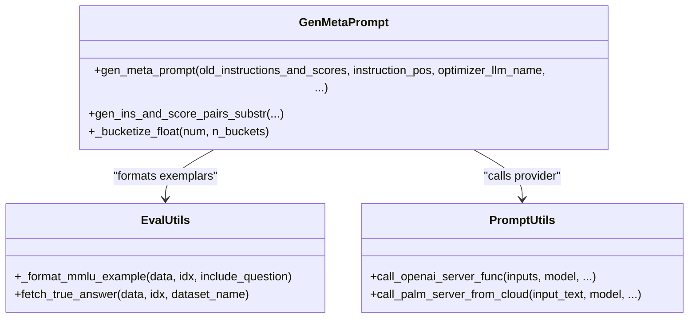
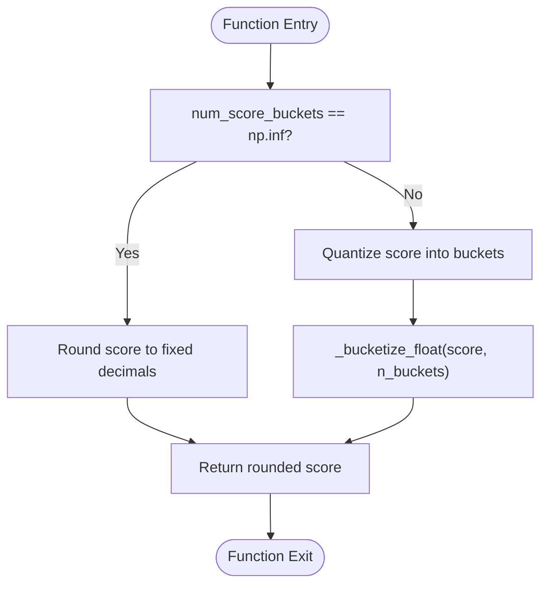
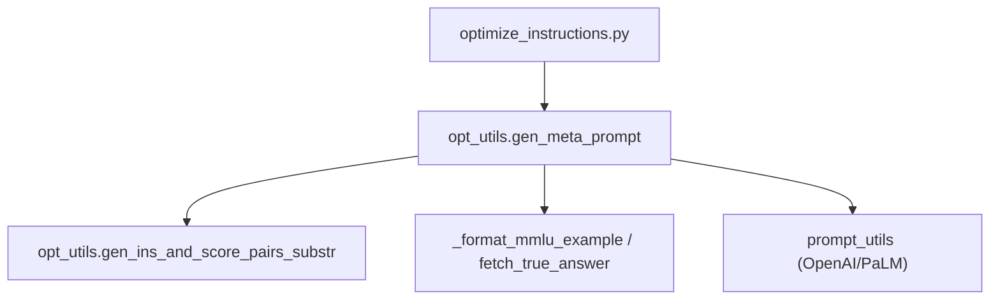

# Meta-Prompt Construction

<cite>
**Referenced Files in This Document**
- [opt_utils.py](file://opro/optimization/opt_utils.py)
- [eval_utils.py](file://opro/evaluation/eval_utils.py)
- [prompt_utils.py](file://opro/prompt_utils.py)
- [optimize_instructions.py](file://opro/optimization/optimize_instructions.py)
- [README.md](file://README.md)
</cite>

## Table of Contents
1. [Introduction](#introduction)
2. [Project Structure](#project-structure)
3. [Core Components](#core-components)
4. [Architecture Overview](#architecture-overview)
5. [Detailed Component Analysis](#detailed-component-analysis)
6. [Dependency Analysis](#dependency-analysis)
7. [Performance Considerations](#performance-considerations)
8. [Troubleshooting Guide](#troubleshooting-guide)
9. [Conclusion](#conclusion)

## Introduction
This document explains the meta-prompt construction process centered on the gen_meta_prompt function in opt_utils.py. It details how instruction-score pairs and dataset exemplars are combined into structured prompts tailored for different LLM providers (OpenAI GPT and Google text-bison). It also covers the branching logic between “both_instructions_and_exemplars” and “instructions_only” meta-prompt types, formatting differences between GPT and text-bison, input/output markers, instruction delimiters, and how few-shot QA pairs integrate with historical instruction data based on instructions_before_exemplars. Implementation details of score bucketization via num_score_buckets and its impact on numerical precision are documented, alongside error handling for invalid dataset names, unsupported instruction positions, and malformed few-shot index lists. Finally, performance implications of meta-prompt length on token consumption and API costs are discussed.

## Project Structure
The meta-prompt construction is implemented in the optimization module and integrates with evaluation utilities and provider-specific prompting wrappers.

```mermaid
graph TB
subgraph "Optimization"
OPT["opt_utils.py<br/>gen_meta_prompt, gen_ins_and_score_pairs_substr"]
end
subgraph "Evaluation"
EVAL["eval_utils.py<br/>_format_mmlu_example, fetch_true_answer"]
end
subgraph "Providers"
PROMPT["prompt_utils.py<br/>call_openai_server_func, call_palm_server_from_cloud"]
end
subgraph "CLI"
CLI["optimize_instructions.py<br/>flags and orchestration"]
end
subgraph "Docs"
DOC["README.md<br/>usage and cost notes"]
end
CLI --> OPT
OPT --> EVAL
OPT --> PROMPT
DOC -.-> CLI
```

**Diagram sources**
- [opt_utils.py](file://opro/optimization/opt_utils.py#L90-L335)
- [eval_utils.py](file://opro/evaluation/eval_utils.py#L126-L259)
- [prompt_utils.py](file://opro/prompt_utils.py#L29-L146)
- [optimize_instructions.py](file://opro/optimization/optimize_instructions.py#L104-L200)
- [README.md](file://README.md#L1-L79)

**Section sources**
- [opt_utils.py](file://opro/optimization/opt_utils.py#L90-L335)
- [eval_utils.py](file://opro/evaluation/eval_utils.py#L126-L259)
- [prompt_utils.py](file://opro/prompt_utils.py#L29-L146)
- [optimize_instructions.py](file://opro/optimization/optimize_instructions.py#L104-L200)
- [README.md](file://README.md#L1-L79)

## Core Components
- gen_meta_prompt: The primary function that builds a meta-prompt from historical instruction-score pairs and optional few-shot QA exemplars, selecting provider-specific formatting and instruction placement.
- gen_ins_and_score_pairs_substr: Generates a compact string of historical instructions and scores, optionally bucketized for precision control.
- Provider wrappers: call_openai_server_func and call_palm_server_from_cloud encapsulate API calls and extraction logic for both optimizer types.

Key responsibilities:
- Combine historical instructions with dataset exemplars.
- Apply dataset-specific formatting and instruction delimiters.
- Control numerical precision via score bucketization.
- Enforce robust assertions for safety and correctness.

**Section sources**
- [opt_utils.py](file://opro/optimization/opt_utils.py#L47-L88)
- [opt_utils.py](file://opro/optimization/opt_utils.py#L90-L335)
- [prompt_utils.py](file://opro/prompt_utils.py#L29-L146)

## Architecture Overview
The meta-prompt construction pipeline orchestrates instruction history, dataset exemplars, and provider-specific formatting to produce a prompt for the optimizer.

```mermaid
sequenceDiagram
participant CLI as "optimize_instructions.py"
participant OPT as "opt_utils.gen_meta_prompt"
participant EVAL as "eval_utils (formatting)"
participant PROVIDER as "prompt_utils (provider calls)"
CLI->>OPT : Build meta-prompt with args (historical ins, exemplars, provider)
OPT->>EVAL : Format dataset exemplars (_format_mmlu_example, fetch_true_answer)
OPT-->>CLI : Return constructed meta_prompt
CLI->>PROVIDER : Call optimizer (GPT or text-bison)
PROVIDER-->>CLI : Raw outputs
CLI->>OPT : Extract generated instructions (markers/boundaries)
OPT-->>CLI : New instructions for next iteration
```

**Diagram sources**
- [opt_utils.py](file://opro/optimization/opt_utils.py#L90-L335)
- [eval_utils.py](file://opro/evaluation/eval_utils.py#L126-L259)
- [prompt_utils.py](file://opro/prompt_utils.py#L29-L146)
- [optimize_instructions.py](file://opro/optimization/optimize_instructions.py#L104-L200)

## Detailed Component Analysis

### gen_meta_prompt: Meta-Prompt Construction
Purpose:
- Construct a structured prompt for instruction rewriting that includes historical instruction-score pairs and optional few-shot QA exemplars.
- Tailor formatting to the optimizer LLM (GPT vs text-bison) and instruction placement (before_Q, Q_begin, Q_end, A_begin).

Branching logic:
- meta_prompt_type == "both_instructions_and_exemplars":
  - Adds historical instruction-score pairs.
  - Optionally adds few-shot QA exemplars based on dataset_name and instruction_pos.
  - Supports instructions_before_exemplars ordering.
- meta_prompt_type == "instructions_only":
  - Builds a task-focused instruction prompt using dataset_name and task_name.
  - Uses provider-specific instruction delimiters and formatting.

Provider-specific formatting:
- GPT family:
  - Instruction delimiter: <INS> ... </INS>
  - Answer-start delimiter: <Start> ... </Start> (when instruction_pos == "A_begin")
  - Few-shot QA markers: Q:, A:, Ground truth answer:
  - Input marker: input:
  - Problem header for non-QA mode: Problem:
- text-bison:
  - Instruction delimiter: <INS> ... </INS> (when instruction_pos != "A_begin")
  - Answer-start delimiter: <INS> (when instruction_pos == "A_begin")
  - Few-shot QA markers: input:, Q:, A:, output:
  - Text delimited in square brackets for extraction.

Instruction placement:
- before_Q: instruction appears before the question text.
- Q_begin: instruction inserted at the beginning of the question.
- Q_end: instruction appended at the end of the question.
- A_begin: instruction placed at the beginning of the answer.

Few-shot QA integration:
- When few_shot_qa_pairs is True, exemplars are selected by few_shot_index_list and formatted according to dataset_name:
  - mmlu: uses _format_mmlu_example to build the question text and fetches the true answer.
  - bbh: uses data[idx]["input"] and data[idx]["target"].
  - gsm8k: uses data.iloc[idx, 0] and data.iloc[idx, 1].
- The instruction placeholder <INS> or <Start> is positioned based on instruction_pos and include_qa flag.

Ordering control:
- instructions_before_exemplars controls whether historical instruction-score pairs appear before exemplars or after.

Numerical precision via bucketization:
- num_score_buckets controls how floating-point scores are rounded:
  - If np.inf: scores are rounded to a fixed decimal place.
  - Else: scores are mapped into discrete buckets using a uniform quantization scheme.

Error handling:
- Assertions validate instruction_pos, meta_prompt_type, dataset_name, and num_score_buckets.
- Dataset-specific assertions ensure dataset_name is one of mmlu, bbh, gsm8k.
- Unsupported instruction positions or provider mismatches trigger explicit errors.

Extraction of generated instructions:
- For GPT: extracts content between <INS>/<START> markers.
- For text-bison: extracts content inside square brackets.

**Section sources**
- [opt_utils.py](file://opro/optimization/opt_utils.py#L90-L335)
- [eval_utils.py](file://opro/evaluation/eval_utils.py#L126-L259)

#### Class Diagram: gen_meta_prompt and Related Utilities


**Diagram sources**
- [opt_utils.py](file://opro/optimization/opt_utils.py#L47-L88)
- [opt_utils.py](file://opro/optimization/opt_utils.py#L90-L335)
- [eval_utils.py](file://opro/evaluation/eval_utils.py#L126-L259)
- [prompt_utils.py](file://opro/prompt_utils.py#L29-L146)

#### Sequence Diagram: Few-Shot Exemplar Formatting
```mermaid
sequenceDiagram
participant OPT as "gen_meta_prompt"
participant EVAL as "_format_mmlu_example / fetch_true_answer"
participant DATA as "Dataset (MMLU/BBH/GSM8K)"
OPT->>DATA : Access idx-th example
OPT->>EVAL : Format question text (dataset-specific)
EVAL-->>OPT : Formatted question
OPT->>EVAL : Fetch true answer (dataset-specific)
EVAL-->>OPT : True answer
OPT-->>OPT : Insert placeholders <INS>/<START> based on instruction_pos
```

**Diagram sources**
- [opt_utils.py](file://opro/optimization/opt_utils.py#L189-L254)
- [eval_utils.py](file://opro/evaluation/eval_utils.py#L126-L259)

#### Flowchart: Score Bucketization


**Diagram sources**
- [opt_utils.py](file://opro/optimization/opt_utils.py#L47-L88)

### gen_ins_and_score_pairs_substr: Historical Instructions and Scores
Purpose:
- Generate a compact string representation of historical instruction-score pairs.
- Apply filtering by score threshold and cap by max_num_instructions.
- Optionally bucketize scores for reduced precision.

Behavior:
- Sorts by score descending and keeps up to max_num_instructions.
- Applies old_instruction_score_threshold filtering.
- Formats entries with a consistent structure and optional bucketization.

**Section sources**
- [opt_utils.py](file://opro/optimization/opt_utils.py#L52-L88)

### Provider Wrappers: GPT and text-bison
- call_openai_server_func: Calls OpenAI ChatCompletion API with retries and error handling.
- call_palm_server_from_cloud: Calls Google PaLM text-bison API with retries and error handling.
- Both functions wrap provider-specific calls and return outputs for downstream parsing.

**Section sources**
- [prompt_utils.py](file://opro/prompt_utils.py#L29-L146)

## Dependency Analysis
- gen_meta_prompt depends on:
  - gen_ins_and_score_pairs_substr for historical instruction rendering.
  - eval_utils for dataset-specific formatting and true-answer retrieval.
  - prompt_utils for provider-specific inference calls.
- The CLI (optimize_instructions.py) orchestrates dataset selection, instruction position, and meta-prompt type, then invokes the optimization loop that repeatedly calls gen_meta_prompt.



**Diagram sources**
- [optimize_instructions.py](file://opro/optimization/optimize_instructions.py#L104-L200)
- [opt_utils.py](file://opro/optimization/opt_utils.py#L90-L335)
- [eval_utils.py](file://opro/evaluation/eval_utils.py#L126-L259)
- [prompt_utils.py](file://opro/prompt_utils.py#L29-L146)

**Section sources**
- [optimize_instructions.py](file://opro/optimization/optimize_instructions.py#L104-L200)
- [opt_utils.py](file://opro/optimization/opt_utils.py#L90-L335)
- [eval_utils.py](file://opro/evaluation/eval_utils.py#L126-L259)
- [prompt_utils.py](file://opro/prompt_utils.py#L29-L146)

## Performance Considerations
- Token consumption:
  - Including historical instruction-score pairs increases prompt length; consider max_num_instructions and old_instruction_score_threshold to cap growth.
  - Adding few-shot QA exemplars significantly increases tokens; use fewer exemplars or reduce dataset-specific formatting overhead.
- API costs:
  - The README highlights potential API costs for GPT and text-bison; start with smaller experiments and estimate token usage.
  - Fewer exemplars and simpler instruction positions (e.g., Q_begin/Q_end) can reduce token usage and cost.
- Numerical precision:
  - Using num_score_buckets reduces token count by mapping continuous scores to discrete buckets, trading off precision for efficiency.

[No sources needed since this section provides general guidance]

## Troubleshooting Guide
Common issues and resolutions:
- Invalid dataset name:
  - Ensure dataset_name is one of mmlu, bbh, gsm8k; otherwise, an assertion error is raised.
- Unsupported instruction position:
  - instruction_pos must be one of before_Q, Q_begin, Q_end, A_begin; otherwise, an assertion error is raised.
- Malformed few-shot index lists:
  - few_shot_index_list must correspond to valid indices in the dataset; ensure indices are within bounds and match dataset_name selection.
- Provider mismatch:
  - For GPT family, ensure optimizer_llm_name is gpt-3.5-turbo or gpt-4; for text-bison, ensure optimizer_llm_name is text-bison.
- Extraction failures:
  - For GPT, ensure <INS> or <START> markers are present in outputs; for text-bison, ensure outputs are bracketed.

**Section sources**
- [opt_utils.py](file://opro/optimization/opt_utils.py#L140-L160)
- [opt_utils.py](file://opro/optimization/opt_utils.py#L221-L254)
- [opt_utils.py](file://opro/optimization/opt_utils.py#L743-L783)
- [prompt_utils.py](file://opro/prompt_utils.py#L29-L146)

## Conclusion
The gen_meta_prompt function provides a robust, provider-aware mechanism to construct meta-prompts that combine historical instruction-score pairs with dataset-specific few-shot exemplars. Its branching logic accommodates both “both_instructions_and_exemplars” and “instructions_only” strategies, while formatting differences between GPT and text-bison ensure compatibility with each provider’s expected input/output markers and delimiters. Score bucketization offers a practical trade-off between precision and token efficiency. Robust assertions and extraction routines help maintain reliability during optimization loops, while cost-conscious defaults and guidance in the README support responsible experimentation.