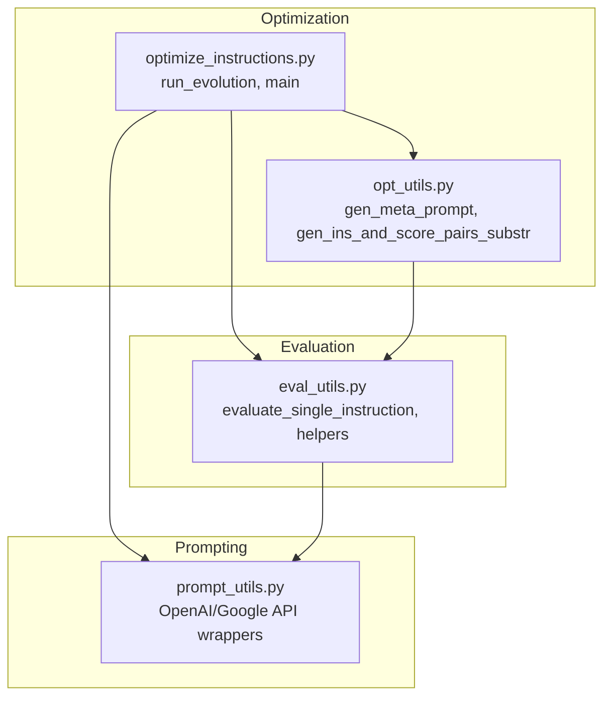
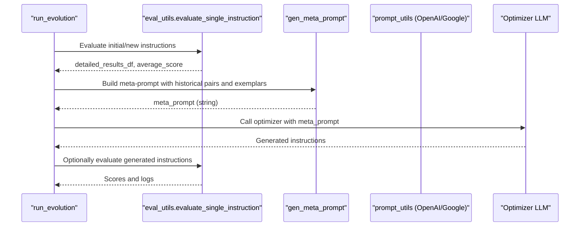
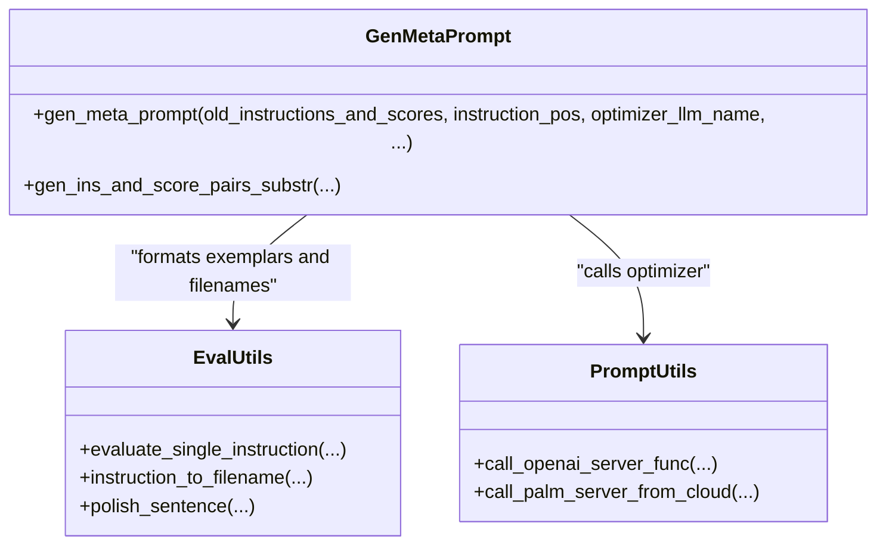
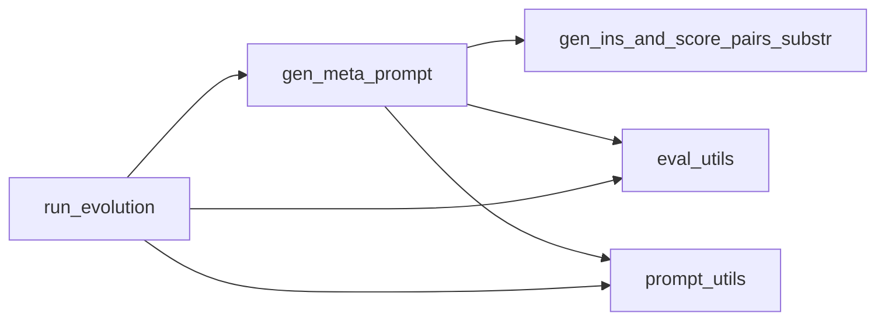

# Meta-Prompt Generation

<cite>
**Referenced Files in This Document**
- [opt_utils.py](file://opro/optimization/opt_utils.py)
- [optimize_instructions.py](file://opro/optimization/optimize_instructions.py)
- [eval_utils.py](file://opro/evaluation/eval_utils.py)
- [prompt_utils.py](file://opro/prompt_utils.py)
- [README.md](file://README.md)
</cite>

## Table of Contents
1. [Introduction](#introduction)
2. [Project Structure](#project-structure)
3. [Core Components](#core-components)
4. [Architecture Overview](#architecture-overview)
5. [Detailed Component Analysis](#detailed-component-analysis)
6. [Dependency Analysis](#dependency-analysis)
7. [Performance Considerations](#performance-considerations)
8. [Troubleshooting Guide](#troubleshooting-guide)
9. [Conclusion](#conclusion)

## Introduction
This document explains the meta-prompt generation phase of the prompt optimization workflow, focusing on the gen_meta_prompt function in opt_utils.py. It details how historical instruction-score pairs are transformed into structured meta-prompts that guide the optimizer LLM. The document covers the data flow from old_instructions_and_scores through filtering by old_instruction_score_threshold to final meta-prompt construction, including provider-specific formatting for GPT and text-bison. It also documents key parameters such as meta_prompt_type, instruction_pos, few_shot_qa_pairs, and num_score_buckets, and provides concrete examples of meta-prompts to illustrate how instruction positioning affects optimization behavior. Finally, it addresses performance considerations and error handling for malformed inputs and invalid parameter combinations.

## Project Structure
The meta-prompt generation is implemented in the optimization module and integrates with evaluation and prompting utilities:
- opt_utils.py: Contains gen_meta_prompt and helper functions for building meta-prompts and filtering historical instructions.
- optimize_instructions.py: Entry point script that orchestrates the optimization loop and calls gen_meta_prompt.
- eval_utils.py: Provides evaluation utilities used to compute instruction scores and format dataset examples.
- prompt_utils.py: Utility functions for calling OpenAI and Google Cloud LLM APIs.

**Diagram sources**
- [opt_utils.py](file://opro/optimization/opt_utils.py#L90-L335)
- [optimize_instructions.py](file://opro/optimization/optimize_instructions.py#L1-L120)
- [eval_utils.py](file://opro/evaluation/eval_utils.py#L520-L620)
- [prompt_utils.py](file://opro/prompt_utils.py#L21-L133)

**Section sources**
- [README.md](file://README.md#L1-L79)
- [opt_utils.py](file://opro/optimization/opt_utils.py#L90-L335)
- [optimize_instructions.py](file://opro/optimization/optimize_instructions.py#L1-L120)

## Core Components
- gen_meta_prompt: Builds a structured meta-prompt from historical instruction-score pairs and optional few-shot QA exemplars, tailored to the optimizer LLM and instruction positioning.
- gen_ins_and_score_pairs_substr: Filters and formats historical instruction-score pairs for inclusion in the meta-prompt.
- run_evolution: Drives the optimization loop, computes instruction scores, selects few-shot examples, and constructs meta-prompts.

Key responsibilities:
- Transform historical tuples (instruction, score, step_index) into readable blocks with optional bucketized scores.
- Conditionally include dataset exemplars and format them according to instruction_pos and provider specifics.
- Control ordering between instruction blocks and exemplars via instructions_before_exemplars.
- Provide provider-specific instructions for GPT vs text-bison.

**Section sources**
- [opt_utils.py](file://opro/optimization/opt_utils.py#L52-L88)
- [opt_utils.py](file://opro/optimization/opt_utils.py#L90-L335)
- [opt_utils.py](file://opro/optimization/opt_utils.py#L528-L670)

## Architecture Overview
The meta-prompt generation pipeline connects the optimization loop with evaluation and provider-specific formatting:

**Diagram sources**
- [opt_utils.py](file://opro/optimization/opt_utils.py#L528-L670)
- [opt_utils.py](file://opro/optimization/opt_utils.py#L692-L740)
- [eval_utils.py](file://opro/evaluation/eval_utils.py#L578-L602)
- [prompt_utils.py](file://opro/prompt_utils.py#L21-L133)

## Detailed Component Analysis

### gen_meta_prompt: Meta-Prompt Construction
Purpose:
- Construct a structured meta-prompt that instructs the optimizer LLM to improve instructions or starting sentences, depending on provider and instruction_pos.

Inputs and roles:
- old_instructions_and_scores: List of (instruction, score, step_index) tuples.
- instruction_pos: Controls where the instruction placeholder appears in exemplars. Options include positions that place the instruction before the question, at the beginning/end of the question, or at the beginning of the answer.
- optimizer_llm_name: Determines provider-specific instructions and formatting.
- old_instruction_score_threshold: Filters historical instructions by score.
- max_num_instructions: Caps the number of historical entries included.
- meta_prompt_type: "both_instructions_and_exemplars" or "instructions_only".
- few_shot_qa_pairs: Whether to include dataset exemplars.
- include_qa: Whether to include explicit Q:/A: markers in exemplars.
- data/few_shot_index_list: Dataset and indices for exemplars.
- instructions_before_exemplars: Order of instruction blocks vs exemplars.
- num_score_buckets: Bucketizes scores for compactness.
- dataset_name/task_name: Used for task description in instructions_only mode.

Processing logic:
- Validates instruction_pos, meta_prompt_type, dataset_name, and num_score_buckets.
- Selects provider-specific introductory text for instruction generation.
- Builds historical instruction-score blocks via gen_ins_and_score_pairs_substr.
- Optionally builds exemplar blocks from dataset examples, respecting instruction_pos and include_qa.
- Concatenates instruction blocks and exemplars in the configured order.
- Adds a final instruction to the optimizer (e.g., generate a new instruction or starting sentence) tailored to the provider and instruction_pos.

Provider differences:
- GPT models: Use placeholders like <INS> or <Start>, and include ground-truth answers in exemplars.
- text-bison: Uses a different framing and expects outputs in square brackets for text generation.

Instruction positioning effects:
- before_Q: Instruction appears before the question text in exemplars.
- Q_begin/Q_end: Instruction appears at the beginning or end of the question text.
- A_begin: Instruction appears at the beginning of the answer; for GPT, this targets generating a starting sentence.

Ordering control:
- instructions_before_exemplars controls whether instruction-score blocks precede exemplars.

Bucketization:
- num_score_buckets converts floating scores into discrete buckets for compact representation.

**Section sources**
- [opt_utils.py](file://opro/optimization/opt_utils.py#L90-L335)
- [opt_utils.py](file://opro/optimization/opt_utils.py#L52-L88)

#### gen_meta_prompt Class Diagram

**Diagram sources**
- [opt_utils.py](file://opro/optimization/opt_utils.py#L90-L335)
- [eval_utils.py](file://opro/evaluation/eval_utils.py#L578-L602)
- [prompt_utils.py](file://opro/prompt_utils.py#L87-L133)

### gen_ins_and_score_pairs_substr: Historical Pair Filtering and Formatting
Purpose:
- Filter historical instruction-score pairs by score threshold and step index, sort by score, cap by max_num_instructions, and format them into a string with optional bucketization.

Behavior:
- Sorts by score ascending and takes the last max_num_instructions.
- Applies threshold filtering.
- Formats each pair as a block with a textual label and score; if bucketizing, rounds to integer buckets.

Complexity:
- Sorting dominates at O(N log N); filtering and formatting are linear in the number of included pairs.

**Section sources**
- [opt_utils.py](file://opro/optimization/opt_utils.py#L52-L88)

### run_evolution: Optimization Loop and Meta-Prompt Usage
Purpose:
- Orchestrates the end-to-end optimization loop, including initial evaluation, few-shot selection, meta-prompt construction, and instruction generation.

Key steps:
- Evaluates initial instructions and stores (instruction, score, step_index) tuples.
- For each step, selects few-shot exemplars based on criteria (e.g., frequent wrong questions).
- Calls gen_meta_prompt to build the meta-prompt.
- Invokes the optimizer with the constructed meta-prompt.
- Processes optimizer outputs to extract new instructions and filters duplicates.

Integration points:
- Uses eval_utils.evaluate_single_instruction to compute scores.
- Uses prompt_utils to call OpenAI or Google Cloud APIs.

**Section sources**
- [opt_utils.py](file://opro/optimization/opt_utils.py#L528-L740)
- [opt_utils.py](file://opro/optimization/opt_utils.py#L743-L800)
- [eval_utils.py](file://opro/evaluation/eval_utils.py#L578-L602)
- [prompt_utils.py](file://opro/prompt_utils.py#L21-L133)

### Instruction Positioning Effects on Meta-Prompts
Instruction positioning determines how the instruction placeholder is embedded in exemplars and how the optimizer interprets the task:
- before_Q: Places the instruction before the question text in the exemplar.
- Q_begin/Q_end: Places the instruction at the beginning or end of the question text.
- A_begin: Places the instruction at the beginning of the answer; for GPT with A_begin, the task becomes generating a starting sentence.

These positions influence how the exemplars are formatted and how the final instruction to the optimizer is phrased.

Concrete examples (descriptive):
- GPT with instruction_pos Q_begin: The meta-prompt includes exemplars where the instruction placeholder appears at the beginning of the question text, and the final instruction asks the optimizer to produce a new instruction that improves performance across the exemplars.
- text-bison with instruction_pos Q_end: The meta-prompt includes exemplars where the instruction placeholder appears at the end of the question text, and the final instruction asks the optimizer to write a new text in square brackets that improves performance.

These examples illustrate how instruction positioning shapes the structure and intent of the meta-prompt.

**Section sources**
- [opt_utils.py](file://opro/optimization/opt_utils.py#L161-L335)

## Dependency Analysis
- gen_meta_prompt depends on:
  - gen_ins_and_score_pairs_substr for historical pair formatting.
  - eval_utils for dataset formatting and filename utilities.
  - prompt_utils for provider-specific API calls.
- run_evolution coordinates:
  - eval_utils for scoring and evaluation.
  - opt_utils for meta-prompt construction.
  - prompt_utils for API invocations.

**Diagram sources**
- [opt_utils.py](file://opro/optimization/opt_utils.py#L52-L88)
- [opt_utils.py](file://opro/optimization/opt_utils.py#L90-L335)
- [eval_utils.py](file://opro/evaluation/eval_utils.py#L578-L602)
- [prompt_utils.py](file://opro/prompt_utils.py#L21-L133)

**Section sources**
- [opt_utils.py](file://opro/optimization/opt_utils.py#L90-L335)
- [opt_utils.py](file://opro/optimization/opt_utils.py#L52-L88)
- [eval_utils.py](file://opro/evaluation/eval_utils.py#L578-L602)
- [prompt_utils.py](file://opro/prompt_utils.py#L21-L133)

## Performance Considerations
Token usage efficiency:
- num_score_buckets reduces token count by converting floating scores to discrete integers, especially useful when many historical instructions are included.
- max_num_instructions caps the number of historical entries, preventing excessive token growth.
- include_qa toggles explicit Q:/A: markers; disabling them can reduce tokens when not needed.

Computational overhead:
- gen_ins_and_score_pairs_substr sorts historical pairs by score and formats them; sorting cost is O(N log N).
- Few-shot selection (e.g., frequent wrong questions) adds additional computation per step, proportional to the number of saved instruction results and the number of exemplars considered.

Provider-specific considerations:
- GPT models may require additional formatting for ground-truth answers in exemplars.
- text-bison expects outputs in square brackets, affecting extraction logic downstream.

Best practices:
- Tune max_num_instructions and num_score_buckets to balance recall and token budget.
- Prefer include_qa only when the dataset format benefits from explicit markers.
- Use instructions_before_exemplars to prioritize historical context when the optimizer benefits from seeing prior attempts first.

[No sources needed since this section provides general guidance]

## Troubleshooting Guide
Common issues and validations:
- Invalid instruction_pos: Ensure instruction_pos is one of the supported values; otherwise, assertion errors will occur.
- Unsupported meta_prompt_type: Only two modes are supported; ensure correct mode is selected.
- Invalid dataset_name: Must be one of the supported datasets; otherwise, assertion errors will occur.
- Invalid num_score_buckets: Must be infinite or an integer; otherwise, assertion errors will occur.
- Provider mismatch: Ensure optimizer_llm_name matches supported providers; otherwise, assertions will fail during formatting.
- Malformed instruction inputs: If instruction extraction fails (e.g., missing placeholders), downstream parsing may not find expected delimiters; verify instruction_pos and provider-specific placeholders.

Debugging tips:
- Print intermediate meta-prompt strings to inspect formatting and ordering.
- Reduce max_num_instructions to isolate token-related issues.
- Temporarily disable few_shot_qa_pairs to confirm whether exemplars contribute to errors.

**Section sources**
- [opt_utils.py](file://opro/optimization/opt_utils.py#L140-L160)
- [opt_utils.py](file://opro/optimization/opt_utils.py#L161-L335)

## Conclusion
The gen_meta_prompt function transforms historical instruction-score pairs and dataset exemplars into a structured, provider-aware meta-prompt that guides the optimizer LLM. By controlling instruction_pos, meta_prompt_type, few_shot_qa_pairs, and num_score_buckets, practitioners can tailor the meta-prompt to improve optimization efficiency and effectiveness. Proper filtering and formatting ensure token efficiency, while robust assertions and provider-specific logic help prevent runtime errors. The optimization loop integrates meta-prompt generation with evaluation and API calls to iteratively refine instructions.