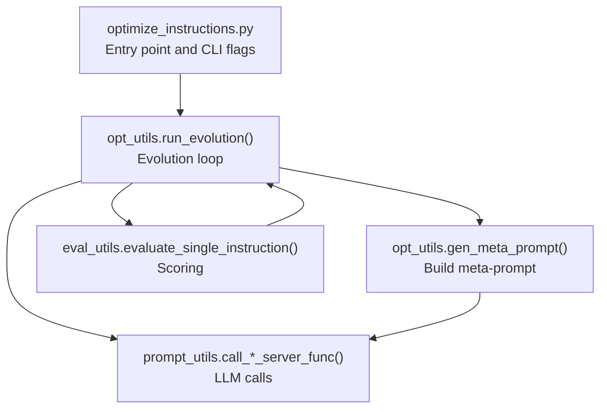
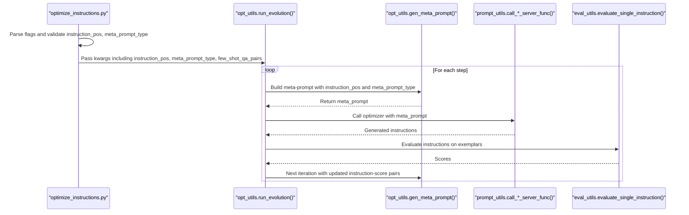
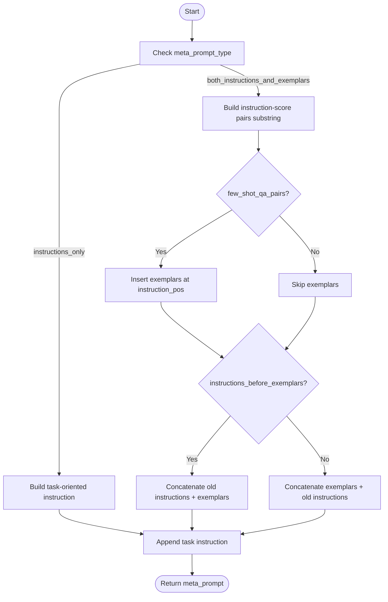
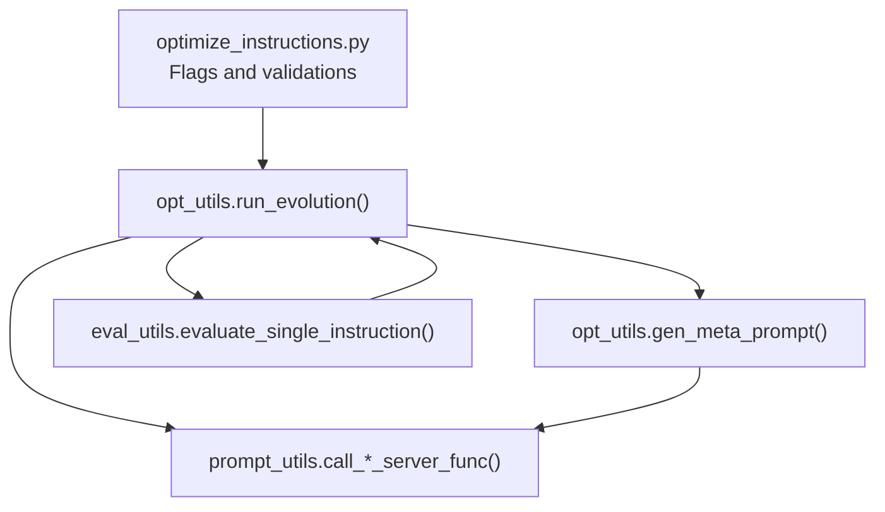

# Meta-Prompt Parameter Configuration

<cite>
**Referenced Files in This Document**
- [optimize_instructions.py](file://opro/optimization/optimize_instructions.py)
- [opt_utils.py](file://opro/optimization/opt_utils.py)
- [eval_utils.py](file://opro/evaluation/eval_utils.py)
- [prompt_utils.py](file://opro/prompt_utils.py)
- [README.md](file://README.md)
</cite>

## Table of Contents
1. [Introduction](#introduction)
2. [Project Structure](#project-structure)
3. [Core Components](#core-components)
4. [Architecture Overview](#architecture-overview)
5. [Detailed Component Analysis](#detailed-component-analysis)
6. [Dependency Analysis](#dependency-analysis)
7. [Performance Considerations](#performance-considerations)
8. [Troubleshooting Guide](#troubleshooting-guide)
9. [Conclusion](#conclusion)
10. [Appendices](#appendices)

## Introduction
This document explains how meta-prompt parameters are configured and validated in the optimization pipeline. It focuses on:
- instruction_pos: controls where the instruction is placed in the prompt template
- meta_prompt_type: toggles between including dataset exemplars and previous instructions, or only previous instructions
- few_shot_qa_pairs: enables inclusion of few-shot QA examples in the meta-prompt

It also documents how these parameters are validated, how they influence the generated meta-prompt structure, and provides configuration examples for different optimization scenarios. Guidance is included for selecting appropriate values for num_score_buckets and max_num_instructions based on model capabilities and token limitations.

## Project Structure
The optimization workflow is centered around two primary modules:
- opro/optimization/optimize_instructions.py: orchestrates the optimization loop and passes parameters to the evolution engine
- opro/optimization/opt_utils.py: constructs the meta-prompt and runs the evolutionary search

Supporting modules:
- opro/evaluation/eval_utils.py: defines how instruction_pos affects prompt construction during evaluation
- opro/prompt_utils.py: provides low-level server call utilities used by the optimizer and scorer

**Diagram sources**
- [optimize_instructions.py](file://opro/optimization/optimize_instructions.py#L104-L804)
- [opt_utils.py](file://opro/optimization/opt_utils.py#L338-L799)
- [eval_utils.py](file://opro/evaluation/eval_utils.py#L220-L260)
- [prompt_utils.py](file://opro/prompt_utils.py#L29-L146)

**Section sources**
- [optimize_instructions.py](file://opro/optimization/optimize_instructions.py#L104-L804)
- [opt_utils.py](file://opro/optimization/opt_utils.py#L338-L799)
- [eval_utils.py](file://opro/evaluation/eval_utils.py#L220-L260)
- [prompt_utils.py](file://opro/prompt_utils.py#L29-L146)

## Core Components
- instruction_pos: Defines the insertion point for the instruction in the prompt. Allowed values are validated and enforced in both the CLI entrypoint and the meta-prompt generator.
- meta_prompt_type: Controls whether the meta-prompt includes both previous instructions and dataset exemplars (“both_instructions_and_exemplars”) or only previous instructions (“instructions_only”). Validation occurs in the meta-prompt generator.
- few_shot_qa_pairs: When enabled, adds a small set of QA examples to guide instruction generation. The selection criteria and inclusion logic are handled in the evolution loop and meta-prompt generator.

Key validations and defaults:
- instruction_pos is constrained to a fixed set of positions and is validated early in the process.
- meta_prompt_type is constrained to two allowed values and validated in the meta-prompt generator.
- few_shot_qa_pairs is enabled by default in the optimization script and can be toggled.
- num_score_buckets and max_num_instructions are configurable and validated in the meta-prompt generator.

**Section sources**
- [optimize_instructions.py](file://opro/optimization/optimize_instructions.py#L113-L184)
- [opt_utils.py](file://opro/optimization/opt_utils.py#L140-L160)
- [opt_utils.py](file://opro/optimization/opt_utils.py#L90-L105)
- [opt_utils.py](file://opro/optimization/opt_utils.py#L710-L743)

## Architecture Overview
The optimization pipeline builds a meta-prompt tailored to the chosen instruction position and meta-prompt type, then uses an optimizer LLM to propose new instructions. The proposed instructions are scored by a separate scorer LLM and fed back into the meta-prompt for subsequent generations.

**Diagram sources**
- [optimize_instructions.py](file://opro/optimization/optimize_instructions.py#L104-L189)
- [opt_utils.py](file://opro/optimization/opt_utils.py#L338-L799)
- [eval_utils.py](file://opro/evaluation/eval_utils.py#L519-L566)
- [prompt_utils.py](file://opro/prompt_utils.py#L95-L146)

## Detailed Component Analysis

### Instruction Position (instruction_pos)
Purpose:
- Determines where the instruction tag (<INS>) or answer starter (<Start>) is inserted in the prompt template.

Allowed values and behavior:
- before_Q: Places the instruction before the question segment.
- Q_begin: Places the instruction at the beginning of the question.
- Q_end: Places the instruction at the end of the question.
- A_begin: Places the instruction at the beginning of the answer.

Validation:
- Both the CLI entrypoint and the meta-prompt generator enforce that instruction_pos belongs to the allowed set.

Impact on meta-prompt structure:
- When meta_prompt_type is “both_instructions_and_exemplars”, the generator composes a prompt with instruction-score pairs and optionally QA exemplars, inserting the instruction tag at the chosen position.
- When meta_prompt_type is “instructions_only”, the generator constructs a task-oriented instruction without exemplars, still respecting the chosen instruction_pos for placement.

Interaction with dataset types:
- The evaluation utilities demonstrate how instruction_pos affects prompt construction for different datasets. The meta-prompt generator mirrors these placements when building exemplars.

Common mismatches to avoid:
- Using A_begin with datasets that do not support answer-starting instructions (e.g., certain multiple-choice or boolean tasks) can lead to inconsistent prompt templates. Ensure instruction_pos aligns with the dataset’s expected input format.

**Section sources**
- [optimize_instructions.py](file://opro/optimization/optimize_instructions.py#L174-L184)
- [opt_utils.py](file://opro/optimization/opt_utils.py#L140-L160)
- [opt_utils.py](file://opro/optimization/opt_utils.py#L220-L246)
- [opt_utils.py](file://opro/optimization/opt_utils.py#L271-L296)
- [opt_utils.py](file://opro/optimization/opt_utils.py#L300-L335)
- [eval_utils.py](file://opro/evaluation/eval_utils.py#L220-L260)

### Meta-Prompt Type (meta_prompt_type)
Purpose:
- Controls whether the meta-prompt includes both previous instructions and dataset exemplars (“both_instructions_and_exemplars”), or only previous instructions (“instructions_only”).

Behavior:
- “both_instructions_and_exemplars”: The generator includes a section for prior instruction-score pairs and optionally QA exemplars. The order of these sections can be controlled by meta_prompt_instructions_before_exemplars.
- “instructions_only”: The generator creates a task-oriented instruction that instructs the optimizer to produce a new instruction or answer starter, without including exemplars.

Validation:
- The meta-prompt generator asserts that meta_prompt_type is one of the allowed values.

Impact on generated meta-prompt:
- With “both_instructions_and_exemplars”, the prompt includes explicit instruction-score pairs and QA exemplars, enabling the optimizer to learn from both historical performance and concrete examples.
- With “instructions_only”, the prompt focuses purely on leveraging historical instruction performance to guide new instruction generation.

Guidance:
- Use “both_instructions_and_exemplars” when the optimizer model is fine-tuned and benefits from seeing exemplars.
- Use “instructions_only” when using a pre-trained optimizer or when exemplars are not needed.

**Section sources**
- [opt_utils.py](file://opro/optimization/opt_utils.py#L161-L168)
- [opt_utils.py](file://opro/optimization/opt_utils.py#L169-L208)
- [opt_utils.py](file://opro/optimization/opt_utils.py#L255-L269)
- [opt_utils.py](file://opro/optimization/opt_utils.py#L297-L335)

### Few-Shot QA Pairs (few_shot_qa_pairs)
Purpose:
- Enables inclusion of a small set of QA examples in the meta-prompt to guide instruction generation.

Behavior:
- When enabled, the generator iterates through selected exemplar indices and formats them according to instruction_pos and dataset_name.
- The generator respects include_qa to decide whether to include “Q:” and “A:” markers or plain formats.

Selection criteria:
- The optimization script sets a default selection strategy (e.g., random) and passes it to the evolution loop, which selects exemplars for each step.

Impact on meta-prompt structure:
- Adding few-shot QA pairs increases the prompt length. Choose instruction_pos and include_qa formats that minimize redundancy and maximize clarity.

Guidance:
- Enable few_shot_qa_pairs when the optimizer benefits from seeing concrete examples.
- Disable when token budgets are tight or when focusing purely on instruction-score history.

**Section sources**
- [opt_utils.py](file://opro/optimization/opt_utils.py#L191-L254)
- [opt_utils.py](file://opro/optimization/opt_utils.py#L587-L688)
- [optimize_instructions.py](file://opro/optimization/optimize_instructions.py#L714-L716)

### Validation and Assertions
The system enforces correctness through multiple assertions:
- instruction_pos is validated in both the CLI entrypoint and the meta-prompt generator.
- meta_prompt_type is validated in the meta-prompt generator.
- dataset_name and task_name are validated in the CLI entrypoint.
- num_score_buckets is validated in the meta-prompt generator.
- few_shot_selection_criteria is validated in the CLI entrypoint.

These checks prevent misconfiguration and ensure consistent prompt construction.

**Section sources**
- [optimize_instructions.py](file://opro/optimization/optimize_instructions.py#L113-L184)
- [opt_utils.py](file://opro/optimization/opt_utils.py#L140-L160)
- [opt_utils.py](file://opro/optimization/opt_utils.py#L738-L743)

### How These Parameters Influence Meta-Prompt Construction
The meta-prompt generator composes the prompt in several stages:
1. Instruction-score pairs: Generated from historical instructions and scores, optionally bucketized by num_score_buckets and limited by max_num_instructions.
2. Exemplars: Optionally included when few_shot_qa_pairs is enabled, formatted according to instruction_pos and dataset_name.
3. Task instruction: Added by the generator to direct the optimizer to produce a new instruction or answer starter.

The order of instruction-score pairs and exemplars is controlled by meta_prompt_instructions_before_exemplars.

**Diagram sources**
- [opt_utils.py](file://opro/optimization/opt_utils.py#L90-L105)
- [opt_utils.py](file://opro/optimization/opt_utils.py#L161-L208)
- [opt_utils.py](file://opro/optimization/opt_utils.py#L255-L269)
- [opt_utils.py](file://opro/optimization/opt_utils.py#L271-L296)

**Section sources**
- [opt_utils.py](file://opro/optimization/opt_utils.py#L90-L105)
- [opt_utils.py](file://opro/optimization/opt_utils.py#L161-L208)
- [opt_utils.py](file://opro/optimization/opt_utils.py#L255-L296)

### Configuration Examples and Scenarios
- Answer priming with A_begin:
  - Use instruction_pos="A_begin" with meta_prompt_type="both_instructions_and_exemplars" to prime the answer-starting sentence for the optimizer.
  - Ensure the dataset supports answer-starting instructions; otherwise, consider Q_begin or Q_end.
  - Example flag usage: --instruction_pos="A_begin" --meta_prompt_type="both_instructions_and_exemplars"

- Question modification with Q_begin:
  - Use instruction_pos="Q_begin" with meta_prompt_type="both_instructions_and_exemplars" to modify the question text with an instruction.
  - Suitable for datasets where question framing impacts performance.
  - Example flag usage: --instruction_pos="Q_begin" --meta_prompt_type="both_instructions_and_exemplars"

- Pre-trained optimizer with instructions_only:
  - Use meta_prompt_type="instructions_only" to rely solely on historical instruction performance.
  - Good for reducing prompt length and focusing on instruction-score history.
  - Example flag usage: --meta_prompt_type="instructions_only"

- Few-shot refinement:
  - Enable few_shot_qa_pairs and choose a selection criterion (e.g., random) to refine instructions on problematic exemplars.
  - Example flag usage: --few_shot_qa_pairs=True --few_shot_selection_criteria="random"

**Section sources**
- [optimize_instructions.py](file://opro/optimization/optimize_instructions.py#L27-L31)
- [optimize_instructions.py](file://opro/optimization/optimize_instructions.py#L113-L184)
- [opt_utils.py](file://opro/optimization/opt_utils.py#L161-L208)
- [opt_utils.py](file://opro/optimization/opt_utils.py#L271-L296)
- [opt_utils.py](file://opro/optimization/opt_utils.py#L587-L688)

### Selecting num_score_buckets and max_num_instructions
- num_score_buckets:
  - Controls how scores are rounded/bucketized in the meta-prompt. Use np.inf to display floating-point scores or a positive integer to reduce token usage by grouping scores into buckets.
  - Lower values reduce token count but decrease granularity; higher values increase clarity at the cost of tokens.

- max_num_instructions:
  - Limits the number of historical instruction-score pairs included in the meta-prompt. Larger values provide more context but increase token usage.
  - Choose based on model context window and available tokens.

Guidance:
- Start with moderate values (e.g., num_score_buckets=100, max_num_instructions=20) and adjust based on model performance and token budget.
- For long-context models, increase max_num_instructions cautiously; for constrained models, reduce both values.

**Section sources**
- [opt_utils.py](file://opro/optimization/opt_utils.py#L47-L50)
- [opt_utils.py](file://opro/optimization/opt_utils.py#L52-L88)
- [opt_utils.py](file://opro/optimization/opt_utils.py#L90-L105)
- [optimize_instructions.py](file://opro/optimization/optimize_instructions.py#L727-L735)

## Dependency Analysis
The optimization pipeline depends on:
- CLI entrypoint for parsing flags and validating instruction_pos and meta_prompt_type
- Evolution loop for orchestrating instruction generation and evaluation
- Meta-prompt generator for constructing prompts tailored to instruction_pos and meta_prompt_type
- Evaluation utilities for scoring instructions consistently with instruction_pos
- Prompt utilities for calling the optimizer and scorer

**Diagram sources**
- [optimize_instructions.py](file://opro/optimization/optimize_instructions.py#L104-L189)
- [opt_utils.py](file://opro/optimization/opt_utils.py#L338-L799)
- [eval_utils.py](file://opro/evaluation/eval_utils.py#L519-L566)
- [prompt_utils.py](file://opro/prompt_utils.py#L95-L146)

**Section sources**
- [optimize_instructions.py](file://opro/optimization/optimize_instructions.py#L104-L189)
- [opt_utils.py](file://opro/optimization/opt_utils.py#L338-L799)
- [eval_utils.py](file://opro/evaluation/eval_utils.py#L519-L566)
- [prompt_utils.py](file://opro/prompt_utils.py#L95-L146)

## Performance Considerations
- Token budget: Few-shot exemplars and instruction-score pairs increase prompt length. Reduce max_num_instructions and consider bucketizing scores via num_score_buckets to fit within model context windows.
- Model capabilities: Fine-tuned optimizers may benefit from exemplars; pre-trained optimizers may perform well with instructions_only.
- Selection strategy: Random selection reduces overhead; accumulative or current-most-frequent strategies may improve instruction quality at the cost of extra computation.

[No sources needed since this section provides general guidance]

## Troubleshooting Guide
Common configuration errors and resolutions:
- Invalid instruction_pos:
  - Symptom: Assertion failure indicating instruction_pos must be one of the allowed values.
  - Resolution: Ensure instruction_pos is one of before_Q, Q_begin, Q_end, A_begin.

- Invalid meta_prompt_type:
  - Symptom: Assertion failure indicating meta_prompt_type must be one of the allowed values.
  - Resolution: Set meta_prompt_type to both_instructions_and_exemplars or instructions_only.

- Mismatched instruction_pos with dataset/task:
  - Symptom: Inconsistent prompt structure or scoring failures.
  - Resolution: Align instruction_pos with dataset expectations (e.g., avoid A_begin for datasets that do not support answer-starting instructions).

- Missing API keys:
  - Symptom: Assertion failures requiring OpenAI or PaLM API keys.
  - Resolution: Provide --openai_api_key or --palm_api_key depending on the chosen models.

- Excessive token usage:
  - Symptom: Model context window exceeded.
  - Resolution: Reduce max_num_instructions and/or set num_score_buckets to a finite integer.

**Section sources**
- [optimize_instructions.py](file://opro/optimization/optimize_instructions.py#L113-L184)
- [opt_utils.py](file://opro/optimization/opt_utils.py#L140-L160)
- [opt_utils.py](file://opro/optimization/opt_utils.py#L738-L743)
- [README.md](file://README.md#L31-L44)

## Conclusion
The meta-prompt parameter configuration in the optimization pipeline centers on instruction_pos, meta_prompt_type, and few_shot_qa_pairs. Robust assertions ensure correctness, while the meta-prompt generator composes prompts tailored to the chosen instruction position and type. By aligning these parameters with dataset characteristics and model capabilities, and by tuning num_score_buckets and max_num_instructions, practitioners can achieve efficient and effective instruction optimization.

[No sources needed since this section summarizes without analyzing specific files]

## Appendices
- Quickstart usage and supported models are documented in the repository README.

**Section sources**
- [README.md](file://README.md#L25-L57)