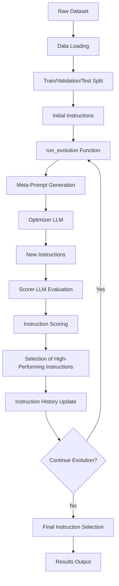
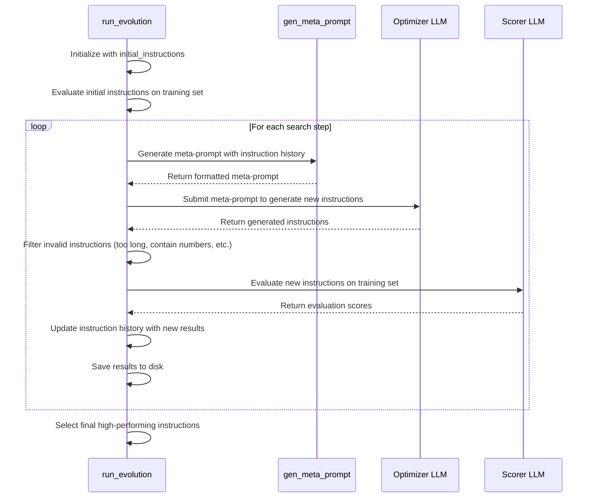
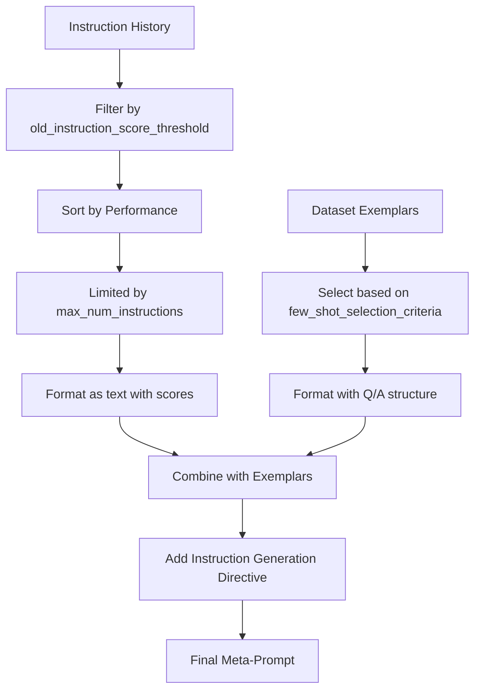
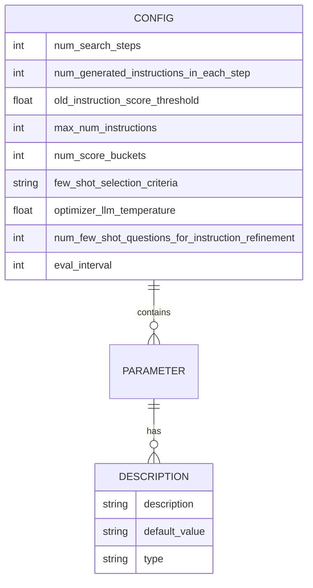

# Optimization Workflow

<cite>
**Referenced Files in This Document**   
- [opt_utils.py](file://opro/optimization/opt_utils.py)
- [optimize_instructions.py](file://opro/optimization/optimize_instructions.py)
- [evaluate_instructions.py](file://opro/evaluation/evaluate_instructions.py)
- [eval_utils.py](file://opro/evaluation/eval_utils.py)
- [prompt_utils.py](file://opro/prompt_utils.py)
</cite>

## Table of Contents
1. [Introduction](#introduction)
2. [Core Components](#core-components)
3. [Architecture Overview](#architecture-overview)
4. [Detailed Component Analysis](#detailed-component-analysis)
5. [Data Flow and Lifecycle](#data-flow-and-lifecycle)
6. [Key Parameters and Configuration](#key-parameters-and-configuration)
7. [Performance Considerations](#performance-considerations)
8. [Error Handling](#error-handling)
9. [Conclusion](#conclusion)

## Introduction
The prompt optimization workflow in the OPRO system is designed to iteratively improve instruction quality through an evolutionary process. The core of this workflow is the `run_evolution` function in `opt_utils.py`, which orchestrates the complete lifecycle of instruction optimization. This process begins with initial instructions and systematically generates new instructions through meta-prompts, evaluates them using scorer LLMs, and selects high-performing instructions for subsequent iterations. The workflow handles various datasets including MMLU, BBH, and GSM8K, with sophisticated data splitting strategies and evaluation methodologies. The system is configurable through numerous parameters that control the optimization behavior, allowing for fine-tuned control over the evolutionary process.

## Core Components
The prompt optimization workflow consists of several interconnected components that work together to evolve high-quality instructions. The primary components include the instruction generation mechanism, evaluation system, data management, and result tracking. The workflow begins by loading raw datasets and splitting them into train/validation/test sets for proper evaluation. The `run_evolution` function serves as the central orchestrator, managing the iterative process of generating new instructions based on previous performance. Instruction generation is accomplished through meta-prompts that incorporate both historical instruction-performance pairs and dataset exemplars. The evaluation system uses scorer LLMs to assess instruction effectiveness on the training set, with results stored for future reference and analysis. Throughout the process, the system maintains comprehensive tracking of all generated instructions, their scores, and associated metadata.

**Section sources**
- [opt_utils.py](file://opro/optimization/opt_utils.py#L338-L1036)
- [optimize_instructions.py](file://opro/optimization/optimize_instructions.py#L104-L800)

## Architecture Overview

**Diagram sources **
- [opt_utils.py](file://opro/optimization/opt_utils.py#L338-L1036)
- [optimize_instructions.py](file://opro/optimization/optimize_instructions.py#L104-L800)

## Detailed Component Analysis

### run_evolution Function Analysis
The `run_evolution` function is the core of the prompt optimization workflow, implementing an iterative evolutionary algorithm for instruction improvement. The function begins by initializing with a set of initial instructions, which are first evaluated on the training dataset to establish baseline performance. For each search step, the function generates a meta-prompt that combines historical instruction-performance pairs with dataset exemplars to guide the optimizer LLM in creating new instructions. The meta-prompt construction is controlled by several parameters including `old_instruction_score_threshold`, which filters which previous instructions are included based on their performance.

**Diagram sources **
- [opt_utils.py](file://opro/optimization/opt_utils.py#L338-L1036)

### Meta-Prompt Generation
The meta-prompt generation process is a critical component that guides the optimizer LLM in creating improved instructions. The `gen_meta_prompt` function constructs prompts that include both historical instruction-performance pairs and dataset exemplars, creating a rich context for instruction evolution. The function supports different meta-prompt types, including "both_instructions_and_exemplars" for fine-tuned optimizers and "instructions_only" for pre-trained models. Historical instructions are filtered by the `old_instruction_score_threshold` parameter and limited by `max_num_instructions` to prevent prompt overflow. The meta-prompt format varies based on the optimizer LLM type, with specific templates for GPT models and text-bison.

**Diagram sources **
- [opt_utils.py](file://opro/optimization/opt_utils.py#L90-L335)

## Data Flow and Lifecycle
The data flow in the prompt optimization workflow follows a systematic lifecycle from raw dataset loading through final instruction selection. The process begins with loading raw datasets from the data directory, which are then split into train/validation/test sets according to specified ratios. For MMLU datasets, this involves reading multiple CSV files and concatenating them into a single DataFrame. BBH datasets are loaded as JSON lists, while GSM8K data comes from TSV files. The training set is used for primary evaluation of instructions, while the validation set is used for periodic evaluation at intervals defined by `eval_interval`.

The instruction optimization lifecycle consists of several phases: initialization, iterative evolution, and final selection. During initialization, the provided `initial_instructions` are evaluated on the training set to establish baseline performance. The iterative evolution phase consists of multiple search steps, each generating new instructions through the meta-prompt process. Generated instructions are evaluated on the training set, with results stored in CSV files named by instruction hash. High-performing instructions are retained in the instruction history for inclusion in future meta-prompts, while low-performing ones are discarded based on the `old_instruction_score_threshold`.

**Diagram sources **
- [opt_utils.py](file://opro/optimization/opt_utils.py#L338-L1036)
- [optimize_instructions.py](file://opro/optimization/optimize_instructions.py#L104-L800)

## Key Parameters and Configuration
The prompt optimization workflow is controlled by numerous parameters that influence its behavior and performance. The `num_search_steps` parameter determines the total number of iterations in the evolutionary process, with each step potentially generating new instructions. The `num_generated_instructions_in_each_step` parameter controls how many instructions are generated per iteration, directly affecting the exploration rate of the search space. The `old_instruction_score_threshold` parameter acts as a filter, determining which historical instructions are included in meta-prompts based on their performance.

Other critical parameters include `max_num_instructions`, which limits the number of historical instruction-performance pairs included in meta-prompts to prevent token overflow, and `num_score_buckets`, which discretizes continuous accuracy scores into integer buckets for the optimizer LLM. The `few_shot_selection_criteria` parameter controls how exemplars are selected for inclusion in meta-prompts, with options including "random", "constant", "accumulative_most_frequent", and "current_most_frequent". The `optimizer_llm_temperature` parameter controls the creativity of the optimizer LLM, with higher values producing more diverse but potentially less coherent instructions.

**Diagram sources **
- [opt_utils.py](file://opro/optimization/opt_utils.py#L338-L1036)
- [optimize_instructions.py](file://opro/optimization/optimize_instructions.py#L104-L800)

## Performance Considerations
The prompt optimization workflow involves significant computational and financial costs due to extensive LLM API calls. Each search step requires multiple API calls to both the optimizer and scorer LLMs, with costs scaling linearly with `num_search_steps` and `num_generated_instructions_in_each_step`. The system implements several strategies to manage these costs, including instruction deduplication through MD5 hashing and result caching to avoid re-evaluating previously assessed instructions.

Rate limiting is a critical consideration, as both OpenAI and Google Cloud APIs enforce request limits. The system handles this through retry mechanisms with exponential backoff in the `prompt_utils.py` functions. Computational complexity is primarily determined by the size of the instruction history, as each meta-prompt includes historical instruction-performance pairs. The `max_num_instructions` parameter helps control this complexity by limiting the history size. Memory usage scales with the number of unique instructions evaluated, as all results are stored in memory and periodically saved to disk.

The workflow also considers the trade-off between exploration and exploitation. Higher `optimizer_llm_temperature` values encourage exploration of novel instructions but may reduce coherence, while lower values favor exploitation of proven patterns. The `few_shot_selection_criteria` parameter further influences this balance, with "random" selection promoting exploration and "accumulative_most_frequent" focusing on persistent problem areas.

**Section sources**
- [opt_utils.py](file://opro/optimization/opt_utils.py#L338-L1036)
- [prompt_utils.py](file://opro/prompt_utils.py#L1-L133)

## Error Handling
The prompt optimization workflow includes comprehensive error handling for various failure modes. LLM API calls are wrapped in retry mechanisms that handle common errors such as timeouts, rate limits, and service unavailability. The `call_openai_server_single_prompt` and `call_palm_server_from_cloud` functions implement specific error handlers for their respective APIs, with automatic retries after appropriate delay periods.

Instruction validation occurs at multiple stages to ensure quality and consistency. Generated instructions are checked for excessive length (>500 characters), presence of numbers (for GSM8K tasks), and containment of the "INS" placeholder, with invalid instructions being discarded. The system also prevents re-evaluation of previously assessed instructions through MD5 hashing, reducing unnecessary API calls and computational overhead.

Data integrity is maintained through comprehensive result serialization. After each search step, the system saves all results to a pickle file, enabling recovery from interruptions. The `results_dict.pkl` file contains the complete state of the optimization process, including meta-prompts, instruction histories, evaluation results, and configuration parameters. This allows the workflow to be resumed from the last saved state in case of failures.

**Section sources**
- [opt_utils.py](file://opro/optimization/opt_utils.py#L338-L1036)
- [prompt_utils.py](file://opro/prompt_utils.py#L1-L133)

## Conclusion
The prompt optimization workflow implemented in the OPRO system represents a sophisticated evolutionary approach to instruction improvement. By systematically generating, evaluating, and selecting instructions through an iterative process, the system can discover high-performing prompts that significantly enhance LLM performance on various tasks. The workflow's modular design, with clear separation between instruction generation, evaluation, and selection components, enables flexible configuration and adaptation to different datasets and optimization goals.

Key strengths of the system include its comprehensive handling of instruction history, sophisticated meta-prompt construction, and robust error handling. The ability to configure numerous parameters allows fine-tuning of the optimization process for specific use cases. Future improvements could include adaptive parameter tuning, more sophisticated instruction crossover and mutation operators, and enhanced result visualization capabilities. The system provides a solid foundation for automated prompt engineering, with potential applications in various domains requiring optimized LLM interactions.