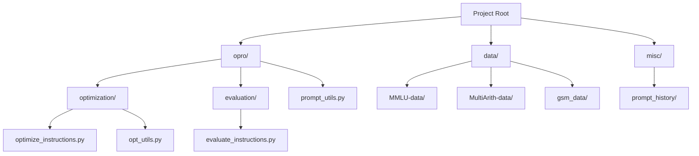
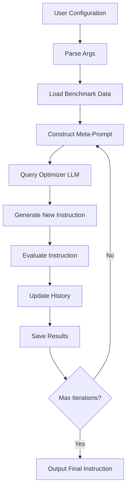
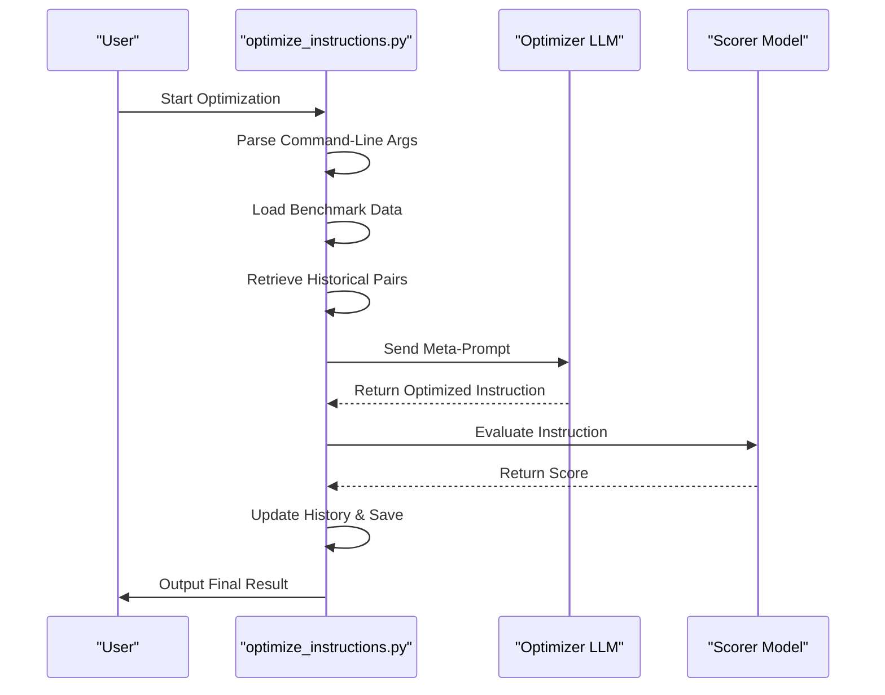
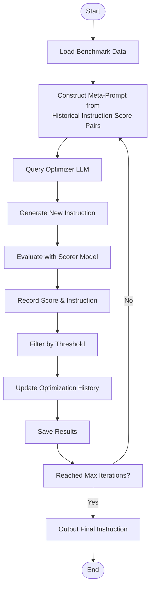
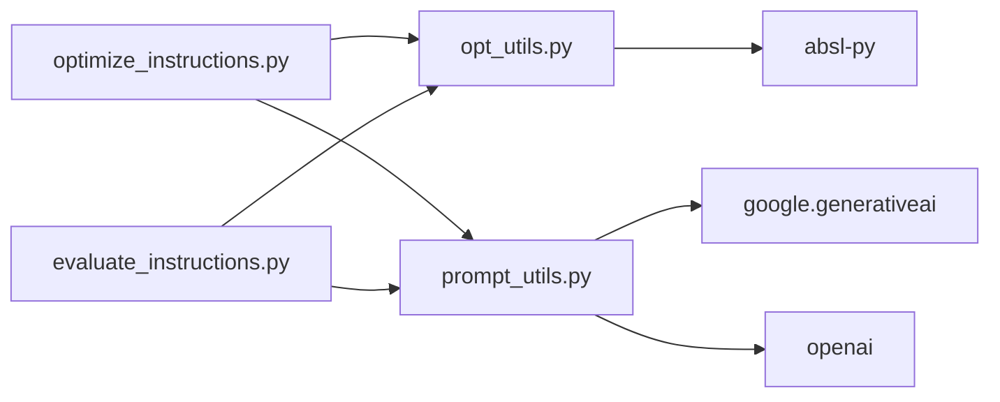

# Prompt Optimization

<cite>
**Referenced Files in This Document**   
- [optimize_instructions.py](file://opro/optimization/optimize_instructions.py)
- [opt_utils.py](file://opro/optimization/opt_utils.py)
- [prompt_utils.py](file://opro/prompt_utils.py)
- [evaluate_instructions.py](file://opro/evaluation/evaluate_instructions.py)
- [README.md](file://README.md)
</cite>

## Table of Contents
1. [Introduction](#introduction)
2. [Project Structure](#project-structure)
3. [Core Components](#core-components)
4. [Architecture Overview](#architecture-overview)
5. [Detailed Component Analysis](#detailed-component-analysis)
6. [Dependency Analysis](#dependency-analysis)
7. [Performance Considerations](#performance-considerations)
8. [Troubleshooting Guide](#troubleshooting-guide)
9. [Conclusion](#conclusion)

## Introduction

The Prompt Optimization system is designed to leverage large language models (LLMs) as optimizers for improving instruction quality through iterative refinement. The core module, `optimize_instructions.py`, serves as the main entry point for this process, enabling users to generate enhanced instructions by utilizing LLM-based optimization techniques. This system follows a meta-learning approach where historical instruction-score pairs are used to construct meta-prompts that guide optimizer LLMs in generating improved instructions. The workflow involves loading benchmark data, constructing meta-prompts, querying optimizer models, evaluating performance, and saving results across iterations. The system supports multiple LLMs such as GPT and PaLM, with configurable parameters for temperature, decoding steps, and scoring mechanisms.

**Section sources**
- [README.md](file://README.md#L1-L79)
- [optimize_instructions.py](file://opro/optimization/optimize_instructions.py#L1-L50)

## Project Structure

The project is organized into several key directories that separate concerns and facilitate modularity. The root contains configuration files and documentation, while the `opro` directory houses the core functionality. Within `opro`, the `optimization` subdirectory contains the primary optimization scripts including `optimize_instructions.py`, which drives the instruction improvement process. The `evaluation` directory includes modules for assessing instruction performance, such as `evaluate_instructions.py`. Utility functions for prompt handling are located in `prompt_utils.py`, and shared optimization utilities are in `opt_utils.py`. Benchmark datasets are stored under the `data` directory, categorized by task type (e.g., MMLU, GSM8K), while historical prompt optimization runs are archived in `misc/prompt_history`.

**Diagram sources**
- [optimize_instructions.py](file://opro/optimization/optimize_instructions.py#L1-L20)
- [evaluate_instructions.py](file://opro/evaluation/evaluate_instructions.py#L1-L15)

**Section sources**
- [optimize_instructions.py](file://opro/optimization/optimize_instructions.py#L1-L100)
- [evaluate_instructions.py](file://opro/evaluation/evaluate_instructions.py#L1-L80)

## Core Components

The core functionality of the prompt optimization system revolves around the `optimize_instructions.py` module, which orchestrates the iterative improvement of instructions using LLMs as optimizers. It loads benchmark data, constructs meta-prompts from historical instruction-score pairs, queries optimizer LLMs (such as GPT or PaLM), evaluates the generated instructions via scorer models, and saves results for future iterations. The system maintains a memory of past instruction attempts and their corresponding scores, filtering them based on performance thresholds to ensure only high-quality examples inform future optimizations. Key parameters like temperature, max_decode_steps, and instruction position are configurable via command-line flags, allowing fine-grained control over the optimization process.

**Section sources**
- [optimize_instructions.py](file://opro/optimization/optimize_instructions.py#L50-L200)
- [opt_utils.py](file://opro/optimization/opt_utils.py#L10-L100)

## Architecture Overview

The prompt optimization architecture follows a modular design with clear separation between optimization, evaluation, and utility components. The system begins with user-specified configuration through command-line arguments, which are parsed and used to initialize the optimization loop. The optimizer LLM generates new instructions based on meta-prompts constructed from previous high-performing instruction-score pairs. These instructions are then evaluated using a scorer model on benchmark datasets, and results are recorded for subsequent iterations. The architecture supports multiple meta_prompt_types that influence how historical data is incorporated into the optimization process, enabling different strategies such as few-shot prompting or iterative refinement.

**Diagram sources**
- [optimize_instructions.py](file://opro/optimization/optimize_instructions.py#L100-L300)
- [opt_utils.py](file://opro/optimization/opt_utils.py#L50-L150)

## Detailed Component Analysis

### optimize_instructions.py Analysis

The `optimize_instructions.py` module implements the primary logic for instruction optimization through an iterative LLM-driven process. It begins by parsing command-line arguments that define the optimizer model, scorer model, dataset, and other parameters. The optimization loop loads benchmark examples and constructs meta-prompts using historical instruction-score pairs filtered by a performance threshold. Different meta_prompt_types determine how these examples are formatted and presented to the optimizer LLM, influencing its behavior and output style. The module supports various instruction positions (e.g., Q_begin, Q_end) and allows customization of generation parameters such as temperature and max_decode_steps.

#### For API/Service Components:

**Diagram sources**
- [optimize_instructions.py](file://opro/optimization/optimize_instructions.py#L150-L400)

**Section sources**
- [optimize_instructions.py](file://opro/optimization/optimize_instructions.py#L100-L500)

### opt_utils.py Analysis

The `opt_utils.py` module provides shared utilities for the optimization process, including functions for loading and saving optimization histories, filtering instruction-score pairs by threshold, and constructing meta-prompts based on different templates. It defines the logic for maintaining a memory of past optimization attempts and ensures consistency in how historical data is processed across iterations. The module also handles formatting of input-output examples for inclusion in meta-prompts, supporting various meta_prompt_types that affect the optimizer's reasoning process.

**Section sources**
- [opt_utils.py](file://opro/optimization/opt_utils.py#L1-L200)

### Command-Line Interface

The system exposes a comprehensive set of command-line flags that map directly to internal optimization parameters:

| Flag | Purpose | Internal Parameter |
|------|---------|-------------------|
| `--optimizer` | Specifies the LLM used for optimization (e.g., gpt-3.5-turbo) | optimizer_model |
| `--scorer` | Specifies the model used for evaluation (e.g., text-bison) | scorer_model |
| `--instruction_pos` | Determines where instruction is placed in input (Q_begin/Q_end) | instruction_position |
| `--dataset` | Selects benchmark dataset (gsm8k, MMLU, etc.) | benchmark_dataset |
| `--task` | Defines operation mode (train/test) | task_mode |
| `--temperature` | Controls output randomness of optimizer LLM | temperature |
| `--max_decode_steps` | Limits generation length of optimizer | max_tokens |
| `--score_threshold` | Filters historical pairs by minimum score | threshold_filter |
| `--meta_prompt_type` | Selects template for constructing meta-prompts | prompt_template_strategy |

**Section sources**
- [optimize_instructions.py](file://opro/optimization/optimize_instructions.py#L20-L100)

### Optimization Workflow

The optimization process follows an iterative trajectory where each cycle improves upon previous instructions. In successful runs, the system demonstrates steady improvement in instruction quality, with early iterations making coarse improvements and later iterations refining nuances. For example, in GSM8K math problem solving, initial instructions might simply request step-by-step reasoning, while optimized versions explicitly prompt chain-of-thought decomposition, verification steps, and format constraints.

**Diagram sources**
- [optimize_instructions.py](file://opro/optimization/optimize_instructions.py#L100-L300)
- [opt_utils.py](file://opro/optimization/opt_utils.py#L30-L80)

**Section sources**
- [optimize_instructions.py](file://opro/optimization/optimize_instructions.py#L50-L400)

## Dependency Analysis

The prompt optimization system has a well-defined dependency structure with minimal circular references. The main module `optimize_instructions.py` depends on `opt_utils.py` for shared optimization logic and on `prompt_utils.py` for interfacing with LLM APIs. The evaluation component `evaluate_instructions.py` shares utilities with the optimization module but operates independently during execution. External dependencies include Google's generative AI library for PaLM access and OpenAI's API client for GPT models, both managed through abstraction layers in `prompt_utils.py`. Configuration is handled via absl-py for command-line argument parsing.

**Diagram sources**
- [optimize_instructions.py](file://opro/optimization/optimize_instructions.py#L1-L20)
- [opt_utils.py](file://opro/optimization/opt_utils.py#L1-L10)
- [prompt_utils.py](file://opro/prompt_utils.py#L1-L10)

**Section sources**
- [optimize_instructions.py](file://opro/optimization/optimize_instructions.py#L1-L50)
- [opt_utils.py](file://opro/optimization/opt_utils.py#L1-L30)
- [prompt_utils.py](file://opro/prompt_utils.py#L1-L40)

## Performance Considerations

The prompt optimization process incurs significant computational costs due to repeated LLM API calls across iterations. Each optimization step involves at least one call to the optimizer model and multiple calls to the scorer model for evaluation, leading to cumulative latency and financial cost. API latency can become a bottleneck, especially when using cloud-based LLMs with rate limiting. To mitigate costs, users are advised to start with small datasets and limited iteration counts. Early stopping strategies can be implemented by monitoring score improvements and terminating when gains plateau. Caching mechanisms for repeated evaluations and parallelization of independent evaluation tasks can improve efficiency. The system documentation explicitly warns about potential high API costs and recommends conservative initial experimentation.

**Section sources**
- [README.md](file://README.md#L59-L62)
- [optimize_instructions.py](file://opro/optimization/optimize_instructions.py#L200-L300)

## Troubleshooting Guide

Error handling in the prompt optimization system addresses common failure modes such as API connectivity issues, malformed LLM outputs, and invalid configuration parameters. Failed API calls are typically retried with exponential backoff, and structured error messages guide users toward resolution (e.g., checking API keys or quota limits). Malformed outputs from optimizer LLMs are detected through validation checks, and fallback mechanisms may use previous valid instructions. Configuration errors are caught during argument parsing, providing clear feedback on valid options. Users should verify their API keys, ensure network connectivity, and confirm model availability before running optimization jobs. The system logs detailed information about each step, facilitating debugging of optimization trajectories.

**Section sources**
- [optimize_instructions.py](file://opro/optimization/optimize_instructions.py#L300-L400)
- [prompt_utils.py](file://opro/prompt_utils.py#L50-L100)

## Conclusion

The prompt optimization system represents a sophisticated framework for leveraging LLMs as meta-optimizers of instructional quality. Through iterative refinement guided by performance feedback, it enables automated improvement of prompts for various benchmark tasks. The modular architecture separates concerns between optimization, evaluation, and utility functions, while supporting flexible configuration through command-line interfaces. By maintaining a memory of high-performing instruction variants and using them to guide future generations, the system embodies a form of evolutionary optimization. Despite its computational costs, the approach demonstrates the potential of LLMs not just as task solvers but as intelligent agents capable of improving their own operating procedures.