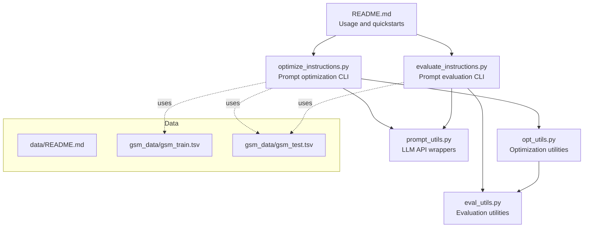
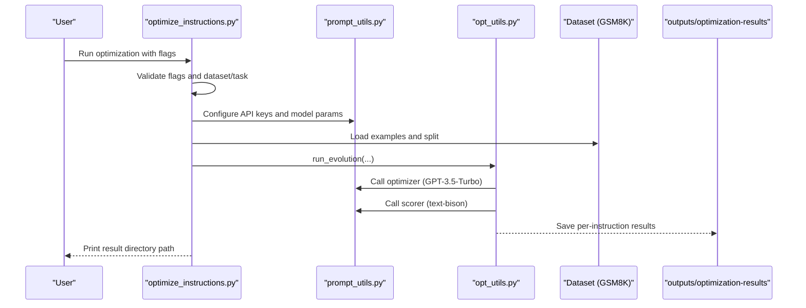
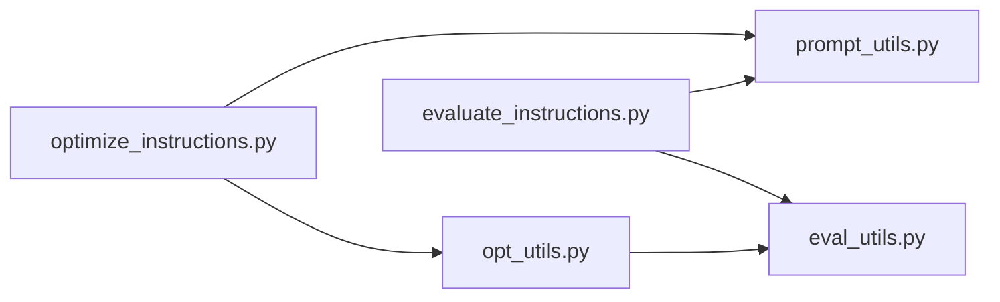

# Quick Start Guide

<cite>
**Referenced Files in This Document**
- [README.md](file://README.md)
- [optimize_instructions.py](file://opro/optimization/optimize_instructions.py)
- [evaluate_instructions.py](file://opro/evaluation/evaluate_instructions.py)
- [prompt_utils.py](file://opro/prompt_utils.py)
- [opt_utils.py](file://opro/optimization/opt_utils.py)
- [eval_utils.py](file://opro/evaluation/eval_utils.py)
- [data/README.md](file://data/README.md)
- [gsm_train.tsv](file://data/gsm_data/gsm_train.tsv)
- [gsm_test.tsv](file://data/gsm_data/gsm_test.tsv)
</cite>

## Table of Contents
1. [Introduction](#introduction)
2. [Project Structure](#project-structure)
3. [Core Components](#core-components)
4. [Architecture Overview](#architecture-overview)
5. [Detailed Component Analysis](#detailed-component-analysis)
6. [Dependency Analysis](#dependency-analysis)
7. [Performance Considerations](#performance-considerations)
8. [Troubleshooting Guide](#troubleshooting-guide)
9. [Conclusion](#conclusion)
10. [Appendices](#appendices)

## Introduction
This Quick Start Guide helps you run prompt optimization and evaluation workflows in opro using real-world examples. You will learn:
- How to run a minimal optimization workflow using GPT-3.5-Turbo as the optimizer and text-bison as the scorer on the GSM8K dataset.
- How to run a minimal evaluation workflow using text-bison as the scorer on the GSM8K test split.
- What each command-line argument means, valid values, and how they affect behavior.
- How to interpret output directories and log messages.
- Expected runtime and cost considerations.
- How to reduce costs during experimentation.
- Common beginner mistakes and how to avoid them.

## Project Structure
The repository organizes prompt optimization and evaluation into separate modules with clear entry points. Data for benchmark datasets resides under the data/ directory.

**Diagram sources**
- [README.md](file://README.md#L25-L45)
- [optimize_instructions.py](file://opro/optimization/optimize_instructions.py#L26-L33)
- [evaluate_instructions.py](file://opro/evaluation/evaluate_instructions.py#L26-L32)
- [opt_utils.py](file://opro/optimization/opt_utils.py#L1-L40)
- [eval_utils.py](file://opro/evaluation/eval_utils.py#L1-L40)
- [prompt_utils.py](file://opro/prompt_utils.py#L1-L40)
- [data/README.md](file://data/README.md#L1-L31)
- [gsm_train.tsv](file://data/gsm_data/gsm_train.tsv)
- [gsm_test.tsv](file://data/gsm_data/gsm_test.tsv)

**Section sources**
- [README.md](file://README.md#L25-L45)
- [data/README.md](file://data/README.md#L1-L31)

## Core Components
- Prompt optimization CLI: Runs iterative instruction refinement using an optimizer LLM and a scorer LLM on a selected dataset and task.
- Prompt evaluation CLI: Evaluates one or more instructions on a dataset split using a scorer LLM and writes per-example and aggregated results.
- LLM API wrappers: Provide unified functions to call OpenAI and Google Cloud text-bison models.
- Dataset loaders: Utilities to load GSM8K and other supported datasets.

Key entry points:
- Optimization: python opro/optimization/optimize_instructions.py ...
- Evaluation: python opro/evaluation/evaluate_instructions.py ...

**Section sources**
- [README.md](file://README.md#L25-L45)
- [optimize_instructions.py](file://opro/optimization/optimize_instructions.py#L26-L33)
- [evaluate_instructions.py](file://opro/evaluation/evaluate_instructions.py#L26-L32)

## Architecture Overview
The optimization workflow:
- Parses CLI flags and validates dataset/task/model combinations.
- Configures API keys and model parameters for the optimizer and scorer.
- Loads dataset examples and splits into train/eval/test.
- Iteratively generates candidate instructions, evaluates them with the scorer, and updates the meta-prompt with historical results.
- Writes results to outputs/optimization-results/<run-id>.

The evaluation workflow:
- Parses CLI flags and validates dataset/task/model combinations.
- Configures API keys and model parameters for the scorer.
- Loads dataset examples and splits into training and/or test folds.
- Evaluates each instruction on the chosen folds and writes CSV outputs.

**Diagram sources**
- [optimize_instructions.py](file://opro/optimization/optimize_instructions.py#L104-L210)
- [opt_utils.py](file://opro/optimization/opt_utils.py#L90-L160)
- [prompt_utils.py](file://opro/prompt_utils.py#L21-L133)
- [gsm_train.tsv](file://data/gsm_data/gsm_train.tsv)
- [gsm_test.tsv](file://data/gsm_data/gsm_test.tsv)

## Detailed Component Analysis

### Quick Start: Optimize Instructions on GSM8K
Goal: Use GPT-3.5-Turbo as optimizer and text-bison as scorer to optimize instructions on GSM8K train split.

Copy-paste command:
- python opro/optimization/optimize_instructions.py --optimizer="gpt-3.5-turbo" --scorer="text-bison" --instruction_pos="Q_begin" --dataset="gsm8k" --task="train" --palm_api_key="<your_palm_api_key>" --openai_api_key="<your_openai_api_key>"

Breakdown of arguments:
- --optimizer: Model name for the optimizer. Valid values include "gpt-3.5-turbo", "gpt-4", "text-bison". Using GPT models requires --openai_api_key.
- --scorer: Model name for the scorer. Valid values include "gpt-3.5-turbo", "gpt-4", "text-bison". Using GPT models requires --openai_api_key.
- --instruction_pos: Position of the instruction in the prompt. Valid values: "before_Q", "Q_begin", "Q_end", "A_begin".
- --dataset: Dataset name. Valid values: "gsm8k", "mmlu", "bbh". For GSM8K, the dataset file is loaded from data/gsm_data/gsm_train.tsv.
- --task: Task within the dataset. For GSM8K, valid values are "train" and "test". For MMLU, it is a category; for BBH, it is a task name.
- --palm_api_key: Required when using text-bison as optimizer or scorer.
- --openai_api_key: Required when using GPT models as optimizer or scorer.

What happens:
- The script validates dataset/task/model combinations and checks that required API keys are provided.
- It configures model parameters for both optimizer and scorer.
- It loads GSM8K training examples and splits into train/eval/test.
- It runs iterative optimization with a fixed number of steps and writes results to outputs/optimization-results/<timestamped-folder>.

Output interpretation:
- Look for a printed result directory path. Inside, there is a result_by_instruction subfolder containing per-instruction logs and metrics.
- Logs include model test calls, dataset statistics, and progress messages.

Duration and cost:
- Expect several hours for a full run depending on API latency and rate limits. Costs scale with the number of API calls and model pricing.

**Section sources**
- [README.md](file://README.md#L27-L45)
- [optimize_instructions.py](file://opro/optimization/optimize_instructions.py#L104-L210)
- [optimize_instructions.py](file://opro/optimization/optimize_instructions.py#L221-L239)
- [optimize_instructions.py](file://opro/optimization/optimize_instructions.py#L356-L369)
- [optimize_instructions.py](file://opro/optimization/optimize_instructions.py#L639-L659)
- [optimize_instructions.py](file://opro/optimization/optimize_instructions.py#L736-L800)
- [gsm_train.tsv](file://data/gsm_data/gsm_train.tsv)

### Quick Start: Evaluate Instructions on GSM8K
Goal: Evaluate a small set of instructions using text-bison as the scorer on GSM8K test split.

Copy-paste command:
- python opro/evaluation/evaluate_instructions.py --scorer="text-bison" --dataset="gsm8k" --task="test" --instruction_pos="Q_begin" --evaluate_training_fold=false --evaluate_test_fold=true --palm_api_key="<your_palm_api_key>"

Parameter descriptions:
- --scorer: Scoring model. Valid values: "gpt-3.5-turbo", "gpt-4", "text-bison".
- --dataset: Dataset name. Valid values: "gsm8k", "mmlu", "bbh", "multiarith", "aqua".
- --task: Task within the dataset. For GSM8K, valid values are "train" and "test".
- --instruction_pos: Instruction placement in prompts. Valid values: "before_Q", "Q_begin", "Q_end", "A_begin".
- --evaluate_training_fold: Whether to evaluate on the training split.
- --evaluate_test_fold: Whether to evaluate on the test split.
- --palm_api_key: Required when using text-bison.
- --openai_api_key: Required when using GPT models.

What happens:
- Validates dataset/task/model combinations and checks API keys.
- Loads GSM8K test examples and splits into training and/or test folds.
- Evaluates each instruction and writes CSV outputs per task and per instruction.

Output interpretation:
- Look for a printed result directory path. Inside, there is a subfolder named after the task (e.g., "test").
- Within that folder, CSV files contain per-example details and aggregated accuracy metrics.

Duration and cost:
- Shorter than optimization, but still depends on dataset size and API rate limits.

**Section sources**
- [README.md](file://README.md#L37-L45)
- [evaluate_instructions.py](file://opro/evaluation/evaluate_instructions.py#L98-L205)
- [evaluate_instructions.py](file://opro/evaluation/evaluate_instructions.py#L222-L237)
- [evaluate_instructions.py](file://opro/evaluation/evaluate_instructions.py#L296-L303)
- [evaluate_instructions.py](file://opro/evaluation/evaluate_instructions.py#L548-L553)
- [gsm_test.tsv](file://data/gsm_data/gsm_test.tsv)

### Command-Line Arguments Reference
- --optimizer: "gpt-3.5-turbo" | "gpt-4" | "text-bison"
- --scorer: "gpt-3.5-turbo" | "gpt-4" | "text-bison"
- --instruction_pos: "before_Q" | "Q_begin" | "Q_end" | "A_begin"
- --dataset: "gsm8k" | "mmlu" | "bbh" | "multiarith" | "aqua"
- --task: For "gsm8k": "train" | "test"; For "mmlu": category name; For "bbh": task name; For "multiarith"/"aqua": "self"
- --evaluate_training_fold: true | false
- --evaluate_test_fold: true | false
- --palm_api_key: <your_palm_api_key>
- --openai_api_key: <your_openai_api_key>

Validation and defaults:
- The scripts assert valid combinations and print helpful messages if assertions fail.
- Some parameters have defaults embedded in the scripts (e.g., instruction positions, dataset splits).

**Section sources**
- [optimize_instructions.py](file://opro/optimization/optimize_instructions.py#L113-L173)
- [optimize_instructions.py](file://opro/optimization/optimize_instructions.py#L174-L188)
- [evaluate_instructions.py](file://opro/evaluation/evaluate_instructions.py#L125-L178)
- [evaluate_instructions.py](file://opro/evaluation/evaluate_instructions.py#L195-L204)

### Output Directories and Log Messages
- Optimization outputs:
  - Directory printed by the script under outputs/optimization-results/<timestamped-folder>.
  - Subdirectory result_by_instruction contains per-instruction logs and metrics.
  - The script prints the full path to the result directory early in execution.
- Evaluation outputs:
  - Directory printed by the script under outputs/scorer-outputs/<timestamped-folder>.
  - Subdirectory named after the task (e.g., "test") contains CSV files for each instruction.
  - Per-example CSVs include accuracy and other metrics; aggregated averages are printed to stdout.

Log messages:
- Test calls to scorer and optimizer models are printed to confirm connectivity.
- Dataset statistics and split sizes are printed before evaluation begins.
- Progress messages indicate current step and saved artifacts.

**Section sources**
- [optimize_instructions.py](file://opro/optimization/optimize_instructions.py#L221-L239)
- [optimize_instructions.py](file://opro/optimization/optimize_instructions.py#L356-L369)
- [evaluate_instructions.py](file://opro/evaluation/evaluate_instructions.py#L222-L237)
- [evaluate_instructions.py](file://opro/evaluation/evaluate_instructions.py#L296-L303)
- [evaluate_instructions.py](file://opro/evaluation/evaluate_instructions.py#L736-L766)

### Cost and Duration Expectations
- Costs depend on:
  - Number of API calls (scorer calls per evaluation, optimizer calls per iteration).
  - Model pricing (GPT vs text-bison).
  - Dataset size and split ratios.
- Duration depends on:
  - Dataset size.
  - API latency and rate limits.
  - Number of optimization steps and evaluation batches.

Tips to reduce costs:
- Use smaller datasets or subsets for initial experiments.
- Reduce the number of optimization steps (see num_search_steps).
- Limit the number of instructions evaluated in evaluation mode.
- Prefer lower-cost models for preliminary runs (e.g., text-bison for scorer).
- Start with evaluation_test_fold=true and evaluate_training_fold=false to minimize calls.

**Section sources**
- [README.md](file://README.md#L59-L63)
- [optimize_instructions.py](file://opro/optimization/optimize_instructions.py#L708-L710)
- [evaluate_instructions.py](file://opro/evaluation/evaluate_instructions.py#L112-L117)

## Dependency Analysis
The optimization and evaluation scripts depend on shared utilities for prompting and evaluation.

**Diagram sources**
- [optimize_instructions.py](file://opro/optimization/optimize_instructions.py#L54-L63)
- [evaluate_instructions.py](file://opro/evaluation/evaluate_instructions.py#L52-L61)
- [opt_utils.py](file://opro/optimization/opt_utils.py#L23-L31)
- [eval_utils.py](file://opro/evaluation/eval_utils.py#L26-L34)

**Section sources**
- [optimize_instructions.py](file://opro/optimization/optimize_instructions.py#L54-L63)
- [evaluate_instructions.py](file://opro/evaluation/evaluate_instructions.py#L52-L61)
- [opt_utils.py](file://opro/optimization/opt_utils.py#L23-L31)
- [eval_utils.py](file://opro/evaluation/eval_utils.py#L26-L34)

## Performance Considerations
- API rate limits: Both OpenAI and Google Cloud APIs may throttle requests. The scripts include retry logic in prompt_utils.py for transient errors.
- Batch sizes: The scripts configure batch_size and num_decodes to match model serving configurations.
- Temperature and decoding parameters: Different models use different defaults for temperature and max_decode_steps.

**Section sources**
- [prompt_utils.py](file://opro/prompt_utils.py#L21-L133)
- [optimize_instructions.py](file://opro/optimization/optimize_instructions.py#L246-L354)
- [evaluate_instructions.py](file://opro/evaluation/evaluate_instructions.py#L239-L295)

## Troubleshooting Guide
Common beginner mistakes:
- Incorrect dataset name: Ensure --dataset is one of "gsm8k", "mmlu", "bbh", "multiarith", "aqua".
- Incorrect task name: For "gsm8k", use "train" or "test"; for "mmlu", use a category; for "bbh", use a task name.
- Missing API keys: If using GPT models, provide --openai_api_key; if using text-bison, provide --palm_api_key.
- Invalid instruction position: Use one of "before_Q", "Q_begin", "Q_end", "A_begin".
- Wrong model combination: The scripts assert valid combinations for --optimizer and --scorer.

Logs to watch:
- Printed result directory path for outputs.
- Test call outputs for scorer and optimizer to confirm connectivity.
- Dataset statistics and split sizes.

**Section sources**
- [optimize_instructions.py](file://opro/optimization/optimize_instructions.py#L113-L188)
- [optimize_instructions.py](file://opro/optimization/optimize_instructions.py#L356-L369)
- [evaluate_instructions.py](file://opro/evaluation/evaluate_instructions.py#L125-L204)
- [evaluate_instructions.py](file://opro/evaluation/evaluate_instructions.py#L296-L303)

## Conclusion
You can quickly start optimizing and evaluating prompts with opro by using the provided CLI commands. Begin with the minimal examples above, adjust parameters according to your goals, and monitor outputs and logs to track progress. For cost-conscious experimentation, reduce dataset size, limit steps, and prefer lower-cost models during exploration.

## Appendices

### Minimal Working Example: Optimization
- Command: python opro/optimization/optimize_instructions.py --optimizer="gpt-3.5-turbo" --scorer="text-bison" --instruction_pos="Q_begin" --dataset="gsm8k" --task="train" --palm_api_key="<your_palm_api_key>" --openai_api_key="<your_openai_api_key>"
- Expected output: A timestamped folder under outputs/optimization-results with result_by_instruction logs.

**Section sources**
- [README.md](file://README.md#L27-L45)
- [optimize_instructions.py](file://opro/optimization/optimize_instructions.py#L221-L239)

### Minimal Working Example: Evaluation
- Command: python opro/evaluation/evaluate_instructions.py --scorer="text-bison" --dataset="gsm8k" --task="test" --instruction_pos="Q_begin" --evaluate_training_fold=false --evaluate_test_fold=true --palm_api_key="<your_palm_api_key>"
- Expected output: A timestamped folder under outputs/scorer-outputs with CSV results per instruction.

**Section sources**
- [README.md](file://README.md#L37-L45)
- [evaluate_instructions.py](file://opro/evaluation/evaluate_instructions.py#L222-L237)

### Dataset Notes
- GSM8K files: data/gsm_data/gsm_train.tsv and data/gsm_data/gsm_test.tsv are used by the scripts for train/test splits.
- Other datasets: MMLU, BBH, MultiArith, and AQuA are supported; see data/README.md for sources.

**Section sources**
- [data/README.md](file://data/README.md#L1-L31)
- [gsm_train.tsv](file://data/gsm_data/gsm_train.tsv)
- [gsm_test.tsv](file://data/gsm_data/gsm_test.tsv)