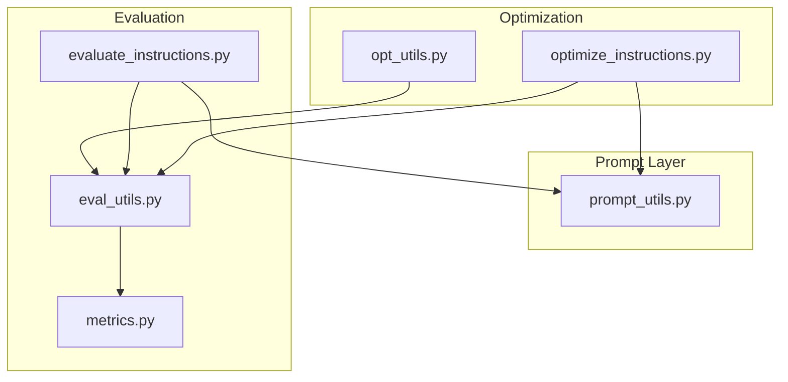
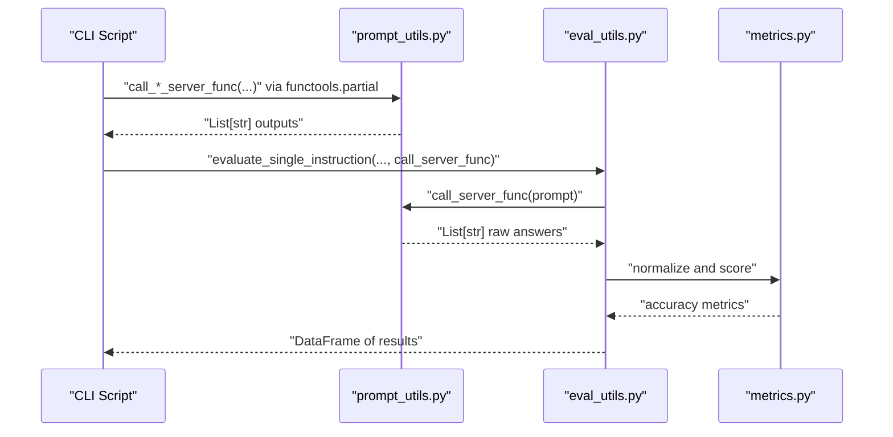
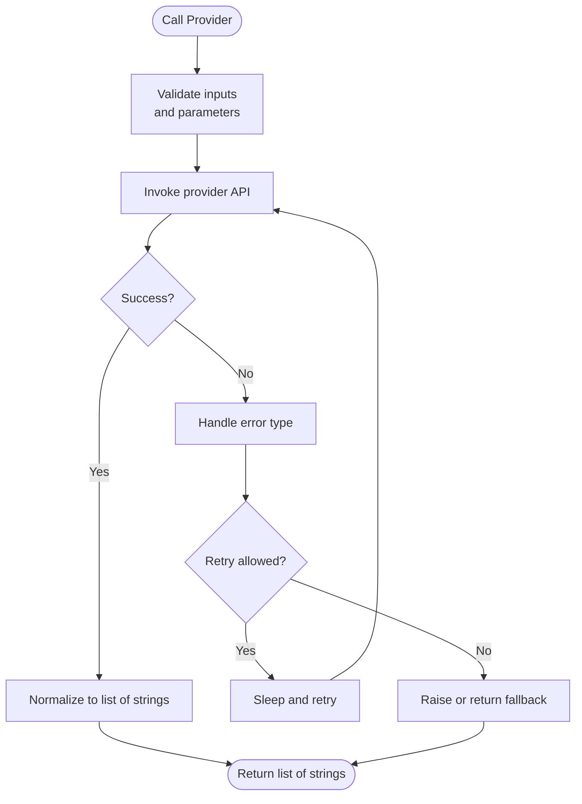
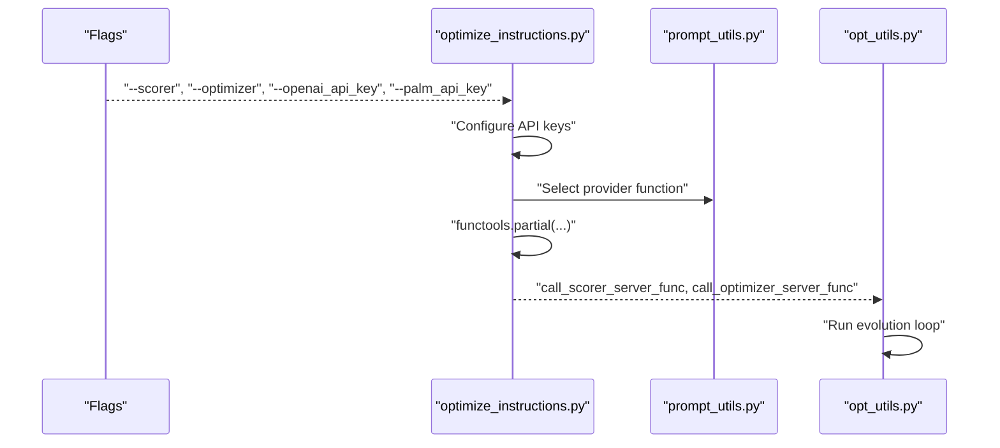
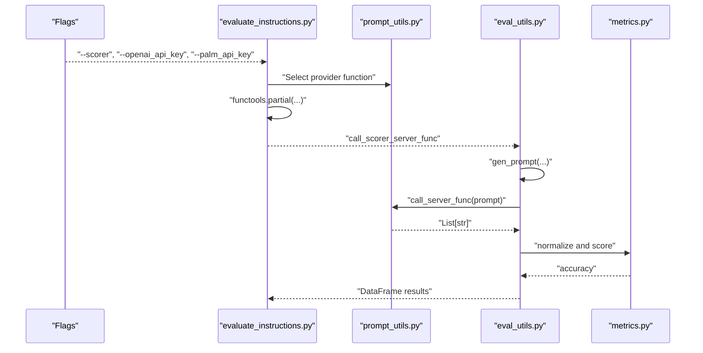
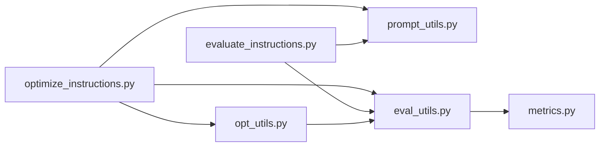

# Custom Model Integration

<cite>
**Referenced Files in This Document**
- [README.md](file://README.md)
- [prompt_utils.py](file://opro/prompt_utils.py)
- [optimize_instructions.py](file://opro/optimization/optimize_instructions.py)
- [evaluate_instructions.py](file://opro/evaluation/evaluate_instructions.py)
- [eval_utils.py](file://opro/evaluation/eval_utils.py)
- [opt_utils.py](file://opro/optimization/opt_utils.py)
- [metrics.py](file://opro/evaluation/metrics.py)
</cite>

## Table of Contents
1. [Introduction](#introduction)
2. [Project Structure](#project-structure)
3. [Core Components](#core-components)
4. [Architecture Overview](#architecture-overview)
5. [Detailed Component Analysis](#detailed-component-analysis)
6. [Dependency Analysis](#dependency-analysis)
7. [Performance Considerations](#performance-considerations)
8. [Troubleshooting Guide](#troubleshooting-guide)
9. [Conclusion](#conclusion)
10. [Appendices](#appendices)

## Introduction
This document explains how to integrate custom LLM providers into opro. The modular design centers around a small set of prompt utilities that expose a consistent interface for calling external LLM APIs. By implementing functions with the same signatures as the existing OpenAI and Google Cloud functions, you can plug in new providers without changing the rest of the pipeline. The guide covers function signatures, input/output formats, error handling and retry patterns, command-line configuration, API key management, and testing with existing evaluation scripts. It also highlights extension points in the optimization and evaluation modules where model selection is dispatched.

## Project Structure
The integration hinges on a small number of modules:
- opro/prompt_utils.py: Provider-agnostic wrappers for calling LLM APIs
- opro/optimization/optimize_instructions.py: CLI-driven orchestration for prompt optimization
- opro/evaluation/evaluate_instructions.py: CLI-driven orchestration for instruction evaluation
- opro/evaluation/eval_utils.py: Evaluation engine that consumes a server-callable function
- opro/optimization/opt_utils.py: Optimization loop that calls the evaluator
- opro/evaluation/metrics.py: Scoring and normalization utilities

**Diagram sources**
- [prompt_utils.py](file://opro/prompt_utils.py#L1-L133)
- [optimize_instructions.py](file://opro/optimization/optimize_instructions.py#L1-L200)
- [evaluate_instructions.py](file://opro/evaluation/evaluate_instructions.py#L1-L120)
- [eval_utils.py](file://opro/evaluation/eval_utils.py#L536-L735)
- [opt_utils.py](file://opro/optimization/opt_utils.py#L836-L1012)
- [metrics.py](file://opro/evaluation/metrics.py#L1-L200)

**Section sources**
- [README.md](file://README.md#L1-L79)

## Core Components
- Provider-agnostic prompt functions in prompt_utils.py:
  - call_openai_server_func(inputs, model, max_decode_steps, temperature)
  - call_openai_server_single_prompt(prompt, model, max_decode_steps, temperature)
  - call_palm_server_from_cloud(input_text, model, max_decode_steps, temperature)
- Evaluation entry points:
  - optimize_instructions.py: defines flags for model selection and API keys, constructs partial functions, and runs optimization
  - evaluate_instructions.py: defines flags for model selection and API keys, constructs partial functions, and runs evaluation
- Evaluation engine:
  - eval_utils.evaluate_single_instruction(...) accepts a call_server_func and orchestrates prompting, decoding, parsing, and scoring

Key integration points:
- Model selection dispatch occurs in both optimize_instructions.py and evaluate_instructions.py based on flags
- The call_server_func passed to evaluation is a functools.partial wrapping a provider function from prompt_utils.py

**Section sources**
- [prompt_utils.py](file://opro/prompt_utils.py#L1-L133)
- [optimize_instructions.py](file://opro/optimization/optimize_instructions.py#L63-L120)
- [evaluate_instructions.py](file://opro/evaluation/evaluate_instructions.py#L63-L120)
- [eval_utils.py](file://opro/evaluation/eval_utils.py#L536-L735)

## Architecture Overview
The system separates concerns:
- Prompt layer: provider-specific functions normalize responses into a uniform list-of-strings format
- Orchestration layer: CLI scripts configure models and API keys, then construct partial functions
- Evaluation layer: a single evaluation routine consumes any call_server_func and produces standardized metrics

**Diagram sources**
- [optimize_instructions.py](file://opro/optimization/optimize_instructions.py#L240-L360)
- [evaluate_instructions.py](file://opro/evaluation/evaluate_instructions.py#L260-L310)
- [eval_utils.py](file://opro/evaluation/eval_utils.py#L536-L735)
- [metrics.py](file://opro/evaluation/metrics.py#L188-L220)

## Detailed Component Analysis

### Prompt Utilities: Interface and Behavior
- call_openai_server_func(inputs, model, max_decode_steps, temperature)
  - Accepts a string or list of strings
  - Returns a list of strings (one per input)
  - Implements robust retry on timeouts, rate limits, API errors, connection errors, service unavailability, and OS errors
- call_openai_server_single_prompt(prompt, model, max_decode_steps, temperature)
  - Accepts a single string prompt
  - Returns a single string
  - Implements the same retry semantics as above
- call_palm_server_from_cloud(input_text, model, max_decode_steps, temperature)
  - Accepts a single string input_text
  - Returns a list containing one string
  - Implements a basic retry fallback

**Diagram sources**
- [prompt_utils.py](file://opro/prompt_utils.py#L21-L133)

**Section sources**
- [prompt_utils.py](file://opro/prompt_utils.py#L21-L133)

### Optimization Pipeline: Model Selection and Partial Functions
- Flags define model names and API keys
- Based on model name, the script configures API keys and constructs a partial function around a provider function from prompt_utils.py
- The partial function encapsulates model name, decoding parameters, and temperature
- The constructed call_scorer_server_func and call_optimizer_server_func are passed to the optimization loop

**Diagram sources**
- [optimize_instructions.py](file://opro/optimization/optimize_instructions.py#L63-L120)
- [optimize_instructions.py](file://opro/optimization/optimize_instructions.py#L240-L360)
- [opt_utils.py](file://opro/optimization/opt_utils.py#L836-L1012)

**Section sources**
- [optimize_instructions.py](file://opro/optimization/optimize_instructions.py#L63-L120)
- [optimize_instructions.py](file://opro/optimization/optimize_instructions.py#L240-L360)
- [opt_utils.py](file://opro/optimization/opt_utils.py#L836-L1012)

### Evaluation Pipeline: Unified Interface
- Flags define model selection and API keys
- The script constructs a call_scorer_server_func partial around a provider function
- eval_utils.evaluate_single_instruction(...) accepts this function and:
  - Generates prompts
  - Calls the server function (optionally in parallel batches)
  - Optionally prompts again to extract final answers
  - Normalizes predictions and computes accuracy via metrics

**Diagram sources**
- [evaluate_instructions.py](file://opro/evaluation/evaluate_instructions.py#L63-L120)
- [evaluate_instructions.py](file://opro/evaluation/evaluate_instructions.py#L260-L310)
- [eval_utils.py](file://opro/evaluation/eval_utils.py#L536-L735)
- [metrics.py](file://opro/evaluation/metrics.py#L188-L220)

**Section sources**
- [evaluate_instructions.py](file://opro/evaluation/evaluate_instructions.py#L63-L120)
- [evaluate_instructions.py](file://opro/evaluation/evaluate_instructions.py#L260-L310)
- [eval_utils.py](file://opro/evaluation/eval_utils.py#L536-L735)
- [metrics.py](file://opro/evaluation/metrics.py#L188-L220)

### Adding a New Model Provider: Step-by-Step Guide
Follow these steps to integrate a new provider:

1. Implement a new provider function in prompt_utils.py
   - Signature must match the existing functions:
     - call_my_provider_func(inputs, model, max_decode_steps, temperature)
       - inputs: string or list of strings
       - returns: list of strings
     - call_my_provider_single_prompt(prompt, model, max_decode_steps, temperature)
       - prompt: string
       - returns: string
   - Preserve the retry and error-handling patterns from the existing functions
   - Normalize provider responses to a list of strings

2. Expose configuration via command-line flags
   - Add flags for your provider’s API key and model name in both optimization and evaluation scripts
   - Mirror the existing flag definitions and assertions for model names and API key requirements

3. Integrate into model selection dispatch
   - In optimize_instructions.py, add a new branch in the scorer and optimizer selection logic to:
     - Configure your provider client/library
     - Construct a functools.partial around your call_my_provider_func with model and decoding parameters
   - In evaluate_instructions.py, mirror the same logic for the scorer

4. Test with existing evaluation scripts
   - Run the evaluation script with your new provider and a small dataset/task to validate:
     - API key configuration
     - Model availability
     - Output normalization and scoring
   - Compare results with known-good providers to ensure comparable performance characteristics

5. Wrap a self-hosted model API or a new cloud provider
   - For self-hosted APIs, implement the function to call your endpoint and normalize responses
   - For new cloud providers, implement the function to call their SDK or REST API and return a list of strings

6. Version compatibility and response schema normalization
   - Ensure your function returns a list of strings regardless of provider specifics
   - Align decoding parameters (max_decode_steps, temperature) with your deployment constraints
   - Validate that the evaluation pipeline can handle the provider’s output format

7. Performance benchmarking
   - Use the evaluation scripts to compare accuracy and latency across providers
   - Adjust batch sizes and parallelism according to provider throughput limits

**Section sources**
- [prompt_utils.py](file://opro/prompt_utils.py#L21-L133)
- [optimize_instructions.py](file://opro/optimization/optimize_instructions.py#L63-L120)
- [optimize_instructions.py](file://opro/optimization/optimize_instructions.py#L240-L360)
- [evaluate_instructions.py](file://opro/evaluation/evaluate_instructions.py#L63-L120)
- [evaluate_instructions.py](file://opro/evaluation/evaluate_instructions.py#L260-L310)
- [eval_utils.py](file://opro/evaluation/eval_utils.py#L536-L735)

### Extension Points for Model Selection
- optimize_instructions.py:
  - Scorer selection: around lines 246–299 and 301–354
  - Optimizer selection: around lines 301–354
  - Flag definitions: around lines 63–103
- evaluate_instructions.py:
  - Scorer selection: around lines 241–295
  - Flag definitions: around lines 63–97

These locations are where you add new providers by:
- Adding a new branch for your model name
- Configuring credentials
- Constructing a partial around your provider function

**Section sources**
- [optimize_instructions.py](file://opro/optimization/optimize_instructions.py#L240-L360)
- [evaluate_instructions.py](file://opro/evaluation/evaluate_instructions.py#L240-L310)

## Dependency Analysis
- prompt_utils.py is consumed by both optimization and evaluation scripts
- Both scripts define flags and construct partial functions around provider functions
- The evaluation engine depends on a unified call_server_func interface
- Metrics module depends on normalized predictions

**Diagram sources**
- [optimize_instructions.py](file://opro/optimization/optimize_instructions.py#L63-L120)
- [evaluate_instructions.py](file://opro/evaluation/evaluate_instructions.py#L63-L120)
- [eval_utils.py](file://opro/evaluation/eval_utils.py#L536-L735)
- [opt_utils.py](file://opro/optimization/opt_utils.py#L836-L1012)
- [metrics.py](file://opro/evaluation/metrics.py#L188-L220)

**Section sources**
- [optimize_instructions.py](file://opro/optimization/optimize_instructions.py#L63-L120)
- [evaluate_instructions.py](file://opro/evaluation/evaluate_instructions.py#L63-L120)
- [eval_utils.py](file://opro/evaluation/eval_utils.py#L536-L735)
- [opt_utils.py](file://opro/optimization/opt_utils.py#L836-L1012)
- [metrics.py](file://opro/evaluation/metrics.py#L188-L220)

## Performance Considerations
- Parallelism: The evaluation engine supports batching and multithreading; disable parallelism for providers that require strict ordering or rate limits
- Batch size: Align with provider serving constraints; too large may cause timeouts or rate limiting
- Decoding parameters: Tune max_decode_steps and temperature to balance quality and cost
- Retries: Built-in retries help mitigate transient failures; adjust sleep times and max_retry counts as needed

[No sources needed since this section provides general guidance]

## Troubleshooting Guide
Common issues and resolutions:
- API key errors: Ensure flags are set and validated before constructing partial functions
- Rate limits and timeouts: The provider functions implement retries; verify retry intervals and consider reducing concurrency
- Output format mismatches: Ensure your provider function returns a list of strings; normalization happens downstream
- Model name mismatches: Verify model names in flags match the selection logic branches

**Section sources**
- [optimize_instructions.py](file://opro/optimization/optimize_instructions.py#L180-L210)
- [evaluate_instructions.py](file://opro/evaluation/evaluate_instructions.py#L178-L205)
- [prompt_utils.py](file://opro/prompt_utils.py#L21-L133)

## Conclusion
By adhering to the established function signatures and retry/error-handling patterns in prompt_utils.py, you can integrate any LLM provider with minimal changes to the broader system. The orchestration scripts and evaluation engine are designed to accept any call_server_func, enabling seamless swapping of providers. Use the provided flags and partial-function construction patterns to wire your provider into the optimization and evaluation pipelines, and validate integration with the existing evaluation scripts.

[No sources needed since this section summarizes without analyzing specific files]

## Appendices

### Function Signatures and Expected Formats
- call_my_provider_func(inputs, model, max_decode_steps, temperature)
  - inputs: string or list of strings
  - returns: list of strings
- call_my_provider_single_prompt(prompt, model, max_decode_steps, temperature)
  - prompt: string
  - returns: string

Normalization expectations:
- The evaluation engine expects normalized predictions suitable for metrics.get_normalized_prediction
- Ensure outputs are consistent with the dataset’s expected answer format

**Section sources**
- [prompt_utils.py](file://opro/prompt_utils.py#L21-L133)
- [eval_utils.py](file://opro/evaluation/eval_utils.py#L536-L735)
- [metrics.py](file://opro/evaluation/metrics.py#L188-L220)

### Example: Wrapping a Self-Hosted Model API
- Implement a function that calls your endpoint, parses the response, and returns a list of strings
- Mirror the retry logic from existing functions to handle transient failures
- Register your function in the model selection branches of both optimization and evaluation scripts

**Section sources**
- [prompt_utils.py](file://opro/prompt_utils.py#L21-L133)
- [optimize_instructions.py](file://opro/optimization/optimize_instructions.py#L240-L360)
- [evaluate_instructions.py](file://opro/evaluation/evaluate_instructions.py#L260-L310)