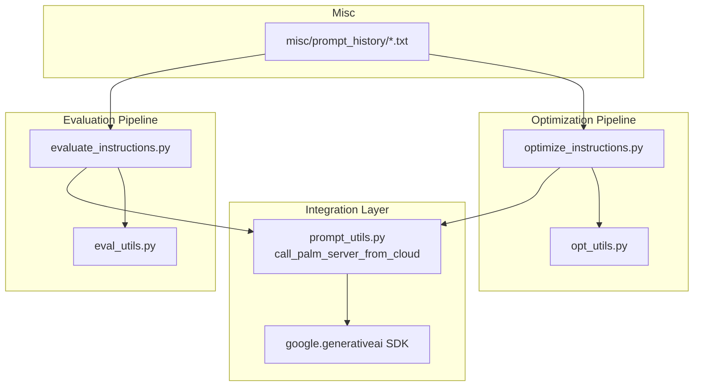
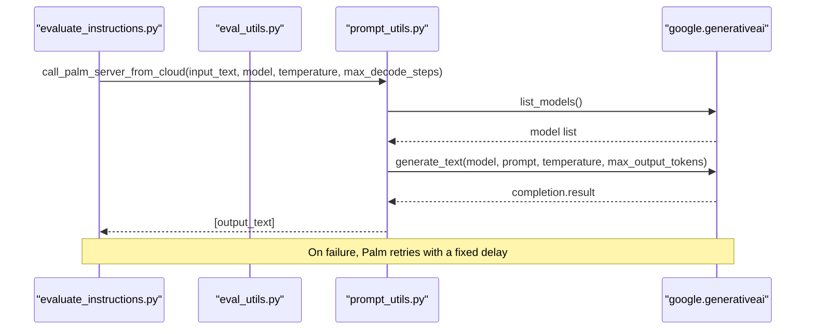
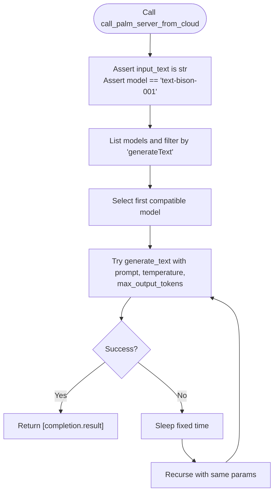
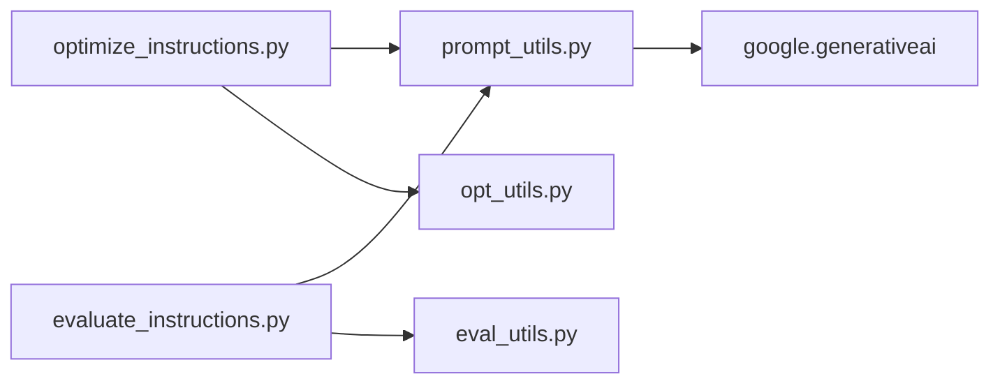

# Google PaLM Integration

<cite>
**Referenced Files in This Document**
- [prompt_utils.py](file://opro/prompt_utils.py)
- [evaluate_instructions.py](file://opro/evaluation/evaluate_instructions.py)
- [optimize_instructions.py](file://opro/optimization/optimize_instructions.py)
- [eval_utils.py](file://opro/evaluation/eval_utils.py)
- [opt_utils.py](file://opro/optimization/opt_utils.py)
- [README.md](file://README.md)
- [BBH-boolean_expressions-s-text-bison-o-palm-2-l-it.txt](file://misc/prompt_history/BBH-boolean_expressions-s-text-bison-o-palm-2-l-it.txt)
- [README.md (prompt_history)](file://misc/prompt_history/README.md)
</cite>

## Table of Contents
1. [Introduction](#introduction)
2. [Project Structure](#project-structure)
3. [Core Components](#core-components)
4. [Architecture Overview](#architecture-overview)
5. [Detailed Component Analysis](#detailed-component-analysis)
6. [Dependency Analysis](#dependency-analysis)
7. [Performance Considerations](#performance-considerations)
8. [Troubleshooting Guide](#troubleshooting-guide)
9. [Conclusion](#conclusion)
10. [Appendices](#appendices)

## Introduction
This document explains how Google’s text-bison (PaLM) model is integrated into opro. It focuses on the implementation of call_palm_server_from_cloud in prompt_utils.py, detailing its parameters (model, temperature, max_decode_steps), assertion checks, and retry mechanism. It also documents how the Google Generative AI SDK (google.generativeai) is used to list available models and generate text responses, the required palm_api_key configuration, and how text-bison integrates with evaluation and optimization pipelines. Finally, it provides examples of using text-bison as a scorer or optimizer in workflows such as MMLU and GSM8K, discusses performance and cost considerations, limitations of the text-bison-001 model, and troubleshooting guidance.

## Project Structure
The integration spans several modules:
- Prompt utilities: call_palm_server_from_cloud and related helpers
- Evaluation pipeline: end-to-end scoring of instructions using text-bison
- Optimization pipeline: evolving instructions using text-bison as both scorer and optimizer
- Utilities: prompt construction, parsing, and evaluation orchestration
- Misc prompt history: real-world usage logs demonstrating text-bison in action

**Diagram sources**
- [prompt_utils.py](file://opro/prompt_utils.py#L105-L132)
- [evaluate_instructions.py](file://opro/evaluation/evaluate_instructions.py#L190-L210)
- [optimize_instructions.py](file://opro/optimization/optimize_instructions.py#L190-L210)
- [eval_utils.py](file://opro/evaluation/eval_utils.py#L338-L379)
- [opt_utils.py](file://opro/optimization/opt_utils.py#L338-L379)
- [BBH-boolean_expressions-s-text-bison-o-palm-2-l-it.txt](file://misc/prompt_history/BBH-boolean_expressions-s-text-bison-o-palm-2-l-it.txt#L1-L20)

**Section sources**
- [prompt_utils.py](file://opro/prompt_utils.py#L105-L132)
- [evaluate_instructions.py](file://opro/evaluation/evaluate_instructions.py#L190-L210)
- [optimize_instructions.py](file://opro/optimization/optimize_instructions.py#L190-L210)
- [eval_utils.py](file://opro/evaluation/eval_utils.py#L338-L379)
- [opt_utils.py](file://opro/optimization/opt_utils.py#L338-L379)
- [README.md](file://README.md#L14-L24)

## Core Components
- call_palm_server_from_cloud: The primary function to call the text-bison model via the Google Generative AI SDK. It validates inputs, lists compatible models, generates text, and retries on failure.
- Configuration and usage:
  - palm_api_key is required when using text-bison and is passed to google.generativeai.configure.
  - The function accepts model, temperature, and max_decode_steps parameters and returns a list containing the generated text.
- Integration points:
  - Evaluation scripts pass a partialized call_palm_server_from_cloud to eval_utils.evaluate_single_instruction for scoring.
  - Optimization scripts use the same function for both scorer and optimizer roles, adjusting temperature and decoding parameters accordingly.

Key implementation highlights:
- Parameter validation and assertions ensure correct usage.
- Model discovery filters models by supported generation methods.
- Retry logic handles transient failures robustly.

**Section sources**
- [prompt_utils.py](file://opro/prompt_utils.py#L105-L132)
- [evaluate_instructions.py](file://opro/evaluation/evaluate_instructions.py#L241-L271)
- [optimize_instructions.py](file://opro/optimization/optimize_instructions.py#L246-L276)

## Architecture Overview
The text-bison integration follows a layered architecture:
- Application layer: evaluation and optimization scripts
- Orchestration layer: utilities that construct prompts, parse results, and manage retries
- Integration layer: prompt_utils that wraps google.generativeai
- External service: Google Generative AI API

**Diagram sources**
- [evaluate_instructions.py](file://opro/evaluation/evaluate_instructions.py#L241-L271)
- [eval_utils.py](file://opro/evaluation/eval_utils.py#L338-L379)
- [prompt_utils.py](file://opro/prompt_utils.py#L105-L132)

## Detailed Component Analysis

### call_palm_server_from_cloud
- Purpose: Call the text-bison model via the Google Generative AI SDK and return a list with the generated text.
- Parameters:
  - input_text: String prompt to send to the model.
  - model: Defaults to "text-bison-001".
  - max_decode_steps: Controls max output tokens.
  - temperature: Controls randomness of generation.
- Assertions:
  - Validates input_text is a string.
  - Enforces model equals "text-bison-001".
- Model discovery:
  - Lists models and filters those supporting "generateText".
  - Selects the first compatible model.
- Generation:
  - Calls generate_text with prompt, temperature, and max_output_tokens.
  - Returns completion.result wrapped in a list.
- Retry mechanism:
  - On any exception, prints a retry message and sleeps for a fixed duration before recursing.

**Diagram sources**
- [prompt_utils.py](file://opro/prompt_utils.py#L105-L132)

**Section sources**
- [prompt_utils.py](file://opro/prompt_utils.py#L105-L132)

### Google Generative AI SDK Usage
- Listing models:
  - Uses palm.list_models() and filters by supported_generation_methods containing "generateText".
- Generating text:
  - Uses palm.generate_text(model, prompt, temperature, max_output_tokens).
  - Reads the result from completion.result.

These calls are encapsulated within call_palm_server_from_cloud.

**Section sources**
- [prompt_utils.py](file://opro/prompt_utils.py#L111-L125)

### Configuration and Integration
- palm_api_key requirement:
  - When using text-bison, the script must configure google.generativeai with the API key.
  - The evaluation and optimization scripts enforce this and set the key via palm.configure(api_key=palm_api_key).
- Passing to evaluation:
  - The evaluation script constructs a partialized call_scorer_server_func using call_palm_server_from_cloud with model "text-bison-001" and specific temperature and max_decode_steps.
- Passing to optimization:
  - The optimization script similarly constructs call_scorer_server_func and call_optimizer_server_func for text-bison, with different temperature and decoding settings depending on role.

**Section sources**
- [evaluate_instructions.py](file://opro/evaluation/evaluate_instructions.py#L190-L210)
- [evaluate_instructions.py](file://opro/evaluation/evaluate_instructions.py#L241-L271)
- [optimize_instructions.py](file://opro/optimization/optimize_instructions.py#L190-L210)
- [optimize_instructions.py](file://opro/optimization/optimize_instructions.py#L246-L276)
- [optimize_instructions.py](file://opro/optimization/optimize_instructions.py#L301-L337)

### Real-World Usage Patterns
- Prompt history logs demonstrate extensive use of text-bison in optimization workflows across tasks like BBH-boolean_expressions.
- These logs show iterative improvement of instructions and consistent use of text-bison as the scorer/optimizer.

**Section sources**
- [BBH-boolean_expressions-s-text-bison-o-palm-2-l-it.txt](file://misc/prompt_history/BBH-boolean_expressions-s-text-bison-o-palm-2-l-it.txt#L1-L20)
- [README.md (prompt_history)](file://misc/prompt_history/README.md#L1-L4)

### Example Workflows: MMLU and GSM8K
- As a scorer:
  - The evaluation scripts pass a partialized call_palm_server_from_cloud to evaluate_single_instruction for scoring instructions on datasets like MMLU and GSM8K.
- As an optimizer:
  - The optimization scripts use the same function for instruction refinement, with higher temperature and multiple decodes configured for exploration.

**Section sources**
- [evaluate_instructions.py](file://opro/evaluation/evaluate_instructions.py#L527-L542)
- [optimize_instructions.py](file://opro/optimization/optimize_instructions.py#L301-L337)

## Dependency Analysis
- Internal dependencies:
  - evaluate_instructions.py and optimize_instructions.py depend on prompt_utils.py for model calls.
  - eval_utils.py orchestrates evaluation and retries; opt_utils.py orchestrates optimization.
- External dependencies:
  - google.generativeai SDK for model listing and text generation.
  - Command-line flags for palm_api_key and model selection.

**Diagram sources**
- [evaluate_instructions.py](file://opro/evaluation/evaluate_instructions.py#L241-L271)
- [optimize_instructions.py](file://opro/optimization/optimize_instructions.py#L246-L276)
- [eval_utils.py](file://opro/evaluation/eval_utils.py#L338-L379)
- [opt_utils.py](file://opro/optimization/opt_utils.py#L338-L379)
- [prompt_utils.py](file://opro/prompt_utils.py#L105-L132)

**Section sources**
- [evaluate_instructions.py](file://opro/evaluation/evaluate_instructions.py#L241-L271)
- [optimize_instructions.py](file://opro/optimization/optimize_instructions.py#L246-L276)
- [eval_utils.py](file://opro/evaluation/eval_utils.py#L338-L379)
- [opt_utils.py](file://opro/optimization/opt_utils.py#L338-L379)
- [prompt_utils.py](file://opro/prompt_utils.py#L105-L132)

## Performance Considerations
- Throughput and latency:
  - The evaluation and optimization scripts set batch_size=1 and num_servers=1 for text-bison, implying single-threaded, single-model serving. This reduces concurrency but simplifies reliability.
- Decoding parameters:
  - max_decode_steps defaults to 1024 for text-bison in evaluation and 1024 for optimization, enabling long-form generations when needed.
  - Temperature defaults to 0.0 for scorer and 1.0 for optimizer, balancing determinism vs. diversity.
- Parallelism:
  - Evaluation sets evaluate_in_parallel=False for text-bison, avoiding contention and ensuring predictable behavior.
- Cost considerations:
  - The repository warns that calling PaLM/GPT APIs for optimization and evaluation may incur unexpected costs. It advises careful estimation and starting with lighter use.

**Section sources**
- [evaluate_instructions.py](file://opro/evaluation/evaluate_instructions.py#L241-L271)
- [evaluate_instructions.py](file://opro/evaluation/evaluate_instructions.py#L527-L542)
- [optimize_instructions.py](file://opro/optimization/optimize_instructions.py#L246-L276)
- [README.md](file://README.md#L59-L63)

## Troubleshooting Guide
Common issues and resolutions:
- Authentication failures:
  - Ensure palm_api_key is provided and correctly configured before calling text-bison. The scripts assert the presence of the key and configure the SDK accordingly.
- Model unavailability:
  - The function lists models and filters by supported generation methods. If no compatible model is found, adjust model selection or verify SDK availability.
- Response parsing errors:
  - The function returns completion.result wrapped in a list. If downstream parsing fails, verify the expected structure and ensure the prompt yields a single coherent response.
- Transient errors:
  - The function retries on exceptions with a fixed delay. If persistent failures occur, check network connectivity, API quotas, and rate limits.

**Section sources**
- [evaluate_instructions.py](file://opro/evaluation/evaluate_instructions.py#L190-L210)
- [optimize_instructions.py](file://opro/optimization/optimize_instructions.py#L190-L210)
- [prompt_utils.py](file://opro/prompt_utils.py#L105-L132)

## Conclusion
The text-bison integration in opro centers around a robust wrapper function that validates inputs, discovers compatible models, and generates text via the Google Generative AI SDK. The evaluation and optimization pipelines integrate this function seamlessly, configuring API keys and tuning decoding parameters for different roles. While the integration is straightforward, careful attention to configuration, retry behavior, and cost management is essential for reliable operation.

## Appendices

### Command-Line Usage Examples
- Evaluate instructions with text-bison:
  - python evaluate_instructions.py --scorer="text-bison" --dataset="gsm8k" --task="test" --instruction_pos="Q_begin" --evaluate_training_fold=false --evaluate_test_fold=true --palm_api_key="<your_key>"
- Optimize instructions with text-bison:
  - python optimize_instructions.py --optimizer="gpt-3.5-turbo" --scorer="text-bison" --instruction_pos="A_begin" --dataset="gsm8k" --task="train" --palm_api_key="<your_key>"

**Section sources**
- [README.md](file://README.md#L25-L45)