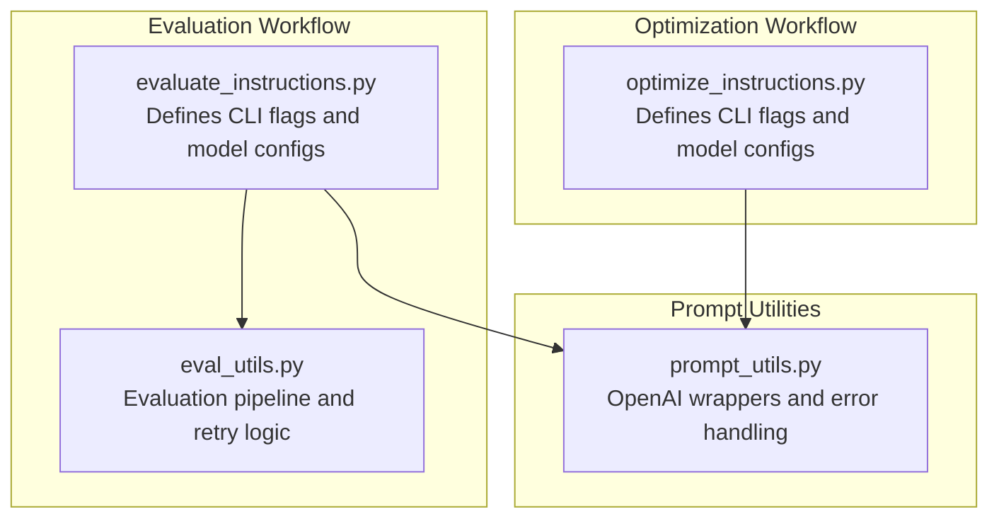
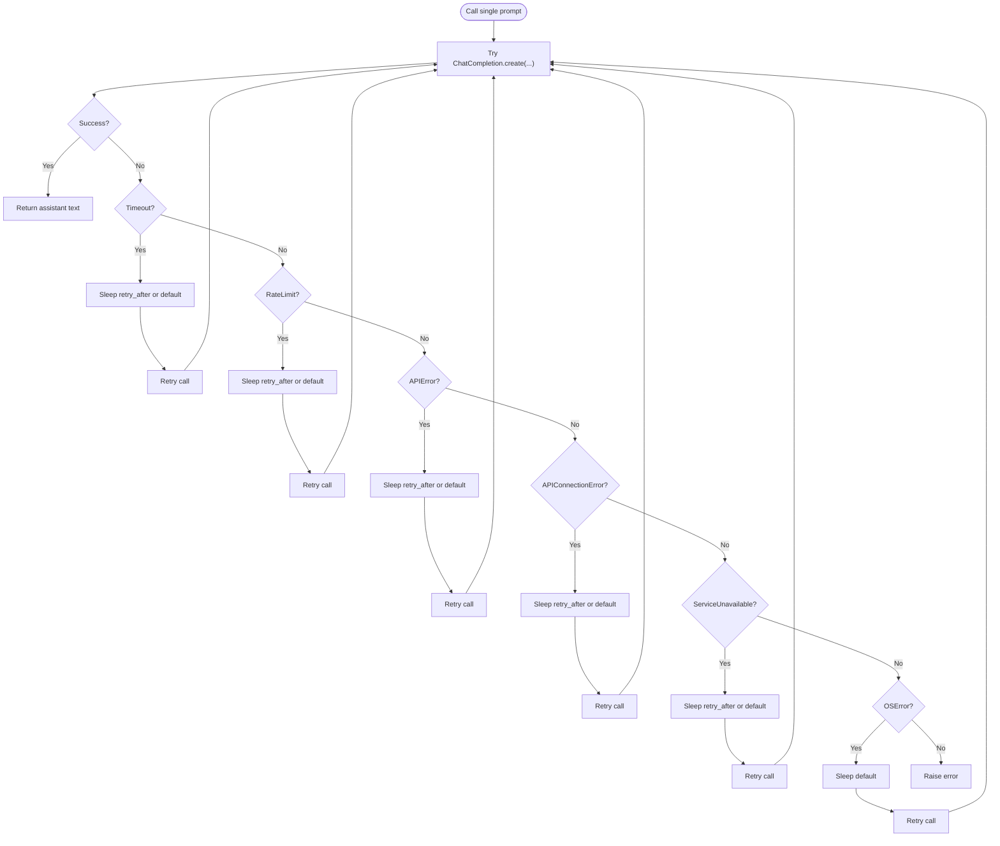
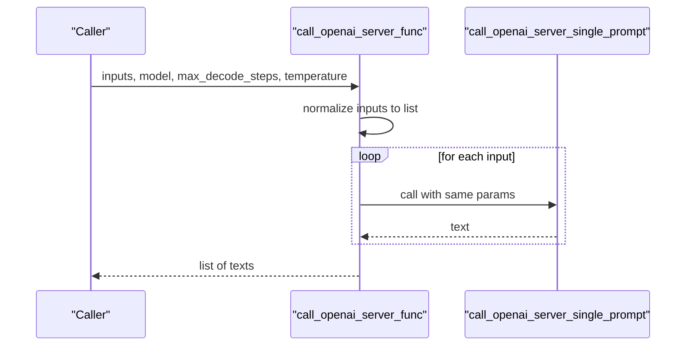
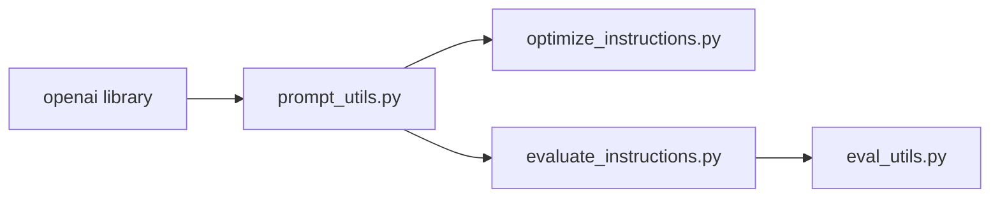

# OpenAI Integration

<cite>
**Referenced Files in This Document**
- [prompt_utils.py](file://opro/prompt_utils.py)
- [optimize_instructions.py](file://opro/optimization/optimize_instructions.py)
- [evaluate_instructions.py](file://opro/evaluation/evaluate_instructions.py)
- [eval_utils.py](file://opro/evaluation/eval_utils.py)
- [README.md](file://README.md)
</cite>

## Table of Contents
1. [Introduction](#introduction)
2. [Project Structure](#project-structure)
3. [Core Components](#core-components)
4. [Architecture Overview](#architecture-overview)
5. [Detailed Component Analysis](#detailed-component-analysis)
6. [Dependency Analysis](#dependency-analysis)
7. [Performance Considerations](#performance-considerations)
8. [Troubleshooting Guide](#troubleshooting-guide)
9. [Conclusion](#conclusion)

## Introduction
This document explains how OpenAI models are integrated into the opro system. It focuses on the implementation of two key functions in the prompt utilities module, how API keys are passed via command-line arguments and propagated through the system, and how these integrations are used in optimization and evaluation workflows. It also covers supported models, error handling strategies, and best practices for robust and cost-conscious usage.

## Project Structure
The OpenAI integration spans a small set of focused modules:
- Prompt utilities: thin wrappers around OpenAI’s Chat Completions API
- Optimization workflow: constructs partial functions to call OpenAI and tests connectivity
- Evaluation workflow: evaluates instructions using OpenAI models with configurable retry and parallelism
- Utilities: evaluation helpers that call the provided server function and parse results



**Diagram sources**
- [optimize_instructions.py](file://opro/optimization/optimize_instructions.py#L63-L110)
- [evaluate_instructions.py](file://opro/evaluation/evaluate_instructions.py#L63-L124)
- [eval_utils.py](file://opro/evaluation/eval_utils.py#L536-L735)
- [prompt_utils.py](file://opro/prompt_utils.py#L21-L103)

**Section sources**
- [README.md](file://README.md#L14-L24)
- [optimize_instructions.py](file://opro/optimization/optimize_instructions.py#L63-L110)
- [evaluate_instructions.py](file://opro/evaluation/evaluate_instructions.py#L63-L124)

## Core Components
- call_openai_server_single_prompt: synchronous wrapper around OpenAI Chat Completions with explicit error handling and retry-on-error semantics.
- call_openai_server_func: convenience function that accepts a list of prompts and iterates over them, delegating to the single-prompt function.

Key parameters:
- model: defaults to a chat model; supported values include “gpt-3.5-turbo” and “gpt-4” in the workflows.
- temperature: controls randomness of decoding.
- max_decode_steps: controls max tokens generated (mapped to max_tokens in the underlying API call).

Supported models:
- “gpt-3.5-turbo”
- “gpt-4”

These are validated and used in both optimization and evaluation scripts.

**Section sources**
- [prompt_utils.py](file://opro/prompt_utils.py#L21-L103)
- [optimize_instructions.py](file://opro/optimization/optimize_instructions.py#L159-L168)
- [evaluate_instructions.py](file://opro/evaluation/evaluate_instructions.py#L178-L182)

## Architecture Overview
The integration follows a layered approach:
- CLI flags define API keys and model names.
- Model configuration functions construct partial functions bound to a specific model and decoding parameters.
- The prompt utilities provide the low-level OpenAI calls with built-in retry logic.
- Evaluation and optimization workflows call these partial functions to obtain model outputs.

```mermaid
sequenceDiagram
participant CLI as "CLI Flags"
participant Opt as "optimize_instructions.py"
participant Eval as "evaluate_instructions.py"
participant PU as "prompt_utils.py"
participant OpenAI as "OpenAI API"
CLI->>Opt : "--openai_api_key=..."
Opt->>Opt : Configure openai.api_key
Opt->>PU : call_openai_server_func(model, temperature, max_decode_steps)
PU->>OpenAI : ChatCompletion.create(...)
OpenAI-->>PU : Response or Error
PU-->>Opt : Text output(s)
CLI->>Eval : "--openai_api_key=..."
Eval->>Eval : Configure openai.api_key
Eval->>PU : call_openai_server_func(...)
PU->>OpenAI : ChatCompletion.create(...)
OpenAI-->>PU : Response or Error
PU-->>Eval : Text output(s)
```

**Diagram sources**
- [optimize_instructions.py](file://opro/optimization/optimize_instructions.py#L104-L110)
- [evaluate_instructions.py](file://opro/evaluation/evaluate_instructions.py#L118-L124)
- [prompt_utils.py](file://opro/prompt_utils.py#L21-L103)

## Detailed Component Analysis

### call_openai_server_single_prompt
Behavior:
- Sends a single user message to the selected model.
- Returns the assistant’s text content.
- Implements robust error handling:
  - Timeout
  - Rate limit
  - API error
  - API connection error
  - Service unavailable
  - General OS errors
- On recoverable errors, waits for a short interval (or a duration suggested by the error) and retries the same call.

Parameters:
- prompt: input string
- model: defaults to “gpt-3.5-turbo”
- max_decode_steps: defaults to 20
- temperature: defaults to 0.8

Error handling specifics:
- Uses retry_after when present; otherwise falls back to fixed intervals.
- Re-raises the call with the same parameters to ensure consistent decoding settings.



**Diagram sources**
- [prompt_utils.py](file://opro/prompt_utils.py#L21-L85)

**Section sources**
- [prompt_utils.py](file://opro/prompt_utils.py#L21-L85)

### call_openai_server_func
Behavior:
- Accepts a single string or a list of strings.
- Iterates over inputs and calls the single-prompt function for each.
- Returns a list of outputs.

Parameters:
- inputs: string or list of strings
- model: forwarded to the single-prompt function
- max_decode_steps: forwarded to the single-prompt function
- temperature: forwarded to the single-prompt function



**Diagram sources**
- [prompt_utils.py](file://opro/prompt_utils.py#L87-L103)

**Section sources**
- [prompt_utils.py](file://opro/prompt_utils.py#L87-L103)

### API Key Propagation and Model Selection
- Command-line flags:
  - openai_api_key: passed to both optimization and evaluation scripts.
  - palm_api_key: used for PaLM models; not relevant to OpenAI integration.
- Validation and configuration:
  - Both scripts validate that the chosen model is among supported values (“gpt-3.5-turbo”, “gpt-4”) and assert that the corresponding API key is provided.
  - When using OpenAI models, the script sets openai.api_key to the provided value.
- Model selection:
  - Scorer and optimizer models are selectable via flags and validated in both scripts.
  - The optimization script constructs partial functions bound to the chosen model and decoding parameters.

Examples of supported models and invocations:
- Supported: “gpt-3.5-turbo”, “gpt-4”
- Invoked in optimization and evaluation workflows via partial functions that embed model, temperature, and max_decode_steps.

**Section sources**
- [optimize_instructions.py](file://opro/optimization/optimize_instructions.py#L104-L110)
- [optimize_instructions.py](file://opro/optimization/optimize_instructions.py#L159-L168)
- [optimize_instructions.py](file://opro/optimization/optimize_instructions.py#L277-L353)
- [evaluate_instructions.py](file://opro/evaluation/evaluate_instructions.py#L118-L124)
- [evaluate_instructions.py](file://opro/evaluation/evaluate_instructions.py#L178-L182)
- [evaluate_instructions.py](file://opro/evaluation/evaluate_instructions.py#L272-L294)

### Usage Patterns in Workflows
- Optimization workflow:
  - Defines flags for openai_api_key, scorer, optimizer, dataset, task, instruction position, and meta-prompt type.
  - Validates model names and asserts API keys.
  - Constructs partial functions for scorer and optimizer using call_openai_server_func with model-specific decoding parameters.
  - Performs a connectivity test by calling the server functions with a short prompt.
  - Proceeds to run the optimization loop with the configured call_server_func.

- Evaluation workflow:
  - Defines flags for openai_api_key, scorer, dataset, task, instruction position, and evaluation folds.
  - Validates model names and asserts API keys.
  - Constructs a scorer partial function using call_openai_server_func.
  - Calls evaluate_single_instruction with the scorer function and evaluation settings.
  - evaluate_single_instruction internally calls the provided call_server_func to obtain model outputs, with configurable retry and parallelism.

```mermaid
sequenceDiagram
participant Opt as "optimize_instructions.py"
participant PU as "prompt_utils.py"
participant Eval as "evaluate_instructions.py"
participant EU as "eval_utils.py"
Opt->>PU : call_openai_server_func(model, temperature, max_decode_steps)
PU-->>Opt : outputs
Eval->>EU : evaluate_single_instruction(..., call_server_func=call_openai_server_func(...))
EU->>EU : Build prompts and call call_server_func
EU-->>Eval : Results DataFrame
```

**Diagram sources**
- [optimize_instructions.py](file://opro/optimization/optimize_instructions.py#L277-L353)
- [evaluate_instructions.py](file://opro/evaluation/evaluate_instructions.py#L272-L294)
- [eval_utils.py](file://opro/evaluation/eval_utils.py#L536-L735)
- [prompt_utils.py](file://opro/prompt_utils.py#L87-L103)

**Section sources**
- [optimize_instructions.py](file://opro/optimization/optimize_instructions.py#L277-L353)
- [evaluate_instructions.py](file://opro/evaluation/evaluate_instructions.py#L272-L294)
- [eval_utils.py](file://opro/evaluation/eval_utils.py#L536-L735)

## Dependency Analysis
- prompt_utils depends on the OpenAI library and exposes two primary functions for interacting with OpenAI models.
- Optimization and evaluation scripts depend on prompt_utils and configure it via partial functions.
- The evaluation utilities depend on the provided call_server_func to obtain model outputs and implement retry and parallelism logic.



**Diagram sources**
- [prompt_utils.py](file://opro/prompt_utils.py#L16-L20)
- [optimize_instructions.py](file://opro/optimization/optimize_instructions.py#L58-L62)
- [evaluate_instructions.py](file://opro/evaluation/evaluate_instructions.py#L56-L60)

**Section sources**
- [prompt_utils.py](file://opro/prompt_utils.py#L16-L20)
- [optimize_instructions.py](file://opro/optimization/optimize_instructions.py#L58-L62)
- [evaluate_instructions.py](file://opro/evaluation/evaluate_instructions.py#L56-L60)

## Performance Considerations
- Latency:
  - The single-prompt function retries on transient errors, which introduces potential delays. The evaluation utilities also support configurable max_retry and sleep_time to mitigate rate limits and temporary failures.
- Token usage and cost:
  - The README warns about potential costs when calling OpenAI or PaLM APIs for optimization and evaluation. It advises careful estimation and starting with lighter usage before formal experiments.
- Model selection impact:
  - Different models (e.g., “gpt-3.5-turbo” vs. “gpt-4”) may have different pricing and performance characteristics. The workflows demonstrate how to select and configure models via flags and partial functions.

Practical tips:
- Tune temperature and max_decode_steps according to the task; higher max_decode_steps increases token usage and cost.
- Use evaluate_in_parallel=False when calling GPT models to avoid concurrency-related issues and to simplify retry logic.
- Monitor and adjust max_retry and sleep_time to balance throughput and stability.

**Section sources**
- [README.md](file://README.md#L59-L62)
- [evaluate_instructions.py](file://opro/evaluation/evaluate_instructions.py#L698-L700)
- [eval_utils.py](file://opro/evaluation/eval_utils.py#L581-L582)

## Troubleshooting Guide
Common issues and remedies:
- Timeout errors:
  - The single-prompt function retries after a short interval or the duration suggested by the error. If persistent, reduce concurrency or increase sleep_time in downstream callers.
- Rate limit errors:
  - The single-prompt function retries after a suggested interval or a default. Consider lowering request rate or increasing sleep_time in evaluation utilities.
- API connection errors and service unavailability:
  - Similar retry behavior applies. Verify network connectivity and consider retrying later.
- OS-level connection errors:
  - The single-prompt function retries after a short interval. Investigate local networking issues.

Best practices:
- Always pass the openai_api_key via CLI flags and ensure it is configured before invoking OpenAI functions.
- Validate model names and assert API keys before proceeding with expensive calls.
- Use partial functions to bind model and decoding parameters consistently across the workflow.
- For GPT models, avoid parallelism in the evaluation utilities to prevent concurrency-related instability.

**Section sources**
- [prompt_utils.py](file://opro/prompt_utils.py#L36-L85)
- [optimize_instructions.py](file://opro/optimization/optimize_instructions.py#L190-L209)
- [evaluate_instructions.py](file://opro/evaluation/evaluate_instructions.py#L184-L193)
- [eval_utils.py](file://opro/evaluation/eval_utils.py#L581-L582)

## Conclusion
The OpenAI integration in opro is intentionally minimal and robust. The prompt utilities provide reliable wrappers around the OpenAI Chat Completions API with built-in error handling and retry logic. The optimization and evaluation workflows demonstrate how to propagate API keys via CLI flags, validate model selections, and configure decoding parameters through partial functions. By following the best practices outlined—careful key management, conservative retry settings, and mindful model selection—you can achieve stable and cost-controlled experimentation.