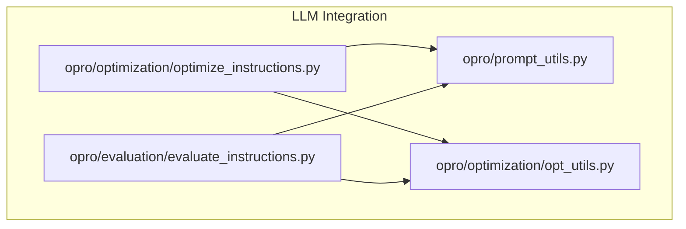
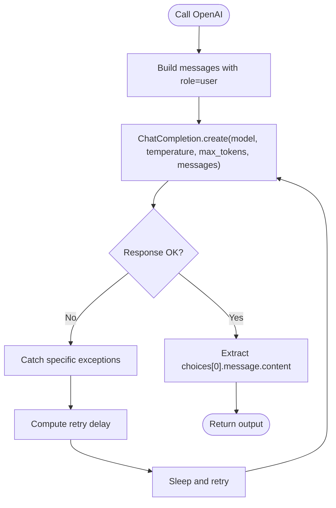
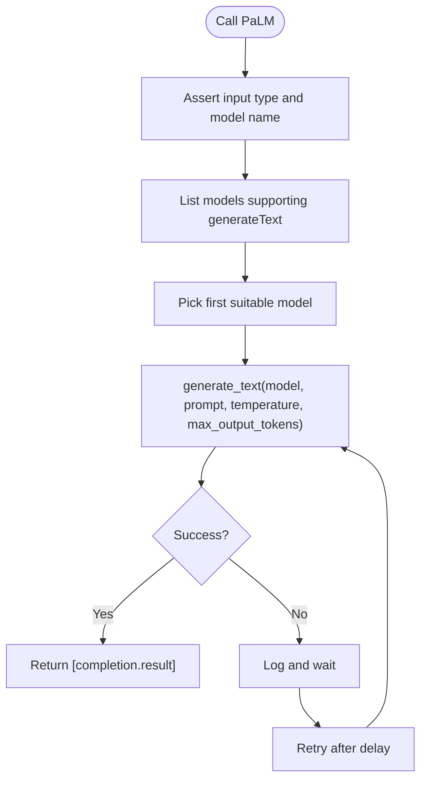
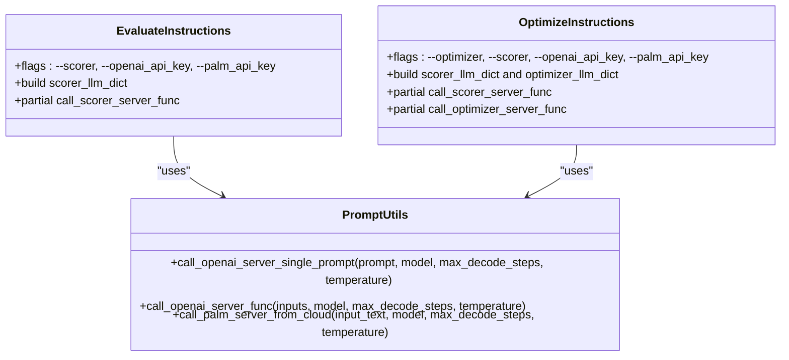
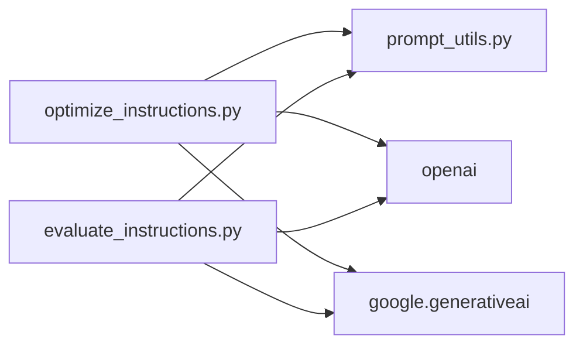

# Supported Models

<cite>
**Referenced Files in This Document**
- [README.md](file://README.md)
- [prompt_utils.py](file://opro/prompt_utils.py)
- [optimize_instructions.py](file://opro/optimization/optimize_instructions.py)
- [evaluate_instructions.py](file://opro/evaluation/evaluate_instructions.py)
- [opt_utils.py](file://opro/optimization/opt_utils.py)
</cite>

## Table of Contents
1. [Introduction](#introduction)
2. [Project Structure](#project-structure)
3. [Core Components](#core-components)
4. [Architecture Overview](#architecture-overview)
5. [Detailed Component Analysis](#detailed-component-analysis)
6. [Dependency Analysis](#dependency-analysis)
7. [Performance Considerations](#performance-considerations)
8. [Troubleshooting Guide](#troubleshooting-guide)
9. [Conclusion](#conclusion)
10. [Appendices](#appendices)

## Introduction
This document explains the LLM integrations supported by opro, focusing on OpenAI models (gpt-3.5-turbo, gpt-4) and Google’s text-bison. It details how prompt_utils.py abstracts provider differences, documents required parameters such as temperature and max_decode_steps, and shows how model selection propagates through system configuration. It also provides guidance for adding new LLM providers and outlines performance and cost considerations.

## Project Structure
The LLM integration is centered around a small set of modules:
- opro/prompt_utils.py: Provider-agnostic prompting functions for OpenAI and Google PaLM.
- opro/optimization/optimize_instructions.py: Model selection and configuration for optimization workflows.
- opro/evaluation/evaluate_instructions.py: Model selection and configuration for evaluation workflows.
- opro/optimization/opt_utils.py: Shared utilities that persist model configurations and orchestrate evaluations.



**Diagram sources**
- [prompt_utils.py](file://opro/prompt_utils.py#L1-L133)
- [optimize_instructions.py](file://opro/optimization/optimize_instructions.py#L270-L369)
- [evaluate_instructions.py](file://opro/evaluation/evaluate_instructions.py#L118-L193)
- [opt_utils.py](file://opro/optimization/opt_utils.py#L410-L426)

**Section sources**
- [prompt_utils.py](file://opro/prompt_utils.py#L1-L133)
- [optimize_instructions.py](file://opro/optimization/optimize_instructions.py#L270-L369)
- [evaluate_instructions.py](file://opro/evaluation/evaluate_instructions.py#L118-L193)
- [opt_utils.py](file://opro/optimization/opt_utils.py#L410-L426)

## Core Components
- OpenAI integration:
  - chat-style completions via a dedicated function that accepts model, temperature, and max tokens.
  - Batch processing via a wrapper that iterates over inputs.
- Google PaLM integration:
  - Cloud text generation via a function that selects a model supporting text generation and applies temperature and max output tokens.
- Unified abstraction:
  - Functions in prompt_utils.py accept consistent parameter names (model, temperature, max_decode_steps) and return lists of outputs, enabling drop-in replacement across providers.

Key parameter defaults and behaviors:
- Default temperature and max_decode_steps are exposed as function parameters in prompt_utils.py.
- Optimization and evaluation scripts set provider-specific defaults and enforce constraints.

**Section sources**
- [prompt_utils.py](file://opro/prompt_utils.py#L21-L133)
- [optimize_instructions.py](file://opro/optimization/optimize_instructions.py#L270-L369)
- [evaluate_instructions.py](file://opro/evaluation/evaluate_instructions.py#L236-L303)

## Architecture Overview
The system separates concerns:
- Configuration and selection: decide which provider/model to use and set parameters.
- Abstraction layer: call_* functions in prompt_utils.py encapsulate provider specifics.
- Orchestration: optimization and evaluation scripts construct partial functions with provider-specific parameters and pass them downstream.

```mermaid
sequenceDiagram
participant CLI as "CLI Flags"
participant Eval as "evaluate_instructions.py"
participant Opt as "optimize_instructions.py"
participant PU as "prompt_utils.py"
participant OA as "OpenAI API"
participant GP as "Google PaLM API"
CLI->>Eval : "--scorer=gpt-3.5-turbo or text-bison"
CLI->>Opt : "--optimizer=gpt-4 or text-bison"
Eval->>Eval : "configure API keys and validate model"
Opt->>Opt : "configure API keys and validate model"
Eval->>PU : "call_openai_server_func(...) or call_palm_server_from_cloud(...)"
Opt->>PU : "call_openai_server_func(...) or call_palm_server_from_cloud(...)"
PU->>OA : "ChatCompletion.create(...)"
PU->>GP : "generate_text(...)"
OA-->>PU : "response"
GP-->>PU : "response"
PU-->>Eval : "list of outputs"
PU-->>Opt : "list of outputs"
```

**Diagram sources**
- [evaluate_instructions.py](file://opro/evaluation/evaluate_instructions.py#L118-L193)
- [optimize_instructions.py](file://opro/optimization/optimize_instructions.py#L270-L369)
- [prompt_utils.py](file://opro/prompt_utils.py#L21-L133)

## Detailed Component Analysis

### OpenAI Integration (gpt-3.5-turbo, gpt-4)
- API endpoint: ChatCompletion.create.
- Authentication: via openai.api_key configured from command-line flag.
- Parameters:
  - model: "gpt-3.5-turbo" or "gpt-4".
  - temperature: float.
  - max_tokens: integer controlling max_decode_steps.
  - messages: list containing a single user message.
- Error handling:
  - Catches timeout, rate limit, API error, connection error, service unavailable, and OS errors; logs and retries with exponential backoff-like delays.
- Batch behavior:
  - call_openai_server_func accepts a string or list of strings and returns a list of outputs.



**Diagram sources**
- [prompt_utils.py](file://opro/prompt_utils.py#L21-L103)

**Section sources**
- [prompt_utils.py](file://opro/prompt_utils.py#L21-L103)
- [evaluate_instructions.py](file://opro/evaluation/evaluate_instructions.py#L184-L193)
- [optimize_instructions.py](file://opro/optimization/optimize_instructions.py#L270-L369)

### Google PaLM Integration (text-bison)
- API endpoint: generate_text from google.generativeai.
- Authentication: via palm.configure(api_key) from command-line flag.
- Parameters:
  - model: "text-bison-001" (explicitly asserted).
  - temperature: float.
  - max_output_tokens: integer controlling max_decode_steps.
  - prompt: input string.
- Error handling:
  - Asserts input type and model name, then attempts generation; on failure, logs and retries after a fixed delay.
- Batch behavior:
  - call_palm_server_from_cloud expects a single string and returns a list with one element.



**Diagram sources**
- [prompt_utils.py](file://opro/prompt_utils.py#L105-L133)

**Section sources**
- [prompt_utils.py](file://opro/prompt_utils.py#L105-L133)
- [evaluate_instructions.py](file://opro/evaluation/evaluate_instructions.py#L184-L193)
- [optimize_instructions.py](file://opro/optimization/optimize_instructions.py#L300-L369)

### Parameter Abstraction and Propagation
- prompt_utils.py exposes:
  - call_openai_server_single_prompt(prompt, model, max_decode_steps, temperature)
  - call_openai_server_func(inputs, model, max_decode_steps, temperature)
  - call_palm_server_from_cloud(input_text, model, max_decode_steps, temperature)
- These functions normalize provider differences by accepting consistent parameter names and returning lists of outputs.
- Model selection and provider-specific defaults are set in:
  - evaluate_instructions.py: constructs call_scorer_server_func using functools.partial with provider-specific parameters.
  - optimize_instructions.py: constructs call_scorer_server_func and call_optimizer_server_func similarly.
- The selected model type is recorded in scorer_llm_dict and optimizer_llm_dict for reproducibility and logging.



**Diagram sources**
- [prompt_utils.py](file://opro/prompt_utils.py#L21-L133)
- [evaluate_instructions.py](file://opro/evaluation/evaluate_instructions.py#L118-L193)
- [optimize_instructions.py](file://opro/optimization/optimize_instructions.py#L270-L369)

**Section sources**
- [prompt_utils.py](file://opro/prompt_utils.py#L21-L133)
- [evaluate_instructions.py](file://opro/evaluation/evaluate_instructions.py#L118-L193)
- [optimize_instructions.py](file://opro/optimization/optimize_instructions.py#L270-L369)
- [opt_utils.py](file://opro/optimization/opt_utils.py#L410-L426)

## Dependency Analysis
- External libraries:
  - openai: used for ChatCompletion.create.
  - google.generativeai: used for list_models and generate_text.
- Internal dependencies:
  - Both optimization and evaluation scripts import prompt_utils and configure provider-specific parameters.
- Coupling:
  - Low coupling between scripts and provider APIs due to abstraction in prompt_utils.py.
  - High cohesion within prompt_utils.py around a small set of provider-specific functions.



**Diagram sources**
- [optimize_instructions.py](file://opro/optimization/optimize_instructions.py#L270-L369)
- [evaluate_instructions.py](file://opro/evaluation/evaluate_instructions.py#L118-L193)
- [prompt_utils.py](file://opro/prompt_utils.py#L16-L18)

**Section sources**
- [optimize_instructions.py](file://opro/optimization/optimize_instructions.py#L270-L369)
- [evaluate_instructions.py](file://opro/evaluation/evaluate_instructions.py#L118-L193)
- [prompt_utils.py](file://opro/prompt_utils.py#L16-L18)

## Performance Considerations
- Throughput and latency:
  - Batch size and num_servers are configurable in model dictionaries; these influence concurrency and throughput.
  - The scripts set batch_size and num_servers for both providers during optimization and evaluation.
- Token limits:
  - max_decode_steps controls output length; larger values increase latency and cost.
- Temperature:
  - Lower temperature reduces randomness and can improve consistency; higher temperature increases diversity.
- Retries:
  - Built-in retry logic for OpenAI and a retry loop for PaLM mitigate transient failures.

Practical guidance:
- For optimization loops, tune max_decode_steps and temperature to balance quality and speed.
- Use smaller batch sizes for stability under rate limits.
- Monitor API quotas and adjust num_servers accordingly.

**Section sources**
- [optimize_instructions.py](file://opro/optimization/optimize_instructions.py#L270-L369)
- [evaluate_instructions.py](file://opro/evaluation/evaluate_instructions.py#L236-L303)
- [opt_utils.py](file://opro/optimization/opt_utils.py#L410-L426)
- [prompt_utils.py](file://opro/prompt_utils.py#L21-L133)

## Troubleshooting Guide
Common issues and resolutions:
- Missing API keys:
  - OpenAI requires --openai_api_key; PaLM requires --palm_api_key. The scripts assert presence before proceeding.
- Unsupported model names:
  - Scorer must be one of {"text-bison", "gpt-3.5-turbo", "gpt-4"}. The scripts validate and configure accordingly.
- Rate limits and timeouts:
  - OpenAI functions catch specific exceptions and retry with delays; ensure network connectivity and quota availability.
- PaLM model selection:
  - The function asserts model name and selects a model supporting text generation dynamically; ensure the API key is valid and the environment allows model listing.

Operational tips:
- Start with small datasets and fewer steps to estimate cost and latency.
- Persist configurations to JSON for reproducibility.

**Section sources**
- [evaluate_instructions.py](file://opro/evaluation/evaluate_instructions.py#L178-L193)
- [optimize_instructions.py](file://opro/optimization/optimize_instructions.py#L270-L369)
- [prompt_utils.py](file://opro/prompt_utils.py#L21-L133)
- [opt_utils.py](file://opro/optimization/opt_utils.py#L410-L426)

## Conclusion
opro integrates OpenAI and Google PaLM through a clean abstraction in prompt_utils.py that exposes consistent parameters and returns normalized outputs. Model selection propagates from CLI flags to provider-specific partial functions, which are then used by optimization and evaluation workflows. The scripts encode provider-specific defaults and configuration, while the abstraction enables straightforward extension to new providers.

## Appendices

### Adding Support for a New LLM Provider
Steps to integrate a new provider:
1. Implement a new function in prompt_utils.py with the signature:
   - call_<provider>_server_single_prompt(prompt, model, max_decode_steps, temperature)
   - call_<provider>_server_func(inputs, model, max_decode_steps, temperature)
2. Ensure the function:
   - Validates inputs and model name.
   - Calls the provider’s API endpoint.
   - Handles provider-specific errors and retries.
   - Returns a list of outputs.
3. In optimization and evaluation scripts:
   - Add a new branch to select the provider and construct call_*_server_func using functools.partial with provider-specific parameters.
   - Update model validation and API key configuration checks.
4. Persist and log model configuration:
   - Add entries to scorer_llm_dict or optimizer_llm_dict (as appropriate) and save via opt_utils.py.

Example references:
- OpenAI wrapper functions: [prompt_utils.py](file://opro/prompt_utils.py#L21-L103)
- PaLM wrapper function: [prompt_utils.py](file://opro/prompt_utils.py#L105-L133)
- Model selection and partial construction: [optimize_instructions.py](file://opro/optimization/optimize_instructions.py#L270-L369), [evaluate_instructions.py](file://opro/evaluation/evaluate_instructions.py#L236-L303)
- Configuration persistence: [opt_utils.py](file://opro/optimization/opt_utils.py#L410-L426)

### Cost Considerations
- The repository warns that API calls for optimization and evaluation may incur unexpectedly large costs. Use smaller datasets and fewer steps initially, or prefer self-hosted models when feasible.

**Section sources**
- [README.md](file://README.md#L58-L62)

### Version Compatibility Notes
- Dependencies:
  - openai (0.27.2)
  - google.generativeai (0.1.0)
- The code uses ChatCompletion.create and generate_text, which are consistent with the indicated versions. If upgrading dependencies, verify API signatures and error classes remain compatible.

**Section sources**
- [README.md](file://README.md#L18-L24)
- [prompt_utils.py](file://opro/prompt_utils.py#L16-L18)